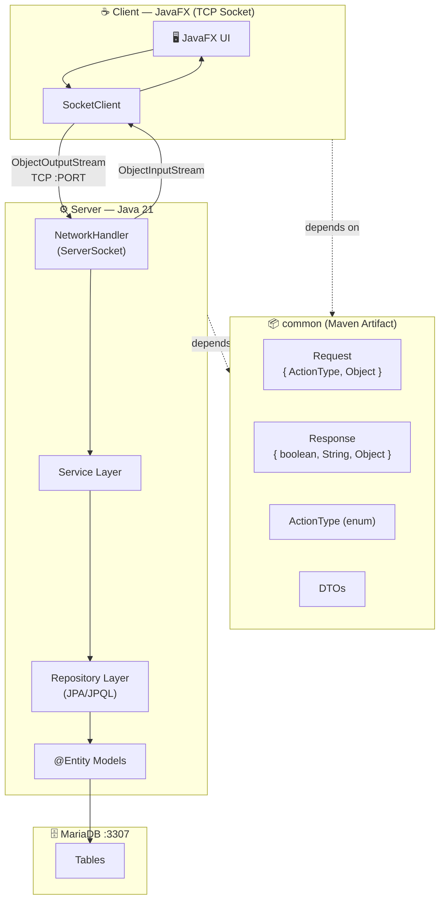

Generate Mermaid diagrams for a given usecase of this distributed Java system.

## Input

`$ARGUMENTS` — the usecase name (e.g. `buy-ticket`, `create-invoice`, `login`)

## Steps

1. Read all relevant source files in parallel:
   - `src/main/java/vn/edu/iuh/fit/common/` — ActionType, Request, Response
   - `src/main/java/vn/edu/iuh/fit/server/model/` — all entities
   - `src/main/java/vn/edu/iuh/fit/server/dto/` — all DTOs
   - `src/main/java/vn/edu/iuh/fit/server/constant/` — all enums
   - `src/main/java/vn/edu/iuh/fit/server/service/` — services (if exist)
   - `src/main/java/vn/edu/iuh/fit/server/network/` — routing (if exist)

2. Analyze the usecase `$ARGUMENTS` and identify:
   - Which entities and DTOs are involved
   - Which ActionType is triggered
   - The full flow from client to DB and back

3. Generate **three diagrams** and save them to `docs/diagrams/$ARGUMENTS.md`

---

## Diagram 1 — System Architecture (always included)

Show the distributed layers. Must make it obvious this is a **Java distributed system over TCP Socket**.



---

## Diagram 2 — Sequence Diagram for `$ARGUMENTS`

Show the full request-response cycle for this specific usecase across all distributed layers. Always include:
- `JavaFX UI` as the initiating actor
- `SocketClient` sending `Request { ActionType.XXX, SomDTO }`
- `NetworkHandler` receiving and routing
- `XxxService` executing business logic
- `XxxRepository` querying via JPA
- `MariaDB` as the data store
- `Response { success, message, data }` returning back through the chain

Label every arrow with the **actual class/method name and data type** (e.g. `send(Request)`, `create(TicketDTO)`, `findById(String)`).

---

## Diagram 3 — Class Diagram for `$ARGUMENTS`

Show only the classes/entities directly involved in this usecase:
- JPA entities with their fields and types
- Relationships (`--o{`, `||--||`, etc.)
- DTOs alongside their entity counterparts
- Mark `@Entity` classes and `DTO` classes clearly

---

## Output file format

Save to `docs/diagrams/$ARGUMENTS.md` with this structure:

```markdown
# Usecase: $ARGUMENTS

> Distributed Java system — Client/Server over TCP Socket

## System Architecture
\`\`\`mermaid
... diagram 1 ...
\`\`\`

## Sequence: $ARGUMENTS
\`\`\`mermaid
sequenceDiagram
... diagram 2 ...
\`\`\`

## Class Diagram
\`\`\`mermaid
classDiagram
... diagram 3 ...
\`\`\`
```

Create `docs/diagrams/` directory if it does not exist.

## Rules

- Every diagram must contain at least one of: `TCP Socket`, `ObjectStream`, `JPA`, `MariaDB` — to make the distributed nature explicit
- Use actual class names from the source code, not generic names
- If the usecase involves an ActionType that does not exist yet, add a note but still draw the intended flow
- Do not fabricate service/repository methods that don't exist — mark them as `«planned»` if not yet implemented
