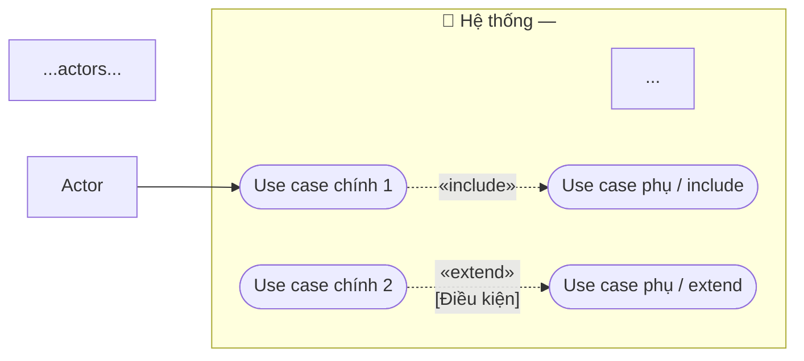

Take a raw usecase description from the user and produce a well-structured usecase document, then save it to `docs/usecases/`.

## Input

`$ARGUMENTS` — usecase name + raw description, e.g.:
`buy-ticket Khách hàng chọn tàu, chọn ghế, thanh toán và nhận vé`
`uc002-hoan-ve Nhân viên hoàn vé theo yêu cầu khách`

Parse `$ARGUMENTS` as: first word = usecase name, remaining = raw description.

## File naming

- If the name already matches the pattern `uc\d+-\w+` (e.g. `uc002-hoan-ve`) — use it **as-is**.
- Otherwise — auto-generate a slug from the raw name (lowercase, spaces → hyphens), then **look at existing files in `docs/usecases/`** to pick the next available number and prepend it (e.g. `uc003-`).
- File is always saved as `docs/usecases/<name>.md`.

## Context to read first

Read in parallel (to understand what already exists):
- All files in `docs/usecases/` — avoid duplicating existing usecases
- `src/main/java/vn/edu/iuh/fit/server/model/` — understand current entities
- `src/main/java/vn/edu/iuh/fit/server/constant/` — understand existing enums

## Steps

1. Parse the usecase name and raw description from `$ARGUMENTS`
2. Read existing context (above)
3. Expand the raw description into a full structured usecase document
4. Generate a Mermaid use case diagram (see **Diagram format** below)
5. Save everything to `docs/usecases/<name>.md` — document first, diagram appended at the end
6. Show the generated file to the user and ask if anything needs adjustment

## Output format

Save to `docs/usecases/<name>.md` with this structure:

```markdown
# Usecase: <Tên usecase>

## Actor
- **Primary:** (e.g. Khách hàng, Nhân viên)
- **System:** Server, Database

## Mô tả
Một đoạn ngắn mô tả mục đích của usecase này.

## Luồng chính
1. Bước 1...
2. Bước 2...
3. ...

## Luồng thay thế
- **[Điều kiện]:** Mô tả xử lý khi điều kiện xảy ra
- **[Điều kiện]:** ...

## Luồng lỗi
- **[Lỗi]:** Mô tả xử lý và thông báo trả về
- **[Lỗi]:** ...

## Dữ liệu vào (Client → Server)
| Field | Kiểu | Bắt buộc | Mô tả |
|---|---|---|---|
| field | String | ✓ | ... |

## Dữ liệu ra (Server → Client)
| Field | Kiểu | Mô tả |
|---|---|---|
| field | String | ... |

## Business Rules
- Rule 1
- Rule 2

---

## Sơ đồ Use Case


```

## Diagram format

Append a `## Sơ đồ Use Case` section at the end of the file using `graph LR`:

- **Actors** (outside subgraph): `NV["👤 Tên actor"]` — one node per actor
- **System boundary**: one `subgraph SYS ["🏢 ..."]` containing all use cases
- **Main use cases** (oval): `UC1(["Tên use case"])` — one per major step in the main flow
- **Sub use cases** (oval): `SUB1(["Tên"])` — for include/extend targets
- **Actor → UC**: solid arrow `Actor --> UC1`
- **Include**: dashed arrow `UC1 -. "«include»" .-> SUB1`
- **Extend**: dashed arrow with condition label `UC1 -. "«extend»\n[Điều kiện]" .-> SUB1`
- Secondary actors (e.g. Máy in, Hệ thống ngoài) on the right side connected from the relevant UC

## Rules

- Expand the raw description as much as possible — never leave a section empty
- Infer missing steps from domain knowledge of Vietnamese railway ticketing
- If the raw description is too vague to expand a section, mark it `<!-- TODO: cần bổ sung -->`
- Do NOT validate business rules here — that is `/bizreview`'s job
- Do NOT generate code — this command only produces documentation
- Create `docs/usecases/` directory if it does not exist
