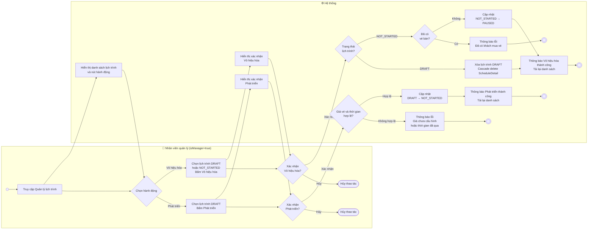

# Activity Diagram — Vô hiệu hóa và Phát triển lịch trình

> Dựa trên: `docs/usecases/uc008-vo-hieu-hoa-va-phat-trien-lich-trinh.md`

## Mô tả use case

**Actor:** Nhân viên quản lý (`isManager = true`)

### Luồng chính: Phát triển lịch trình (Publish)

| Actor | Hệ thống |
|---|---|
| 1. Nhân viên quản lý truy cập màn hình Quản lý lịch trình. | |
| | 2. Hệ thống hiển thị danh sách lịch trình và các nút hành động (Phát triển, Vô hiệu hóa). |
| 3a. Nhân viên chọn một lịch trình đang ở trạng thái `DRAFT` và bấm **"Phát triển"**. | |
| | 4a. Hệ thống hiển thị hộp thoại xác nhận. |
| 5a. Nhân viên bấm **"Xác nhận"**. | |
| | 6a. Hệ thống kiểm tra: tất cả ghế đã cấu hình giá vé và thời gian khởi hành còn trong tương lai. |
| | 7a. Nếu hợp lệ → Hệ thống cập nhật trạng thái từ `DRAFT` thành `NOT_STARTED`. |
| | 8a. Hệ thống thông báo thành công và tải lại danh sách. |

### Luồng thay thế: Vô hiệu hóa lịch trình (Disable)

| Actor | Hệ thống |
|---|---|
| 3b. Nhân viên chọn lịch trình ở trạng thái `DRAFT` hoặc `NOT_STARTED` và bấm **"Vô hiệu hóa"**. | |
| | 4b. Hệ thống hiển thị hộp thoại xác nhận (nội dung khác nhau tuỳ trạng thái). |
| 5b. Nhân viên bấm **"Xác nhận"**. | |
| | 6b. Hệ thống kiểm tra trạng thái lịch trình. |
| | 7b. Nếu `DRAFT` → Hệ thống xóa vĩnh viễn lịch trình và tất cả `ScheduleDetail` liên quan (Cascade delete). |
| | 7b'. Nếu `NOT_STARTED` → Hệ thống kiểm tra số vé đã bán (JOIN qua `ScheduleDetail`). |
| | 8b. Nếu chưa có vé bán → Hệ thống cập nhật trạng thái sang `PAUSED`. |
| | 9b. Hệ thống thông báo thành công và tải lại danh sách. |

**Luồng ngoại lệ:**

| Actor | Hệ thống |
|---|---|
| 5.x Nhân viên bấm **"Hủy"** trong hộp thoại xác nhận. | |
| | 6.x Hệ thống đóng hộp thoại, không thực hiện thay đổi nào. |
| | 6.y *(Phát triển)* Nếu có ghế chưa cấu hình giá vé → Hệ thống thông báo lỗi *"Cần cấu hình giá vé trước khi phát triển"*. |
| | 6.z *(Phát triển)* Nếu thời gian khởi hành đã qua → Hệ thống thông báo lỗi *"Thời gian khởi hành không hợp lệ"*. |
| | 8.x *(Vô hiệu hóa NOT_STARTED)* Nếu đã có ít nhất 1 vé bán → Hệ thống từ chối và thông báo lỗi *"Không thể vô hiệu hóa lịch trình đã có khách mua vé"*. |

---

## Sơ đồ Activity

