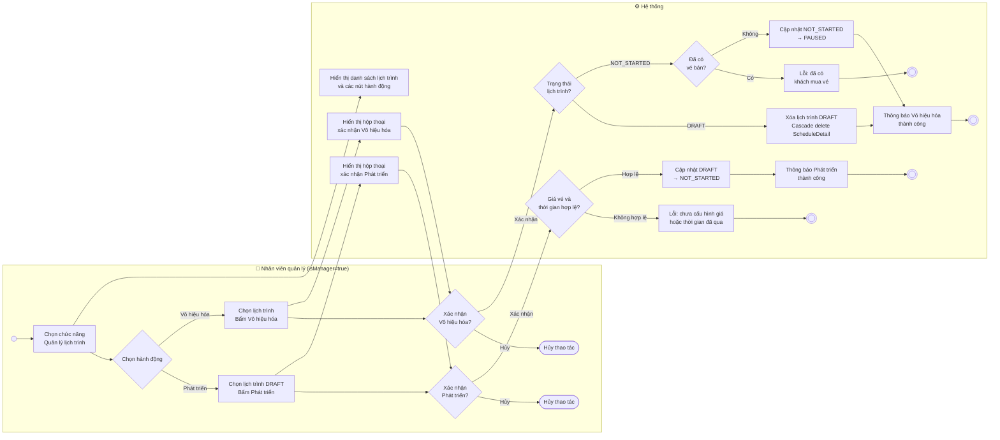

# Activity Diagram — Vô hiệu hóa và Phát triển lịch trình

> Dựa trên: `docs/usecases/uc008-vo-hieu-hoa-va-phat-trien-lich-trinh.md`

## Mô tả use case

| Actor | Hệ thống |
|---|---|
| 1. Nhân viên quản lý chọn chức năng Quản lý lịch trình. | |
| | 2. Hệ thống hiển thị danh sách lịch trình và các nút hành động. |
| 3a. Nhân viên chọn lịch trình `DRAFT` và bấm **"Phát triển"**. | |
| | 4a. Hệ thống hiển thị hộp thoại xác nhận. |
| 5a. Nhân viên bấm **"Xác nhận"**. | |
| | 6a. Hệ thống kiểm tra giá vé tất cả ghế và thời gian khởi hành. |
| | 7a. Nếu hợp lệ → Cập nhật trạng thái `DRAFT` → `NOT_STARTED`. |
| | 8a. Hệ thống thông báo thành công và tải lại danh sách. |
| 3b. Nhân viên chọn lịch trình `DRAFT` hoặc `NOT_STARTED` và bấm **"Vô hiệu hóa"**. | |
| | 4b. Hệ thống hiển thị hộp thoại xác nhận (nội dung khác nhau tuỳ trạng thái). |
| 5b. Nhân viên bấm **"Xác nhận"**. | |
| | 6b. Hệ thống kiểm tra trạng thái lịch trình. |
| | 7b. Nếu `DRAFT` → Hệ thống xóa vĩnh viễn lịch trình (Cascade delete `ScheduleDetail`). |
| | 7b'. Nếu `NOT_STARTED` → Hệ thống kiểm tra số vé đã bán. Nếu chưa có vé → Cập nhật → `PAUSED`. |
| | 8b. Hệ thống thông báo thành công và tải lại danh sách. |
| **Luồng ngoại lệ** | |
| 5.x Nhân viên bấm **"Hủy"** trong hộp thoại xác nhận. | |
| | 6.x Hệ thống đóng hộp thoại, không thực hiện thay đổi. |
| | 6.y *(3a)* Có ghế chưa cấu hình giá hoặc thời gian khởi hành đã qua → Hệ thống thông báo lỗi. |
| | 7.x *(3b — NOT_STARTED)* Đã có ít nhất 1 vé bán → Hệ thống từ chối và thông báo lỗi. |

---

## Sơ đồ Activity

