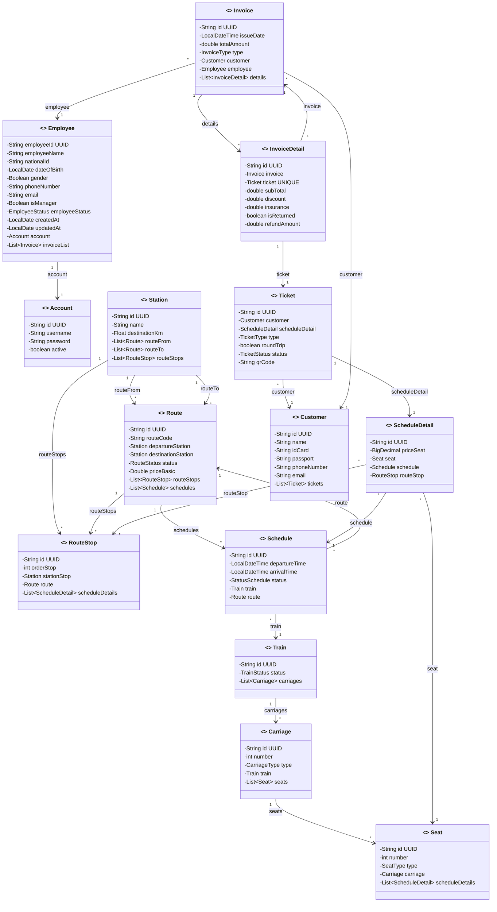

# Architecture Review (Lần 2 — sau khi fix)

> Reviewed at: 2026-04-19T15:25 on branch `dev/tra`

## Verdict
**OPTIMAL** ✅ — với một số suggestion nhỏ

Tất cả 5 critical issues và 7 improvement issues từ lần review trước đã được fix. Không còn vấn đề nào block được Hibernate startup hay gây lỗi runtime.

---

## Issues Found

### 🔴 Critical
**Không có.** Tất cả critical issues đã được giải quyết:

| Issue cũ | Trạng thái |
|----------|-----------|
| `TrainStation` orphan + PK `int` sai kiểu | ✅ Đã xóa |
| `Account` rỗng, không có `@Entity` | ✅ Đã implement đầy đủ (UUID PK, username, password, active) |
| `Employee.employeeId` column length 20 | ✅ Đã sửa thành length 36 |
| `InvoiceDetail` composite key vi phạm UUID rule | ✅ Đã chuyển sang UUID PK + unique constraint |
| `Route` dùng sai `StationStatus` | ✅ Đã tạo `RouteStatus` enum riêng |

---

### 🟡 Improvement
**Không có.** Tất cả improvement issues đã được giải quyết:

| Issue cũ | Trạng thái |
|----------|-----------|
| `Train.status` / `Ticket.status` là `String` | ✅ Đã chuyển sang `TrainStatus` / `TicketStatus` enum |
| `InvoiceDetail.insurance` hardcode `final` | ✅ Đã bỏ `final` |
| `Schedule` thiếu thời gian | ✅ Đã thêm `departureTime`, `arrivalTime` |
| `ScheduleDetailDTO.id` sai type `int` | ✅ Đã sửa thành `String` |
| DTOs thiếu `implements Serializable` | ✅ Tất cả DTOs đã implement |
| `Employee` dùng `@Data` | ✅ Đã chuyển sang `@Setter @Getter` |
| `Customer` thiếu `phoneNumber`, `email` | ✅ Đã thêm |

---

### 🔵 Suggestion

#### 1. `InvoiceDTO.details` chứa nested `List<InvoiceDetailDTO>` — vi phạm DTO flat rule

DTO rule ghi: "**Flat** — reference parent by `String parentId`, never nest the full parent object." `InvoiceDTO` có field `List<InvoiceDetailDTO> details` là nested DTO. Trong thực tế, đây có thể là chấp nhận được cho usecase "xem hóa đơn chi tiết" — nhưng cần cân nhắc tách thành 2 request riêng nếu muốn tuân thủ strict flat rule.

#### 2. `ScheduleDetail` thiếu `@Column` annotation cho PK và missing `@JoinColumn` cho `seat`, `schedule`

```java
// Hiện tại
@ManyToOne
private Seat seat;           // thiếu @JoinColumn

@ManyToOne
private Schedule schedule;    // thiếu @JoinColumn
```

Hibernate sẽ tự sinh tên FK, nhưng tốt hơn nên explicit `@JoinColumn(name = "seat_id")` và `@JoinColumn(name = "schedule_id")` để kiểm soát tên cột.

Tương tự, PK thiếu `@Column(name = "schedule_detail_id", length = 36)`.

#### 3. `RouteStop` thiếu `@Column` annotation cho PK

`RouteStop.id` thiếu `@Column(name = "route_stop_id", length = 36)`.

#### 4. `Station` thiếu `@Column` annotations

`Station.id` thiếu `@Column(name = "station_id", length = 36)`. `Station.name` thiếu `@Column(name = "station_name", ...)` và nếu tên ga có tiếng Việt thì nên dùng `columnDefinition = "NVARCHAR(255)"`.

#### 5. `Train` Lombok annotation order

Entity rule: `@NoArgsConstructor, @AllArgsConstructor, @Setter, @Getter, @ToString, @Builder`. Hiện tại `Train` đang `@AllArgsConstructor, @NoArgsConstructor, ...` (đảo ngược).

#### 6. `InvoiceDetail` import `Serializable` thừa

`InvoiceDetail` entity import `java.io.Serializable` nhưng class không implement `Serializable`. Entity không cần Serializable (chỉ DTO cần).

#### 7. `Schedule.route` thiếu `@JoinColumn`

```java
@ManyToOne
private Route route;  // Hibernate tự sinh FK name → nên explicit
```

Nên thêm `@JoinColumn(name = "route_id")`.

---

## Inventory

### 14 Entities

| Entity | PK | Status |
|--------|-----|--------|
| Account | UUID ✅ | ✅ OK |
| Carriage | UUID ✅ | ✅ OK |
| Customer | UUID ✅ | ✅ OK |
| Employee | UUID ✅ | ✅ OK |
| Invoice | UUID ✅ | ✅ OK |
| InvoiceDetail | UUID ✅ | ✅ OK |
| Route | UUID ✅ | ✅ OK |
| RouteStop | UUID ✅ | ✅ OK |
| Schedule | UUID ✅ | ✅ OK |
| ScheduleDetail | UUID ✅ | ✅ OK |
| Seat | UUID ✅ | ✅ OK |
| Station | UUID ✅ | ✅ OK |
| Ticket | UUID ✅ | ✅ OK |
| Train | UUID ✅ | ✅ OK |

### 17 DTOs (tất cả implement `Serializable`)

| DTO | Serializable | Flat |
|-----|-------------|------|
| AccountDTO | ✅ | ✅ |
| CarriageDTO | ✅ | ✅ |
| CustomerDTO | ✅ | ✅ |
| CustomerStatisticDTO | ✅ | ✅ |
| DailyRevenueDTO | ✅ | ✅ |
| EmployeeDTO | ✅ | ✅ |
| InvoiceDTO | ✅ | ⚠️ nested `List<InvoiceDetailDTO>` |
| InvoiceDetailDTO | ✅ | ✅ |
| RouteDTO | ✅ | ✅ |
| RouteStopDTO | ✅ | ✅ |
| ScheduleDTO | ✅ | ✅ |
| ScheduleDetailDTO | ✅ | ✅ |
| SeatDTO | ✅ | ✅ |
| StationDTO | ✅ | ✅ |
| StatisticalDTO | ✅ | ✅ |
| TicketDTO | ✅ | ✅ |
| TrainDTO | ✅ | ✅ |

### 10 Enums

| Enum | Used By |
|------|---------|
| CarriageType | Carriage |
| EmployeeStatus | Employee |
| InvoiceType | Invoice |
| RouteStatus | Route |
| SeatType | Seat |
| StationStatus | *(available for Station — hiện chưa dùng)* |
| StatusSchedule | Schedule |
| TicketStatus | Ticket |
| TicketType | Ticket |
| TrainStatus | Train |

---

## Current Class Diagram



---

## Previous Issues — Resolution Log

| # | Issue | Severity | Resolution |
|---|-------|----------|------------|
| 1 | `TrainStation` orphan entity, PK `int` + UUID strategy | 🔴 Critical | **Deleted** `TrainStation.java` + `TrainStationDTO.java` |
| 2 | `Account` empty class, no `@Entity` | 🔴 Critical | **Implemented** with UUID PK, username, password, active |
| 3 | `Employee.employeeId` column length 20 (UUID = 36) | 🔴 Critical | **Fixed** length → 36, JoinColumn → `account_id` |
| 4 | `InvoiceDetail` composite key `@IdClass` | 🔴 Critical | **Replaced** with UUID surrogate PK + unique constraint on ticket |
| 5 | `Route.status` used `StationStatus` | 🔴 Critical | **Created** `RouteStatus` enum |
| 6 | `Train.status` was `String` | 🟡 Improve | **Created** `TrainStatus` enum |
| 7 | `Ticket.status` was `String` | 🟡 Improve | **Created** `TicketStatus` enum |
| 8 | `InvoiceDetail.insurance` was `final` | 🟡 Improve | **Removed** `final` |
| 9 | `Schedule` missing time fields | 🟡 Improve | **Added** `departureTime`, `arrivalTime` |
| 10 | `ScheduleDetailDTO.id` was `int` | 🟡 Improve | **Changed** to `String` |
| 11 | 5 DTOs missing `Serializable` | 🟡 Improve | **Added** to all DTOs |
| 12 | `Employee` used `@Data` | 🟡 Improve | **Changed** to `@Setter @Getter` |
| 13 | `Customer` missing phone/email | 🔵 Suggest | **Added** `phoneNumber`, `email` |
| 14 | `Route` missing code | 🔵 Suggest | **Added** `routeCode` |
| 15 | Missing DTOs for Route, RouteStop, Station, Schedule | 🔵 Suggest | **Created** 4 new DTOs + `AccountDTO` |
