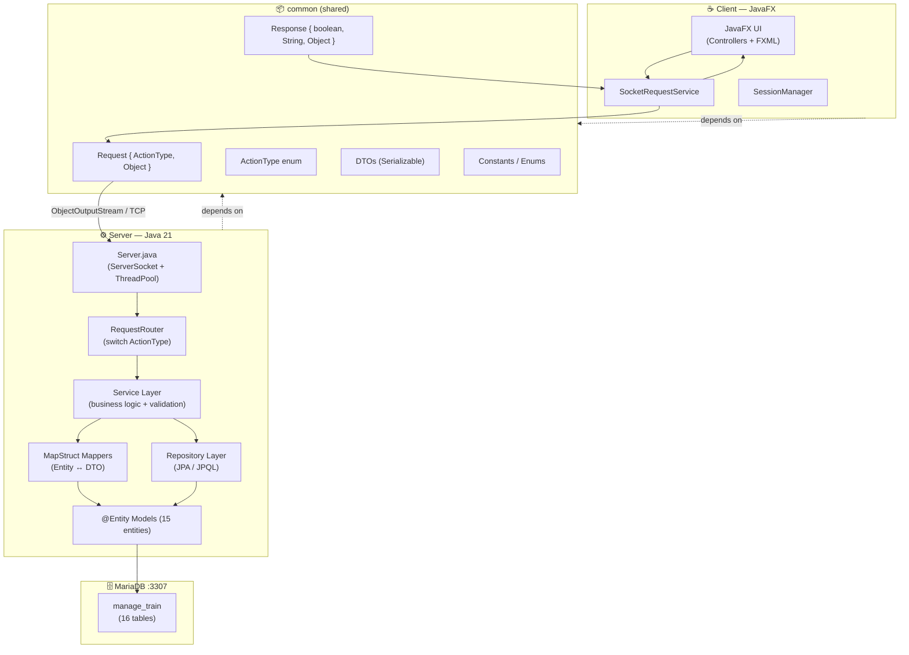
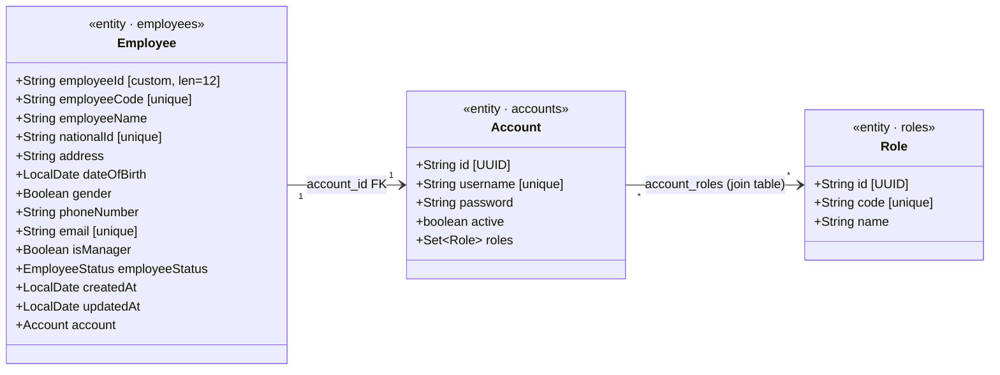
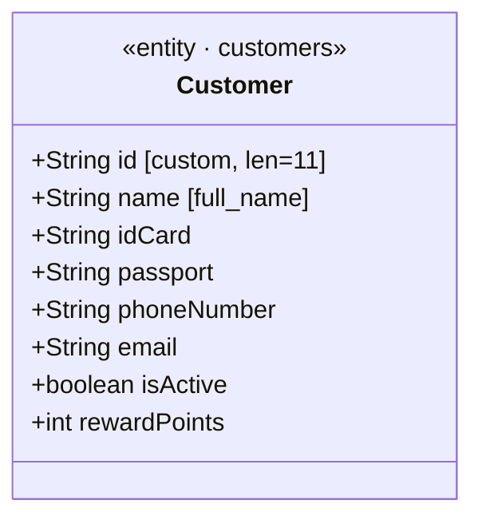
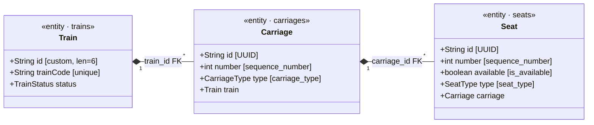
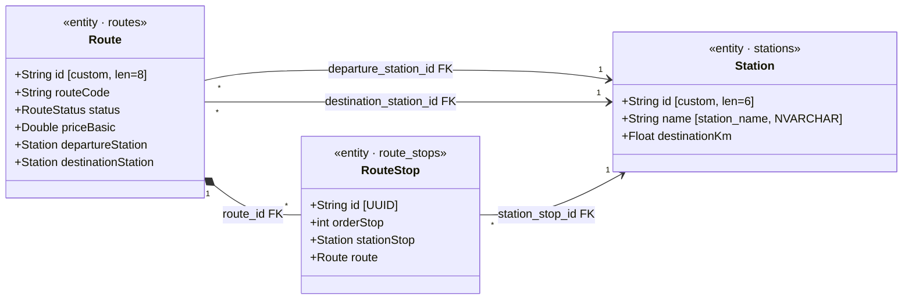
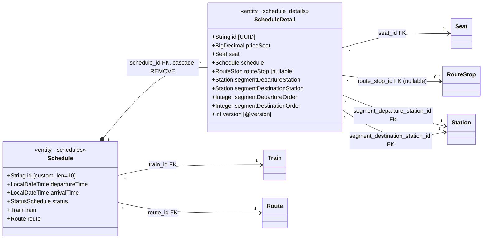
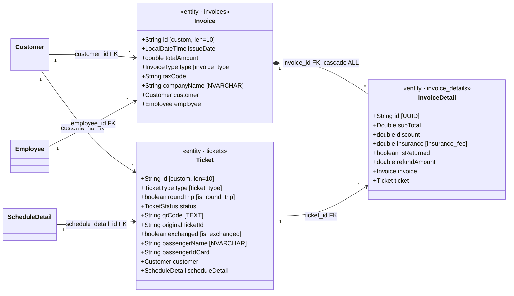

# Class Diagram & DB Mapping — Train Booking System

> Distributed Java system — Client/Server over TCP Socket  
> Updated: 2026-05-05

---

## 1. System Architecture

---

## 2. Class Diagram — Entities

### 2a. Auth & Nhân viên

### 2b. Khách hàng

### 2c. Tàu — Toa — Ghế

### 2d. Ga — Tuyến — Điểm dừng

### 2e. Lịch trình — Chi tiết lịch trình

### 2f. Vé — Hóa đơn

---

## 3. DB Mapping — ER Diagram

---

## 4. Class Diagram — Core DTOs

```mermaid
classDiagram
    direction TB

    class AccountDTO {
        <<DTO>>
        +String id
        +String username
        +boolean active
        +String employeeId
        +boolean isManager
    }

    class EmployeeDTO {
        <<DTO>>
        +String employeeId
        +String employeeCode
        +String employeeName
        +String nationalId
        +String address
        +LocalDate dateOfBirth
        +Boolean gender
        +String phoneNumber
        +String email
        +Boolean isManager
        +EmployeeStatus employeeStatus
        +LocalDate createdAt
        +LocalDate updatedAt
    }

    class CustomerDTO {
        <<DTO>>
        +String customerId
        +String fullName
        +String idCard
        +String passport
        +String phone
        +String email
        +Boolean isActive
        +int rewardPoints
    }

    class TrainDTO {
        <<DTO>>
        +String id
        +String trainCode
        +TrainStatus status
    }

    class CarriageDTO {
        <<DTO>>
        +String id
        +int number
        +CarriageType type
        +String trainId
    }

    class SeatDTO {
        <<DTO>>
        +String id
        +int number
        +boolean available
        +SeatType type
        +String carriageId
    }

    class StationDTO {
        <<DTO>>
        +String id
        +String name
        +Float destinationKm
    }

    class RouteDTO {
        <<DTO>>
        +String id
        +String routeCode
        +String departureStationId
        +String destinationStationId
        +RouteStatus status
        +Double priceBasic
    }

    class RouteStopDTO {
        <<DTO>>
        +String id
        +int orderStop
        +String stationStopId
        +String routeId
    }

    class ScheduleDTO {
        <<DTO>>
        +String id
        +LocalDateTime departureTime
        +LocalDateTime arrivalTime
        +StatusSchedule status
        +String trainId
        +String trainName
        +String routeId
        +String routeCode
        +String departureStationName
        +String destinationStationName
    }

    class ScheduleDetailDTO {
        <<DTO>>
        +String id
        +double seatPrice
        +String scheduleId
        +String seatId
        +String routeStopId
        +String segmentDepartureStationId
        +String segmentDepartureStationName
        +String segmentDestinationStationId
        +String segmentDestinationStationName
        +Integer segmentDepartureOrder
        +Integer segmentDestinationOrder
        +int seatNumber
        +SeatType seatType
        +int carriageNumber
        +boolean sold
    }

    class TicketDTO {
        <<DTO>>
        +String id
        +String customerId
        +String scheduleDetailId
        +TicketType type
        +boolean roundTrip
        +TicketStatus status
        +String qrCode
        +String originalTicketId
        +boolean exchanged
        +String passengerName
        +String passengerIdCard
    }

    class InvoiceDTO {
        <<DTO>>
        +String id
        +LocalDateTime issueDate
        +double totalAmount
        +InvoiceType type
        +String customerId
        +String employeeId
        +String taxCode
        +String companyName
        +List~InvoiceDetailDTO~ details
    }

    class InvoiceDetailDTO {
        <<DTO>>
        +String id
        +String invoiceId
        +String ticketId
        +Double subTotal
        +double discount
        +double insurance
        +boolean isReturned
        +double refundAmount
    }
```

---

## 5. Enums

```mermaid
classDiagram
    direction LR

    class TrainStatus {
        <<enum>>
        ACTIVE
        MAINTENANCE
        INACTIVE
    }

    class CarriageType {
        <<enum>>
        HARD_SEAT
        SOFT_SEAT
        SOFT_SEAT_AC
        BERTH_6
        BERTH_4
    }

    class SeatType {
        <<enum>>
        HARD_SEAT
        SOFT_SEAT
        VIP_SEAT
        BERTH_6
        BERTH_4
    }

    class RouteStatus {
        <<enum>>
        DRAFT
        ACTIVE
        PAUSED
        CANCELLED
    }

    class StatusSchedule {
        <<enum>>
        DRAFT
        NOT_STARTED
        IN_PROGRESS
        PAUSED
        READY
        COMPLETED
        CANCELLED
    }

    class TicketType {
        <<enum>>
        NORMAL
        SENIOR
        CHILD
        STUDENT
    }

    class TicketStatus {
        <<enum>>
        BOOKED
        PAID
        CANCELLED
        USED
        EXPIRED
        EXCHANGED
        RETURNED
    }

    class InvoiceType {
        <<enum>>
        SALE
        REFUND
        EXCHANGE
    }

    class EmployeeStatus {
        <<enum>>
        ACTIVE
        PAUSE
        INACTIVE
    }

    class StatisticsPeriod {
        <<enum>>
        DAY
        WEEK
        MONTH
    }
```

---

## 6. Ký hiệu

| Ký hiệu | Ý nghĩa |
|---|---|
| `"1" *-- "*"` | Composition — One-to-Many (cascade) |
| `"1" --> "*"` | Association — One-to-Many (FK) |
| `"*" --> "1"` | Many-to-One (FK nằm ở bảng Many) |
| `"1" -- "1"` | One-to-One |
| `"*" --> "*"` | Many-to-Many (qua join table) |
| `..>` | Dependency / DTO input |
| `<<entity · table_name>>` | JPA entity ánh xạ đến bảng `table_name` |
| `[UUID]` | PK tự sinh UUID |
| `[custom, len=N]` | PK dùng custom generator, độ dài N |
