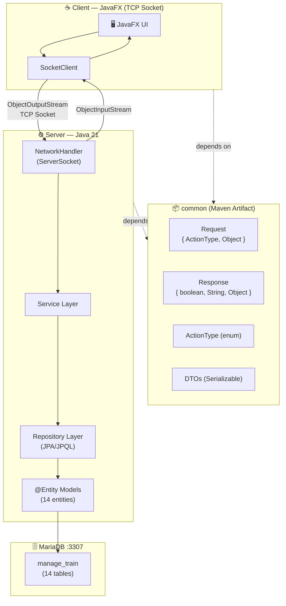
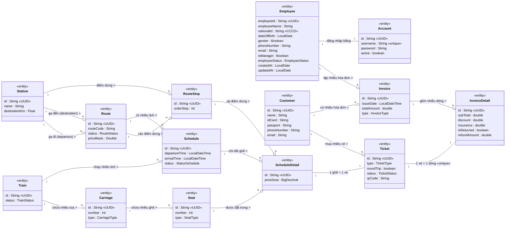

# Class Diagram — Train Booking System (Toàn bộ hệ thống)

> Distributed Java system — Client/Server over TCP Socket
> Generated: 2026-04-19

## System Architecture

## Class Diagram — Entities & Relationships

## Class Diagram — DTOs

```mermaid
classDiagram
    direction TB

    class AccountDTO {
        <<DTO / Serializable>>
        id : String
        username : String
        active : boolean
    }

    class TrainDTO {
        <<DTO / Serializable>>
        id : String
        status : TrainStatus
    }

    class CarriageDTO {
        <<DTO / Serializable>>
        id : String
        number : int
        type : CarriageType
        trainId : String
    }

    class SeatDTO {
        <<DTO / Serializable>>
        id : String
        number : int
        type : SeatType
        carriageId : String
    }

    class StationDTO {
        <<DTO / Serializable>>
        id : String
        name : String
        destinationKm : Float
    }

    class RouteDTO {
        <<DTO / Serializable>>
        id : String
        routeCode : String
        departureStationId : String
        destinationStationId : String
        status : RouteStatus
        priceBasic : Double
    }

    class RouteStopDTO {
        <<DTO / Serializable>>
        id : String
        orderStop : int
        stationStopId : String
        routeId : String
    }

    class ScheduleDTO {
        <<DTO / Serializable>>
        id : String
        departureTime : LocalDateTime
        arrivalTime : LocalDateTime
        status : StatusSchedule
        trainId : String
        routeId : String
    }

    class ScheduleDetailDTO {
        <<DTO / Serializable>>
        id : String
        seatPrice : double
        scheduleId : String
        seatId : String
        routeStopId : String
    }

    class CustomerDTO {
        <<DTO / Serializable>>
        id : String
        name : String
        idCard : String
        passport : String
        phoneNumber : String
        email : String
    }

    class TicketDTO {
        <<DTO / Serializable>>
        id : String
        customerId : String
        scheduleDetailId : String
        type : TicketType
        roundTrip : boolean
        status : TicketStatus
        qrCode : String
    }

    class EmployeeDTO {
        <<DTO / Serializable>>
        employeeId : String
        employeeName : String
        nationalId : String
        dateOfBirth : LocalDate
        gender : Boolean
        phoneNumber : String
        email : String
        isManager : Boolean
        employmentStatus : String
        createdAt : LocalDate
        updatedAt : LocalDate
    }

    class InvoiceDTO {
        <<DTO / Serializable>>
        id : String
        issueDate : LocalDateTime
        totalAmount : double
        type : InvoiceType
        customerId : String
        employeeId : String
    }

    class InvoiceDetailDTO {
        <<DTO / Serializable>>
        id : String
        invoiceId : String
        ticketId : String
        subTotal : double
        discount : double
        insurance : double
        isReturned : boolean
        refundAmount : double
    }

    %% Entity ↔ DTO mapping
    AccountDTO ..|> Account : maps to
    TrainDTO ..|> Train : maps to
    CarriageDTO ..|> Carriage : maps to
    SeatDTO ..|> Seat : maps to
    StationDTO ..|> Station : maps to
    RouteDTO ..|> Route : maps to
    RouteStopDTO ..|> RouteStop : maps to
    ScheduleDTO ..|> Schedule : maps to
    ScheduleDetailDTO ..|> ScheduleDetail : maps to
    CustomerDTO ..|> Customer : maps to
    TicketDTO ..|> Ticket : maps to
    EmployeeDTO ..|> Employee : maps to
    InvoiceDTO ..|> Invoice : maps to
    InvoiceDetailDTO ..|> InvoiceDetail : maps to
```

## Enums

```mermaid
classDiagram
    direction LR

    class CarriageType {
        <<enum>>
        HARD_SEAT
        SOFT_SEAT
        SOFT_SEAT_AC
        BERTH_6
        BERTH_4
    }

    class SeatType {
        <<enum>>
        HARD_SEAT
        SOFT_SEAT
        VIP_SEAT
        BERTH_6
        BERTH_4
    }

    class TrainStatus {
        <<enum>>
        ACTIVE
        MAINTENANCE
        INACTIVE
    }

    class RouteStatus {
        <<enum>>
        DRAFT
        ACTIVE
        PAUSED
        CANCELLED
    }

    class StationStatus {
        <<enum>>
        DRAFT
        PAUSED
        READY
    }

    class StatusSchedule {
        <<enum>>
        DRAFT
        NOT_STARTED
        IN_PROGRESS
        PAUSED
        READY
        COMPLETED
    }

    class TicketType {
        <<enum>>
        NORMAL
        SENIOR
        CHILD
        STUDENT
    }

    class TicketStatus {
        <<enum>>
        BOOKED
        PAID
        CANCELLED
        USED
        EXPIRED
    }

    class EmployeeStatus {
        <<enum>>
        ACTIVE
        PAUSE
        INACTIVE
    }

    class InvoiceType {
        <<enum>>
        SALE
        REFUND
        EXCHANGE
    }

    %% Used by
    CarriageType <-- Carriage : uses
    SeatType <-- Seat : uses
    TrainStatus <-- Train : uses
    RouteStatus <-- Route : uses
    StatusSchedule <-- Schedule : uses
    TicketType <-- Ticket : uses
    TicketStatus <-- Ticket : uses
    EmployeeStatus <-- Employee : uses
    InvoiceType <-- Invoice : uses
```

## Ký hiệu Relationship

| Ký hiệu | Ý nghĩa | Ví dụ |
|----------|---------|-------|
| `"1" --o "N"` | One-to-Many (composition) | Train `1` --o `N` Carriage |
| `"1" -- "1"` | One-to-One | Employee `1` -- `1` Account |
| `..\|>` | DTO maps to Entity | TrainDTO ..\|> Train |
| `<--` | Enum used by Entity | TrainStatus <-- Train |
