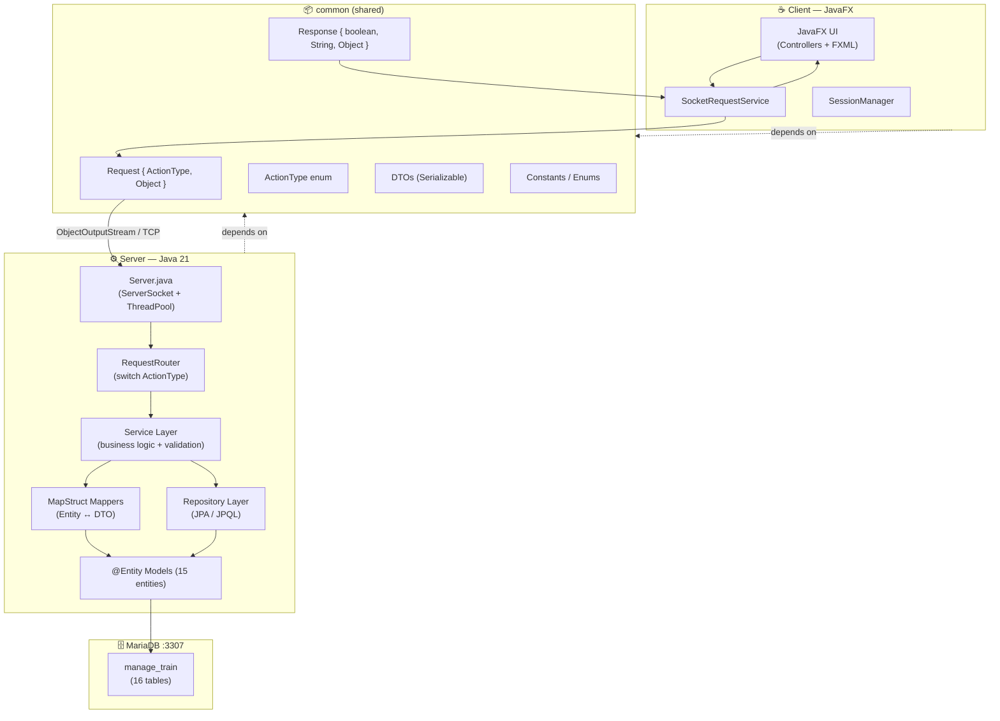
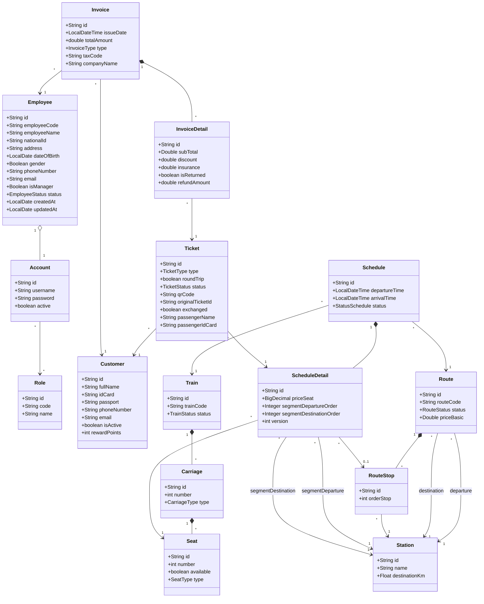
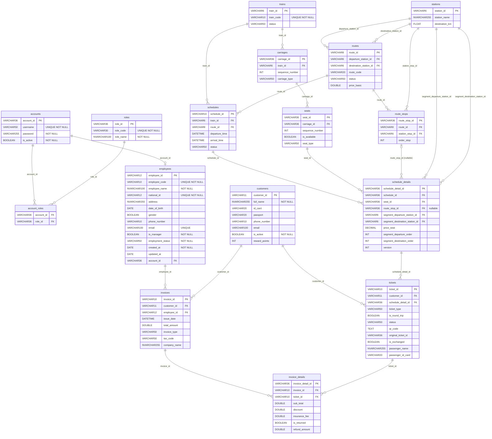

# Class Diagram & DB Mapping — Train Booking System

> Distributed Java system — Client/Server over TCP Socket  
> Updated: 2026-05-05

---

## 1. System Architecture

---

## 2. Class Diagram — Entities

---

## 3. DB Mapping — ER Diagram

---

## 4. Class Diagram — Core DTOs

---

## 5. Enums

```mermaid
classDiagram
    direction LR

    class TrainStatus {
        <<enum>>
        ACTIVE
        MAINTENANCE
        INACTIVE
    }

    class CarriageType {
        <<enum>>
        HARD_SEAT
        SOFT_SEAT
        SOFT_SEAT_AC
        BERTH_6
        BERTH_4
    }

    class SeatType {
        <<enum>>
        HARD_SEAT
        SOFT_SEAT
        VIP_SEAT
        BERTH_6
        BERTH_4
    }

    class RouteStatus {
        <<enum>>
        DRAFT
        ACTIVE
        PAUSED
        CANCELLED
    }

    class StatusSchedule {
        <<enum>>
        DRAFT
        NOT_STARTED
        IN_PROGRESS
        PAUSED
        READY
        COMPLETED
        CANCELLED
    }

    class TicketType {
        <<enum>>
        NORMAL
        SENIOR
        CHILD
        STUDENT
    }

    class TicketStatus {
        <<enum>>
        BOOKED
        PAID
        CANCELLED
        USED
        EXPIRED
        EXCHANGED
        RETURNED
    }

    class InvoiceType {
        <<enum>>
        SALE
        REFUND
        EXCHANGE
    }

    class EmployeeStatus {
        <<enum>>
        ACTIVE
        PAUSE
        INACTIVE
    }

    class StatisticsPeriod {
        <<enum>>
        DAY
        WEEK
        MONTH
    }
```

---

## 6. Ký hiệu

| Ký hiệu | Loại | Ý nghĩa |
|---|---|---|
| `A "1" *-- "*" B` | **Composition** ◆── | A sở hữu B, B không tồn tại nếu không có A (cascade delete) |
| `A "1" o-- "1" B` | **Aggregation** ◇── | A chứa B, nhưng B có thể tồn tại độc lập |
| `A "*" --> "1" B` | **Association** ──▶ | A tham chiếu B qua FK, không quản lý lifecycle |
| `A "*" --> "*" B` | **Association** ──▶ | Many-to-Many (join table) |
| `"0..1"` | Cardinality | Quan hệ nullable (FK có thể null) |
| `"1" -- "1"` | One-to-One |
| `"*" --> "*"` | Many-to-Many (qua join table) |
| `..>` | Dependency / DTO input |
| `<<entity · table_name>>` | JPA entity ánh xạ đến bảng `table_name` |
| `[UUID]` | PK tự sinh UUID |
| `[custom, len=N]` | PK dùng custom generator, độ dài N |
