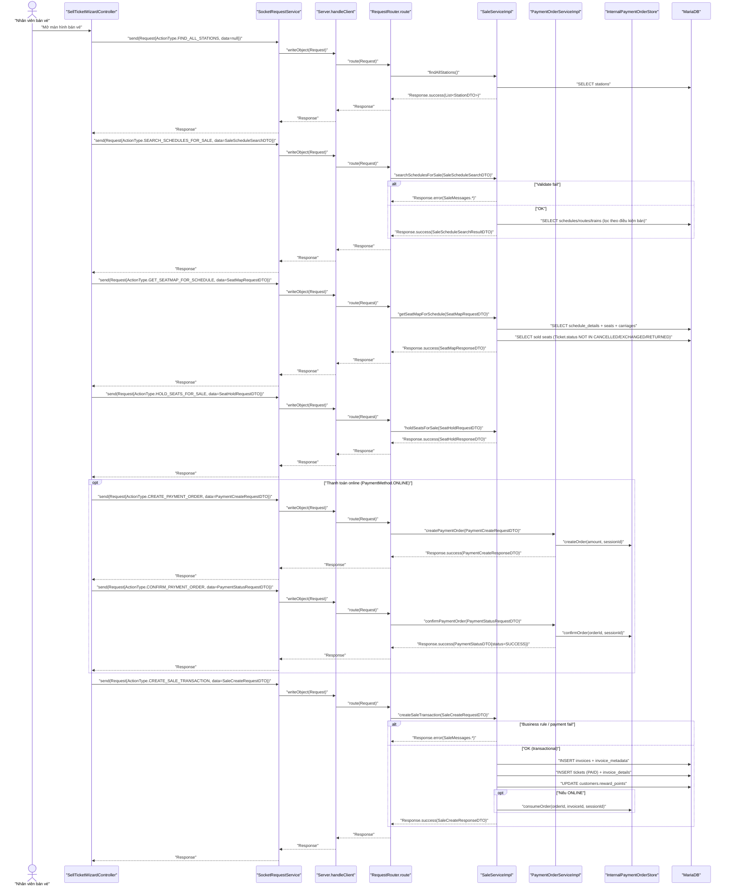

# Sequence Diagrams — UC001: Bán vé

## 1) System Architecture

```mermaid
graph TB
  subgraph CLIENT["Client (JavaFX)"]
    UI["\"SellTicketWizardController\""]
    SocketSvc["\"SocketRequestService\""]
  end

  subgraph TRANSPORT["TCP Socket Transport"]
    OOS["\"ObjectOutputStream.writeObject(Request)\""]
    OIS["\"ObjectInputStream.readObject() -> Response\""]
  end

  subgraph SERVER["Server (Java Socket Server)"]
    Handler["\"Server.handleClient(Socket)\""]
    Router["\"RequestRouter.route(Request)\""]
    SaleSvc["\"SaleServiceImpl\""]
    PaySvc["\"PaymentOrderServiceImpl\""]
    Store["\"InternalPaymentOrderStore\""]
    JPA["\"JPAUtils / EntityManager\""]
    Repos["\"Repositories (JPQL/JPA)\""]
  end

  subgraph DB["MariaDB"]
    Stations["\"stations\""]
    Schedules["\"schedules\""]
    ScheduleDetails["\"schedule_details\""]
    Tickets["\"tickets\""]
    Customers["\"customers\""]
    Invoices["\"invoices\""]
    InvoiceDetails["\"invoice_details\""]
    InvoiceMeta["\"invoice_metadata\""]
  end

  UI --> SocketSvc --> OOS
  OOS -- "\"TCP ObjectStream\"" --> Handler
  Handler --> Router
  Router --> SaleSvc
  Router --> PaySvc
  SaleSvc --> JPA --> Repos --> DB
  PaySvc --> Store
  Repos --> Stations
  Repos --> Schedules
  Repos --> ScheduleDetails
  Repos --> Tickets
  Repos --> Customers
  Repos --> Invoices
  Repos --> InvoiceDetails
  Repos --> InvoiceMeta
  Handler -- "\"Response\"" --> OIS --> SocketSvc --> UI
```

---

## 2) Sequence Diagram (Client → Socket → Service → DB)



