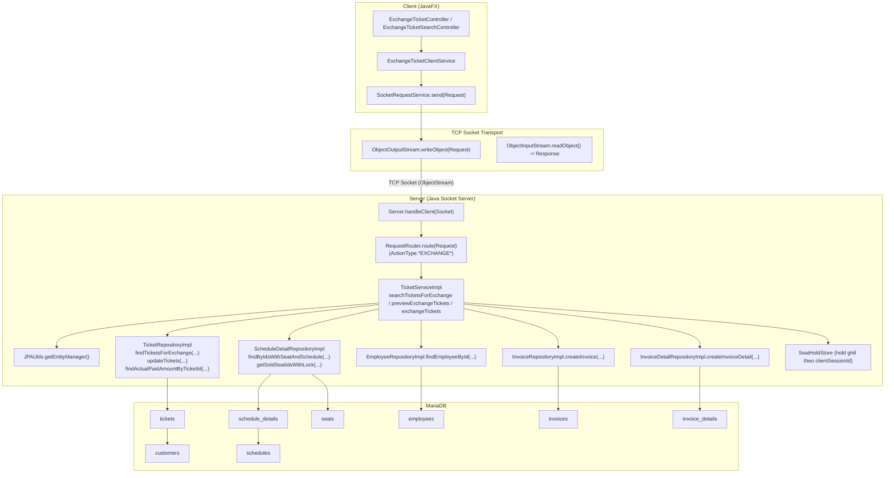
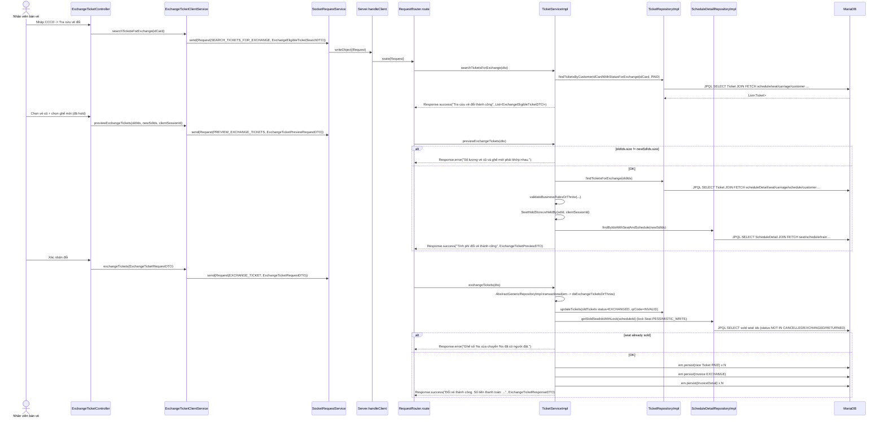
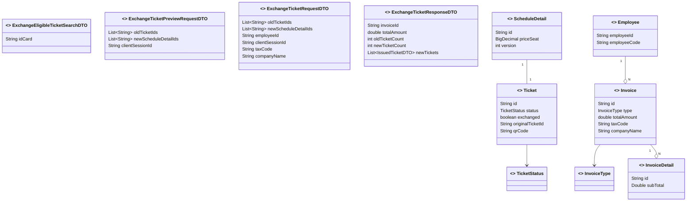

# Diagrams — UC002: Đổi vé

---

## 1. System Architecture

```mermaid
graph TB
  subgraph CLIENT["Client (JavaFX)"]
    UI["ExchangeTicketController / ExchangeTicketSearchController"]
    CS["ExchangeTicketClientService"]
    SRS["SocketRequestService.send(Request)"]
  end

  subgraph TRANSPORT["TCP Socket Transport"]
    OOS["ObjectOutputStream.writeObject(Request)"]
    OIS["ObjectInputStream.readObject() -> Response"]
  end

  subgraph SERVER["Server (Java Socket Server)"]
    SRV["Server.handleClient(Socket)"]
    RR["RequestRouter.route(Request)<br/>(ActionType.*EXCHANGE*)"]
    SVC["TicketServiceImpl<br/>searchTicketsForExchange / previewExchangeTickets / exchangeTickets"]
    JPA["JPAUtils.getEntityManager()"]
    T_REPO["TicketRepositoryImpl<br/>findTicketsForExchange(...)<br/>updateTickets(...)<br/>findActualPaidAmountByTicketId(...)"]
    SD_REPO["ScheduleDetailRepositoryImpl<br/>findByIdsWithSeatAndSchedule(...)<br/>getSoldSeatIdsWithLock(...)"]
    E_REPO["EmployeeRepositoryImpl.findEmployeeById(...)"]
    INV_REPO["InvoiceRepositoryImpl.createInvoice(...)"]
    INVD_REPO["InvoiceDetailRepositoryImpl.createInvoiceDetail(...)"]
    HOLD["SeatHoldStore (hold ghế theo clientSessionId)"]
  end

  subgraph DB["MariaDB"]
    T_EMP["employees"]
    T_TICKET["tickets"]
    T_SD["schedule_details"]
    T_SEAT["seats"]
    T_SCH["schedules"]
    T_INV["invoices"]
    T_INVD["invoice_details"]
    T_CUS["customers"]
  end

  UI --> CS --> SRS --> OOS
  OOS -- "TCP Socket (ObjectStream)" --> SRV
  SRV --> RR --> SVC --> JPA
  SVC --> T_REPO --> T_TICKET
  SVC --> SD_REPO --> T_SD
  SD_REPO --> T_SEAT
  SVC --> E_REPO --> T_EMP
  SVC --> INV_REPO --> T_INV
  SVC --> INVD_REPO --> T_INVD
  SVC --> HOLD
  T_TICKET --> T_CUS
  T_SD --> T_SCH
```

---

## 2. Sequence Diagram

```mermaid
sequenceDiagram
  actor Clerk as Nhân viên bán vé
  participant UI as ExchangeTicketController
  participant ClientSvc as ExchangeTicketClientService
  participant Socket as SocketRequestService
  participant Server as Server.handleClient
  participant Router as RequestRouter.route
  participant TicketSvc as TicketServiceImpl
  participant TicketRepo as TicketRepositoryImpl
  participant SDRepo as ScheduleDetailRepositoryImpl
  participant DB as MariaDB

  Clerk->>UI: Nhập CCCD -> Tra cứu vé đổi
  UI->>ClientSvc: searchTicketsForExchange(idCard)
  ClientSvc->>Socket: send(Request(SEARCH_TICKETS_FOR_EXCHANGE, ExchangeEligibleTicketSearchDTO))
  Socket->>Server: writeObject(Request)
  Server->>Router: route(Request)
  Router->>TicketSvc: searchTicketsForExchange(dto)
  TicketSvc->>TicketRepo: findTicketsByCustomerIdCardWithStatusForExchange(idCard, PAID)
  TicketRepo->>DB: JPQL SELECT Ticket JOIN FETCH schedule/seat/carriage/customer ...
  DB-->>TicketRepo: List<Ticket>
  TicketSvc-->>Router: Response.success("Tra cứu vé đổi thành công", List<ExchangeEligibleTicketDTO>)

  Clerk->>UI: Chọn vé cũ + chọn ghế mới (đã hold)
  UI->>ClientSvc: previewExchangeTickets(oldIds, newSdIds, clientSessionId)
  ClientSvc->>Socket: send(Request(PREVIEW_EXCHANGE_TICKETS, ExchangeTicketPreviewRequestDTO))
  Router->>TicketSvc: previewExchangeTickets(dto)
  alt oldIds.size != newSdIds.size
    TicketSvc-->>Router: Response.error("Số lượng vé cũ và ghế mới phải khớp nhau.")
  else OK
    TicketSvc->>TicketRepo: findTicketsForExchange(oldIds)
    TicketRepo->>DB: JPQL SELECT Ticket JOIN FETCH scheduleDetail/seat/carriage/schedule/customer ...
    TicketSvc->>TicketSvc: validateBusinessRulesOrThrow(...)
    TicketSvc->>TicketSvc: SeatHoldStore.isHeldBy(sdId, clientSessionId)
    TicketSvc->>SDRepo: findByIdsWithSeatAndSchedule(newSdIds)
    SDRepo->>DB: JPQL SELECT ScheduleDetail JOIN FETCH seat/schedule/train ...
    TicketSvc-->>Router: Response.success("Tính phí đổi vé thành công", ExchangeTicketPreviewDTO)
  end

  Clerk->>UI: Xác nhận đổi
  UI->>ClientSvc: exchangeTickets(ExchangeTicketRequestDTO)
  ClientSvc->>Socket: send(Request(EXCHANGE_TICKET, ExchangeTicketRequestDTO))
  Router->>TicketSvc: exchangeTickets(dto)
  TicketSvc->>TicketSvc: AbstractGenericRepositoryImpl.transactional(em -> doExchangeTicketsOrThrow)
  TicketSvc->>TicketRepo: updateTickets(oldTickets status=EXCHANGED, qrCode=INVALID)
  TicketSvc->>SDRepo: getSoldSeatIdsWithLock(scheduleId) (lock Seat PESSIMISTIC_WRITE)
  SDRepo->>DB: JPQL SELECT sold seat ids (status NOT IN CANCELLED/EXCHANGED/RETURNED)
  alt seat already sold
    TicketSvc-->>Router: Response.error("Ghế số %s của chuyến %s đã có người đặt.")
  else OK
    TicketSvc->>DB: em.persist(new Ticket PAID) x N
    TicketSvc->>DB: em.persist(Invoice EXCHANGE)
    TicketSvc->>DB: em.persist(InvoiceDetail) x N
    TicketSvc-->>Router: Response.success("Đổi vé thành công. Số tiền thanh toán: ...", ExchangeTicketResponseDTO)
  end
```

---

## 3. Class Diagram (DTO / Entity / Enum)

```mermaid
classDiagram
  direction TB

  class ExchangeEligibleTicketSearchDTO["<<DTO>> ExchangeEligibleTicketSearchDTO"] {
    String idCard
  }
  class ExchangeTicketPreviewRequestDTO["<<DTO>> ExchangeTicketPreviewRequestDTO"] {
    List~String~ oldTicketIds
    List~String~ newScheduleDetailIds
    String clientSessionId
  }
  class ExchangeTicketRequestDTO["<<DTO>> ExchangeTicketRequestDTO"] {
    List~String~ oldTicketIds
    List~String~ newScheduleDetailIds
    String employeeId
    String clientSessionId
    String taxCode
    String companyName
  }
  class ExchangeTicketResponseDTO["<<DTO>> ExchangeTicketResponseDTO"] {
    String invoiceId
    double totalAmount
    int oldTicketCount
    int newTicketCount
    List~IssuedTicketDTO~ newTickets
  }

  class Ticket["<<entity>> Ticket"] {
    String id
    TicketStatus status
    boolean exchanged
    String originalTicketId
    String qrCode
  }
  class ScheduleDetail["<<entity>> ScheduleDetail"] {
    String id
    BigDecimal priceSeat
    int version
  }
  class Invoice["<<entity>> Invoice"] {
    String id
    InvoiceType type
    double totalAmount
    String taxCode
    String companyName
  }
  class InvoiceDetail["<<entity>> InvoiceDetail"] {
    String id
    Double subTotal
  }
  class Employee["<<entity>> Employee"] {
    String employeeId
    String employeeCode
  }

  class TicketStatus["<<enum>> TicketStatus"]
  class InvoiceType["<<enum>> InvoiceType"]

  Ticket --> TicketStatus
  Invoice --> InvoiceType
  ScheduleDetail "1" -- "1" Ticket
  Invoice "1" --o "N" InvoiceDetail
  Employee "1" --o "N" Invoice
```
