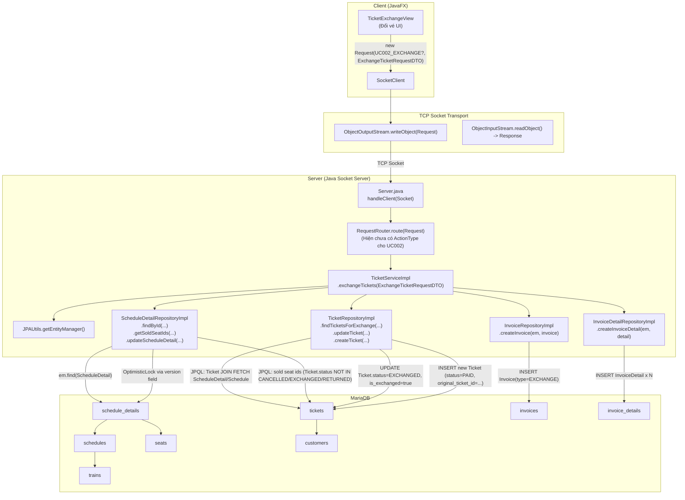
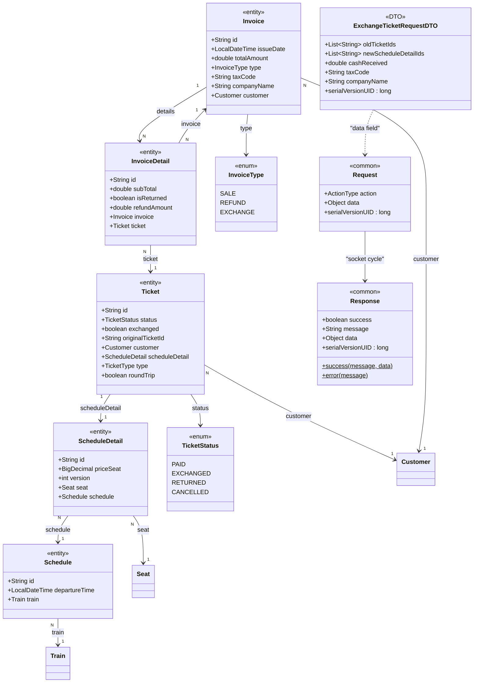

# Diagrams — UC002: Đổi vé

---

## 1. System Architecture



---

## 2. Sequence Diagram

```mermaid
sequenceDiagram
    actor Clerk as NhanVienBanVe
    participant UI as TicketExchangeView
    participant Socket as SocketClient
    participant Server as Server.java
    participant Router as RequestRouter
    participant Service as TicketServiceImpl
    participant TicketRepo as TicketRepositoryImpl
    participant SDRepo as ScheduleDetailRepositoryImpl
    participant InvRepo as InvoiceRepositoryImpl
    participant InvDetRepo as InvoiceDetailRepositoryImpl
    participant DB as MariaDB

    Clerk->>UI: Chọn "Đổi vé", chọn vé cũ + ghế/chuyến mới
    UI->>UI: new ExchangeTicketRequestDTO(oldTicketIds, newScheduleDetailIds, cashReceived, taxCode, companyName)
    UI->>Socket: sendRequest(new Request(UC002_EXCHANGE?, requestDTO))
    note over Socket,Router: Code hiện tại chưa có ActionType/RequestRouter cho UC002.\nSequence mô tả đường gọi tới TicketServiceImpl.exchangeTickets().
    Socket->>Server: ObjectOutputStream.writeObject(request)
    Server->>Router: route(request)
    Router->>Service: exchangeTickets(requestDTO)

    Service->>Service: ValidationUtils.validate(requestDTO)
    alt Lỗi validation (@NotEmpty/@Min)
        Service-->>Router: Response.error(DATA_INVALID_PREFIX + errors)
        Router-->>Server: Response
        Server-->>Socket: Response
        Socket-->>UI: Response(success=false)
    else oldTicketIds.size != newScheduleDetailIds.size
        Service-->>Router: Response.error(COUNT_MISMATCH)
        Router-->>Server: Response
        Server-->>Socket: Response
        Socket-->>UI: Response(success=false)
    else Hợp lệ
        Service->>Service: JPAUtils.getEntityManager() -> em
        Service->>Service: em.getTransaction().begin()

        Service->>TicketRepo: findTicketsForExchange(oldTicketIds, em)
        TicketRepo->>DB: JPQL SELECT Ticket t JOIN FETCH t.scheduleDetail sd JOIN FETCH sd.schedule WHERE t.id IN :ids
        DB-->>TicketRepo: List<Ticket> oldTickets
        TicketRepo-->>Service: oldTickets

        alt oldTickets.size != oldTicketIds.size
            note over Service,DB: Early return trong try; transaction vẫn active (code không rollback tường minh).
            Service-->>Router: Response.error(SOME_TICKETS_INVALID)
        else Đủ tickets
            Service->>Service: validateBusinessRules(oldTickets)
            alt ticket.isExchanged == true OR ticket.originalTicketId != null
                note over Service,DB: Early return; không rollback tường minh.
                Service-->>Router: Response.error(TICKET_ALREADY_EXCHANGED)
            else ticket.status != PAID
                note over Service,DB: Early return; không rollback tường minh.
                Service-->>Router: Response.error(TICKET_NOT_PAID)
            else < 24h trước giờ khởi hành
                note over Service,DB: Early return; không rollback tường minh.
                Service-->>Router: Response.error(EXCHANGE_TIME_EXPIRED)
            else Pass business rules
                loop Mỗi oldTicket
                    Service->>Service: oldTicket.exchanged=true; oldTicket.status=EXCHANGED
                    Service->>TicketRepo: updateTicket(em, oldTicket)
                    TicketRepo->>DB: em.merge(Ticket) -> UPDATE tickets
                    DB-->>TicketRepo: ok
                    TicketRepo-->>Service: ok
                end

                loop i = 0..n-1 (oldTicketId -> newScheduleDetailId)
                    Service->>SDRepo: findById(newSeatId, em)
                    SDRepo->>DB: em.find(ScheduleDetail, newSeatId) -> SELECT schedule_details
                    DB-->>SDRepo: ScheduleDetail? newSeat
                    SDRepo-->>Service: newSeat

                    alt newSeat == null
                        Service->>Service: throw IllegalArgumentException(scheduleDetailNotFound)
                    else newSeat tồn tại
                        Service->>SDRepo: getSoldSeatIds(em, scheduleId) [cache theo scheduleId]
                        SDRepo->>DB: JPQL SELECT sd.seat.id FROM Ticket t JOIN t.scheduleDetail sd WHERE sd.schedule.id=:scheduleId AND t.status NOT IN (CANCELLED,EXCHANGED,RETURNED)
                        DB-->>SDRepo: Set<String> soldSeatIds
                        SDRepo-->>Service: soldSeatIds

                        alt soldSeatIds contains newSeat.seat.id
                            note over Service,DB: Early return; không rollback tường minh.
                            Service-->>Router: Response.error(SEAT_NOT_AVAILABLE)
                        else Ghế còn trống
                            Service->>SDRepo: updateScheduleDetail(em, newSeat)
                            SDRepo->>DB: em.merge(ScheduleDetail versioned) -> optimistic lock check
                            DB-->>SDRepo: ok
                            SDRepo-->>Service: ok

                            Service->>TicketRepo: createTicket(newTicket{status=PAID, originalTicketId=oldTicket.id}, em)
                            TicketRepo->>DB: em.persist(Ticket) -> INSERT tickets
                            DB-->>TicketRepo: ok
                            TicketRepo-->>Service: ok
                        end
                    end
                end

                Service->>InvRepo: createInvoice(em, Invoice{type=EXCHANGE,totalAmount=finalAmount,taxCode,companyName})
                InvRepo->>DB: em.persist(Invoice) -> INSERT invoices
                DB-->>InvRepo: invoiceId
                InvRepo-->>Service: invoice

                loop Mỗi newTicket
                    Service->>InvDetRepo: createInvoiceDetail(em, InvoiceDetail{subTotal=finalAmount/n,isReturned=false})
                    InvDetRepo->>DB: em.persist(InvoiceDetail) -> INSERT invoice_details
                    DB-->>InvDetRepo: ok
                    InvDetRepo-->>Service: ok
                end

                Service->>Service: em.getTransaction().commit()
                Service-->>Router: Response.success(EXCHANGE_SUCCESS(finalAmount), null)
            end
        end

        Router-->>Server: Response
        Server-->>Socket: Response + out.reset()
        Socket-->>UI: Response
    end

    alt OptimisticLockException (xung dot version khi chiem ghe)
        Service->>Service: rollbackQuietly(transaction)
        Service-->>Router: Response.error(DATA_CONFLICT)
    else Exception khác
        Service->>Service: rollbackQuietly(transaction)
        Service-->>Router: Response.error(EXCHANGE_FAILED_PREFIX + e.message)
    end
```

---

## 3. Class Diagram


