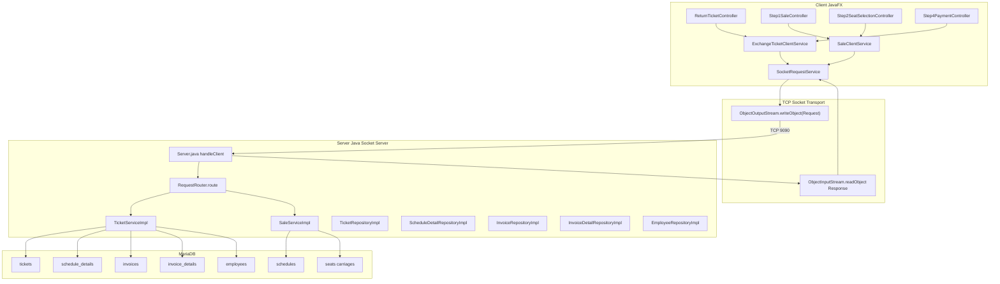
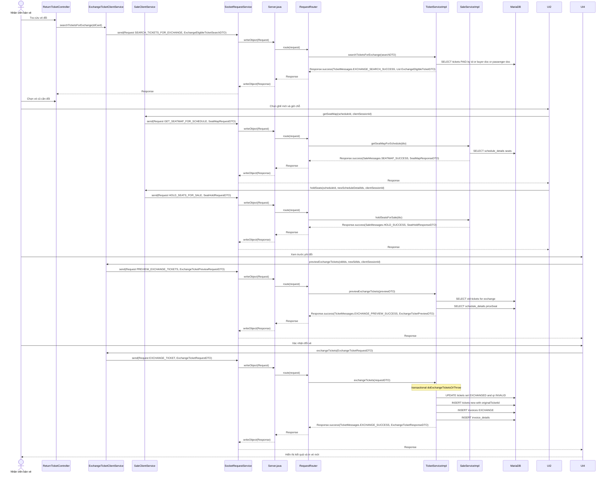
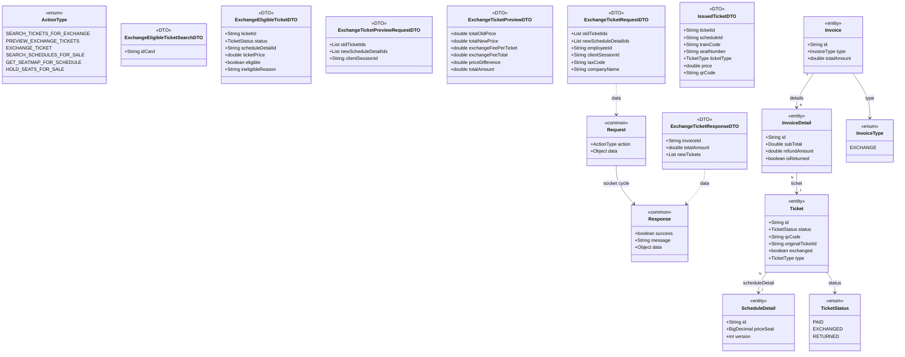

# Diagrams — UC002: Đổi vé

---

## 1. System Architecture

```mermaid
graph TB
    subgraph CLIENT ["Client JavaFX"]
        UI0["ReturnTicketController"]
        UI1["Step1SaleController"]
        UI2["Step2SeatSelectionController"]
        UI4["Step4PaymentController"]
        EXS["ExchangeTicketClientService"]
        SALE["SaleClientService"]
        SC["SocketRequestService"]
    end

    subgraph TRANSPORT ["TCP Socket Transport"]
        OOS["ObjectOutputStream.writeObject(Request)"]
        OIS["ObjectInputStream.readObject Response"]
    end

    subgraph SERVER ["Server Java Socket Server"]
        SRV["Server.java handleClient"]
        RR["RequestRouter.route"]
        TSVC["TicketServiceImpl"]
        SSVC["SaleServiceImpl"]
        REPO1["TicketRepositoryImpl"]
        REPO2["ScheduleDetailRepositoryImpl"]
        REPO3["InvoiceRepositoryImpl"]
        REPO4["InvoiceDetailRepositoryImpl"]
        REPO5["EmployeeRepositoryImpl"]
    end

    subgraph DB ["MariaDB"]
        T_TK["tickets"]
        T_SCHD["schedule_details"]
        T_SCH["schedules"]
        T_SEAT["seats carriages"]
        T_INV["invoices"]
        T_DET["invoice_details"]
        T_EMP["employees"]
    end

    UI0 --> EXS
    UI1 --> SALE
    UI2 --> SALE
    UI4 --> EXS
    EXS --> SC
    SALE --> SC
    SC --> OOS
    OOS -- "TCP 9090" --> SRV
    SRV --> RR
    RR --> TSVC
    RR --> SSVC

    TSVC --> T_TK
    TSVC --> T_SCHD
    TSVC --> T_INV
    TSVC --> T_DET
    TSVC --> T_EMP
    SSVC --> T_SCH
    SSVC --> T_SEAT

    SRV --> OIS
    OIS --> SC
```

---

## 2. Sequence Diagram

```mermaid
sequenceDiagram
    actor Staff as Nhân viên bán vé
    participant UI0 as ReturnTicketController
    participant EXS as ExchangeTicketClientService
    participant SALE as SaleClientService
    participant Socket as SocketRequestService
    participant Server as Server.java
    participant Router as RequestRouter
    participant TicketSvc as TicketServiceImpl
    participant SaleSvc as SaleServiceImpl
    participant DB as MariaDB

    Staff->>UI0: Tra cứu vé đổi
    UI0->>EXS: searchTicketsForExchange(idCard)
    EXS->>Socket: send(Request SEARCH_TICKETS_FOR_EXCHANGE, ExchangeEligibleTicketSearchDTO)
    Socket->>Server: writeObject(Request)
    Server->>Router: route(request)
    Router->>TicketSvc: searchTicketsForExchange(searchDTO)
    TicketSvc->>DB: SELECT tickets PAID by id or buyer doc or passenger doc
    TicketSvc-->>Router: Response.success(TicketMessages.EXCHANGE_SEARCH_SUCCESS, List ExchangeEligibleTicketDTO)
    Router-->>Server: Response
    Server-->>Socket: writeObject(Response)
    Socket-->>UI0: Response

    Staff->>UI0: Chọn vé cũ cần đổi
    Staff->>UI2: Chọn ghế mới và giữ chỗ
    UI2->>SALE: getSeatMap(scheduleId, clientSessionId)
    SALE->>Socket: send(Request GET_SEATMAP_FOR_SCHEDULE, SeatMapRequestDTO)
    Socket->>Server: writeObject(Request)
    Server->>Router: route(request)
    Router->>SaleSvc: getSeatMapForSchedule(dto)
    SaleSvc->>DB: SELECT schedule_details seats
    SaleSvc-->>Router: Response.success(SaleMessages.SEATMAP_SUCCESS, SeatMapResponseDTO)
    Router-->>Server: Response
    Server-->>Socket: writeObject(Response)
    Socket-->>UI2: Response

    UI2->>SALE: holdSeats(scheduleId, newScheduleDetailIds, clientSessionId)
    SALE->>Socket: send(Request HOLD_SEATS_FOR_SALE, SeatHoldRequestDTO)
    Socket->>Server: writeObject(Request)
    Server->>Router: route(request)
    Router->>SaleSvc: holdSeatsForSale(dto)
    SaleSvc-->>Router: Response.success(SaleMessages.HOLD_SUCCESS, SeatHoldResponseDTO)
    Router-->>Server: Response
    Server-->>Socket: writeObject(Response)
    Socket-->>UI2: Response

    Staff->>UI4: Xem trước phí đổi
    UI4->>EXS: previewExchangeTickets(oldIds, newSdIds, clientSessionId)
    EXS->>Socket: send(Request PREVIEW_EXCHANGE_TICKETS, ExchangeTicketPreviewRequestDTO)
    Socket->>Server: writeObject(Request)
    Server->>Router: route(request)
    Router->>TicketSvc: previewExchangeTickets(previewDTO)
    TicketSvc->>DB: SELECT old tickets for exchange
    TicketSvc->>DB: SELECT schedule_details priceSeat
    TicketSvc-->>Router: Response.success(TicketMessages.EXCHANGE_PREVIEW_SUCCESS, ExchangeTicketPreviewDTO)
    Router-->>Server: Response
    Server-->>Socket: writeObject(Response)
    Socket-->>UI4: Response

    Staff->>UI4: Xác nhận đổi vé
    UI4->>EXS: exchangeTickets(ExchangeTicketRequestDTO)
    EXS->>Socket: send(Request EXCHANGE_TICKET, ExchangeTicketRequestDTO)
    Socket->>Server: writeObject(Request)
    Server->>Router: route(request)
    Router->>TicketSvc: exchangeTickets(requestDTO)
    note over TicketSvc: transactional doExchangeTicketsOrThrow

    TicketSvc->>DB: UPDATE tickets set EXCHANGED and qr INVALID
    TicketSvc->>DB: INSERT tickets new with originalTicketId
    TicketSvc->>DB: INSERT invoices EXCHANGE
    TicketSvc->>DB: INSERT invoice_details
    TicketSvc-->>Router: Response.success(TicketMessages.EXCHANGE_SUCCESS, ExchangeTicketResponseDTO)
    Router-->>Server: Response
    Server-->>Socket: writeObject(Response)
    Socket-->>UI4: Response

    UI4-->>Staff: Hiển thị kết quả và in vé mới
```

---

## 3. Class Diagram

```mermaid
classDiagram
    class ActionType {
        <<enum>>
        SEARCH_TICKETS_FOR_EXCHANGE
        PREVIEW_EXCHANGE_TICKETS
        EXCHANGE_TICKET
        SEARCH_SCHEDULES_FOR_SALE
        GET_SEATMAP_FOR_SCHEDULE
        HOLD_SEATS_FOR_SALE
    }

    class Request {
        <<common>>
        +ActionType action
        +Object data
    }

    class Response {
        <<common>>
        +boolean success
        +String message
        +Object data
    }

    class ExchangeEligibleTicketSearchDTO {
        <<DTO>>
        +String idCard
    }

    class ExchangeEligibleTicketDTO {
        <<DTO>>
        +String ticketId
        +TicketStatus status
        +String scheduleDetailId
        +double ticketPrice
        +boolean eligible
        +String ineligibleReason
    }

    class ExchangeTicketPreviewRequestDTO {
        <<DTO>>
        +List oldTicketIds
        +List newScheduleDetailIds
        +String clientSessionId
    }

    class ExchangeTicketPreviewDTO {
        <<DTO>>
        +double totalOldPrice
        +double totalNewPrice
        +double exchangeFeePerTicket
        +double exchangeFeeTotal
        +double priceDifference
        +double totalAmount
    }

    class ExchangeTicketRequestDTO {
        <<DTO>>
        +List oldTicketIds
        +List newScheduleDetailIds
        +String employeeId
        +String clientSessionId
        +String taxCode
        +String companyName
    }

    class ExchangeTicketResponseDTO {
        <<DTO>>
        +String invoiceId
        +double totalAmount
        +List newTickets
    }

    class IssuedTicketDTO {
        <<DTO>>
        +String ticketId
        +String scheduleId
        +String trainCode
        +String seatNumber
        +TicketType ticketType
        +double price
        +String qrCode
    }

    class Ticket {
        <<entity>>
        +String id
        +TicketStatus status
        +String qrCode
        +String originalTicketId
        +boolean exchanged
        +TicketType type
    }

    class ScheduleDetail {
        <<entity>>
        +String id
        +BigDecimal priceSeat
        +int version
    }

    class Invoice {
        <<entity>>
        +String id
        +InvoiceType type
        +double totalAmount
    }

    class InvoiceDetail {
        <<entity>>
        +String id
        +Double subTotal
        +double refundAmount
        +boolean isReturned
    }

    class TicketStatus {
        <<enum>>
        PAID
        EXCHANGED
        RETURNED
    }

    class InvoiceType {
        <<enum>>
        EXCHANGE
    }

    Ticket "N" --> "1" ScheduleDetail : scheduleDetail
    Invoice "1" --> "N" InvoiceDetail : details
    InvoiceDetail "N" --> "1" Ticket : ticket
    Ticket --> TicketStatus : status
    Invoice --> InvoiceType : type

    ExchangeTicketRequestDTO ..> Request : data
    Request --> Response : socket cycle
    ExchangeTicketResponseDTO ..> Response : data
```

---

## Notes
- Không có uncertainty đáng kể.

