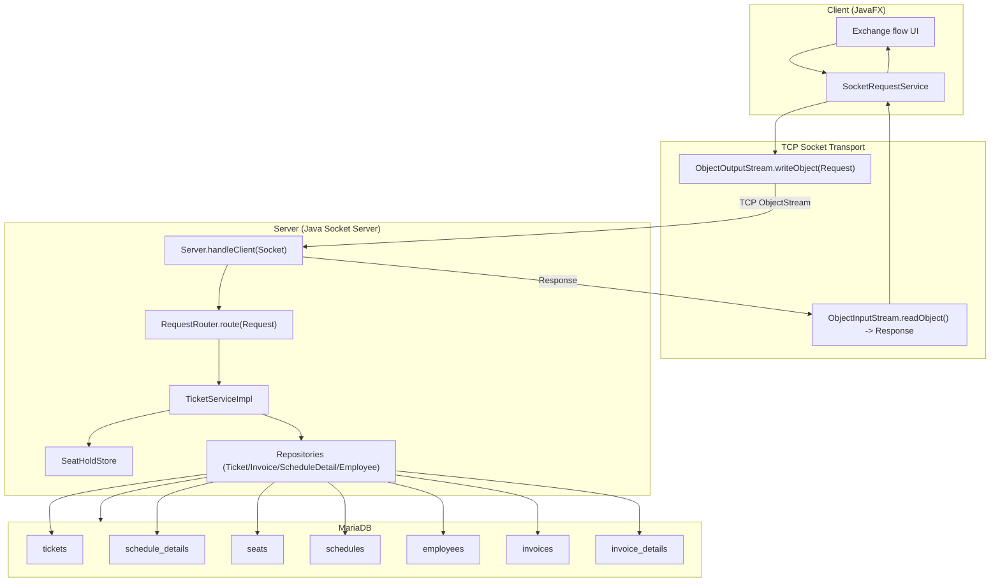
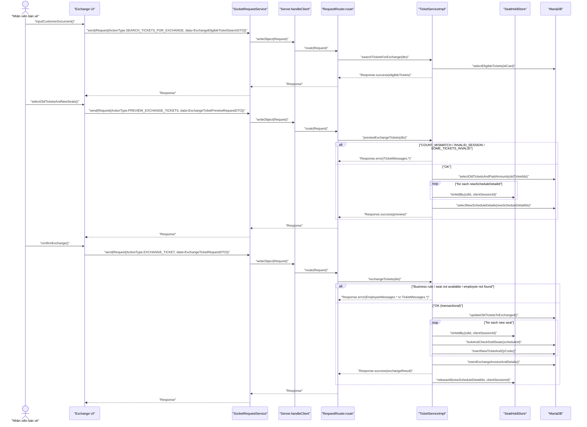

# Sequence Diagrams — UC002: Đổi vé

## 1) System Architecture

```mermaid
graph TB
  subgraph CLIENT["Client (JavaFX)"]
    UI["Exchange flow UI"]
    SocketSvc["SocketRequestService"]
  end

  subgraph TRANSPORT["TCP Socket Transport"]
    OOS["ObjectOutputStream.writeObject(Request)"]
    OIS["ObjectInputStream.readObject() -> Response"]
  end

  subgraph SERVER["Server (Java Socket Server)"]
    Handler["Server.handleClient(Socket)"]
    Router["RequestRouter.route(Request)"]
    TicketSvc["TicketServiceImpl"]
    HoldStore["SeatHoldStore"]
    Repos["Repositories (Ticket/Invoice/ScheduleDetail/Employee)"]
  end

  subgraph DB["MariaDB"]
    Tickets["tickets"]
    ScheduleDetails["schedule_details"]
    Seats["seats"]
    Schedules["schedules"]
    Employees["employees"]
    Invoices["invoices"]
    InvoiceDetails["invoice_details"]
  end

  UI --> SocketSvc --> OOS
  OOS -->|"TCP ObjectStream"| Handler --> Router --> TicketSvc
  TicketSvc --> HoldStore
  TicketSvc --> Repos --> DB
  Repos --> Tickets
  Repos --> ScheduleDetails
  Repos --> Seats
  Repos --> Schedules
  Repos --> Employees
  Repos --> Invoices
  Repos --> InvoiceDetails
  Handler -->|"Response"| OIS --> SocketSvc --> UI
```

---

## 2) Sequence Diagram

```mermaid
sequenceDiagram
  actor Clerk as "Nhân viên bán vé"
  participant UI as "Exchange UI"
  participant Socket as "SocketRequestService"
  participant Server as "Server.handleClient"
  participant Router as "RequestRouter.route"
  participant TicketSvc as "TicketServiceImpl"
  participant Hold as "SeatHoldStore"
  participant DB as "MariaDB"

  Clerk->>UI: "inputCustomerDocument()"
  UI->>Socket: "send(Request{ActionType.SEARCH_TICKETS_FOR_EXCHANGE, data=ExchangeEligibleTicketSearchDTO})"
  Socket->>Server: "writeObject(Request)"
  Server->>Router: "route(Request)"
  Router->>TicketSvc: "searchTicketsForExchange(dto)"
  TicketSvc->>DB: "selectEligibleTickets(idCard)"
  TicketSvc-->>Router: "Response.success(eligibleTickets)"
  Router-->>Socket: "Response"
  Socket-->>UI: "Response"

  Clerk->>UI: "selectOldTicketsAndNewSeats()"
  UI->>Socket: "send(Request{ActionType.PREVIEW_EXCHANGE_TICKETS, data=ExchangeTicketPreviewRequestDTO})"
  Socket->>Server: "writeObject(Request)"
  Server->>Router: "route(Request)"
  Router->>TicketSvc: "previewExchangeTickets(dto)"
  alt "COUNT_MISMATCH / INVALID_SESSION / SOME_TICKETS_INVALID"
    TicketSvc-->>Router: "Response.error(TicketMessages.*)"
  else "OK"
    TicketSvc->>DB: "selectOldTicketsAndPaidAmounts(oldTicketIds)"
    loop "for each newScheduleDetailId"
      TicketSvc->>Hold: "isHeldBy(sdId, clientSessionId)"
    end
    TicketSvc->>DB: "selectNewScheduleDetails(newScheduleDetailIds)"
    TicketSvc-->>Router: "Response.success(preview)"
  end
  Router-->>Socket: "Response"
  Socket-->>UI: "Response"

  Clerk->>UI: "confirmExchange()"
  UI->>Socket: "send(Request{ActionType.EXCHANGE_TICKET, data=ExchangeTicketRequestDTO})"
  Socket->>Server: "writeObject(Request)"
  Server->>Router: "route(Request)"
  Router->>TicketSvc: "exchangeTickets(dto)"
  alt "Business rule / seat not available / employee not found"
    TicketSvc-->>Router: "Response.error(EmployeeMessages.* or TicketMessages.*)"
  else "OK (transactional)"
    TicketSvc->>DB: "updateOldTicketsToExchanged()"
    loop "for each new seat"
      TicketSvc->>Hold: "isHeldBy(sdId, clientSessionId)"
      TicketSvc->>DB: "lockAndCheckSoldSeats(scheduleId)"
      TicketSvc->>DB: "insertNewTicketAndQrCode()"
    end
    TicketSvc->>DB: "insertExchangeInvoiceAndDetails()"
    TicketSvc-->>Router: "Response.success(exchangeResult)"
    TicketSvc->>Hold: "releaseAll(newScheduleDetailIds, clientSessionId)"
  end
  Router-->>Socket: "Response"
  Socket-->>UI: "Response"
```
