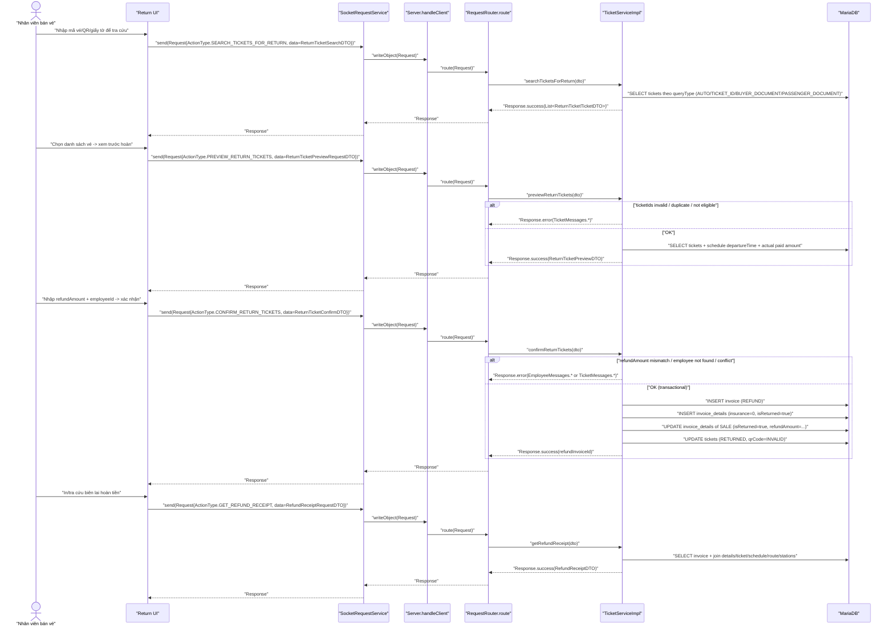

# Sequence Diagrams — UC003: Trả vé (Hoàn vé)

## 1) System Architecture

```mermaid
graph TB
  subgraph CLIENT["Client (JavaFX)"]
    UI["\"Return flow UI\""]
    SocketSvc["\"SocketRequestService\""]
  end

  subgraph TRANSPORT["TCP Socket Transport"]
    OOS["\"ObjectOutputStream.writeObject(Request)\""]
    OIS["\"ObjectInputStream.readObject() -> Response\""]
  end

  subgraph SERVER["Server (Java Socket Server)"]
    Handler["\"Server.handleClient(Socket)\""]
    Router["\"RequestRouter.route(Request)\""]
    TicketSvc["\"TicketServiceImpl\""]
    Repos["\"Repositories (Ticket/Invoice/InvoiceDetail/Employee)\""]
  end

  subgraph DB["MariaDB"]
    Tickets["\"tickets\""]
    Invoices["\"invoices\""]
    InvoiceDetails["\"invoice_details\""]
    Employees["\"employees\""]
    ScheduleDetails["\"schedule_details\""]
    Schedules["\"schedules\""]
    Routes["\"routes\""]
    Stations["\"stations\""]
  end

  UI --> SocketSvc --> OOS
  OOS -- "\"TCP ObjectStream\"" --> Handler --> Router --> TicketSvc
  TicketSvc --> Repos --> DB
  Repos --> Tickets
  Repos --> Invoices
  Repos --> InvoiceDetails
  Repos --> Employees
  Repos --> ScheduleDetails
  Repos --> Schedules
  Repos --> Routes
  Repos --> Stations
  Handler -- "\"Response\"" --> OIS --> SocketSvc --> UI
```

---

## 2) Sequence Diagram



