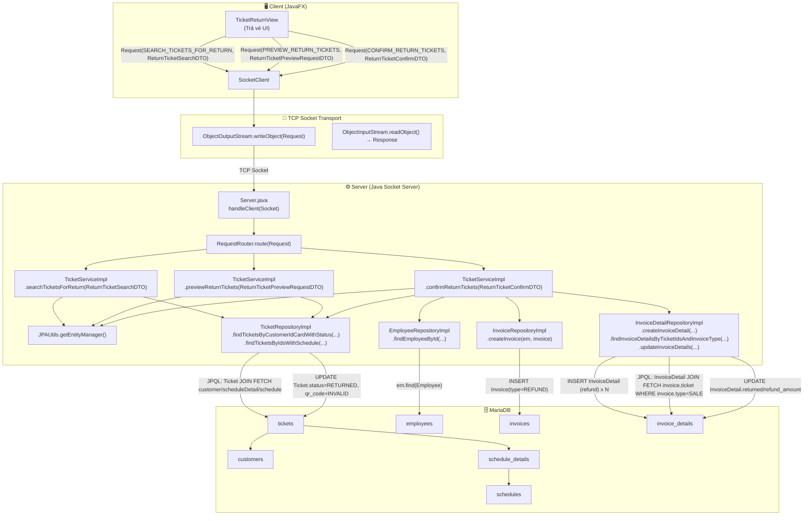
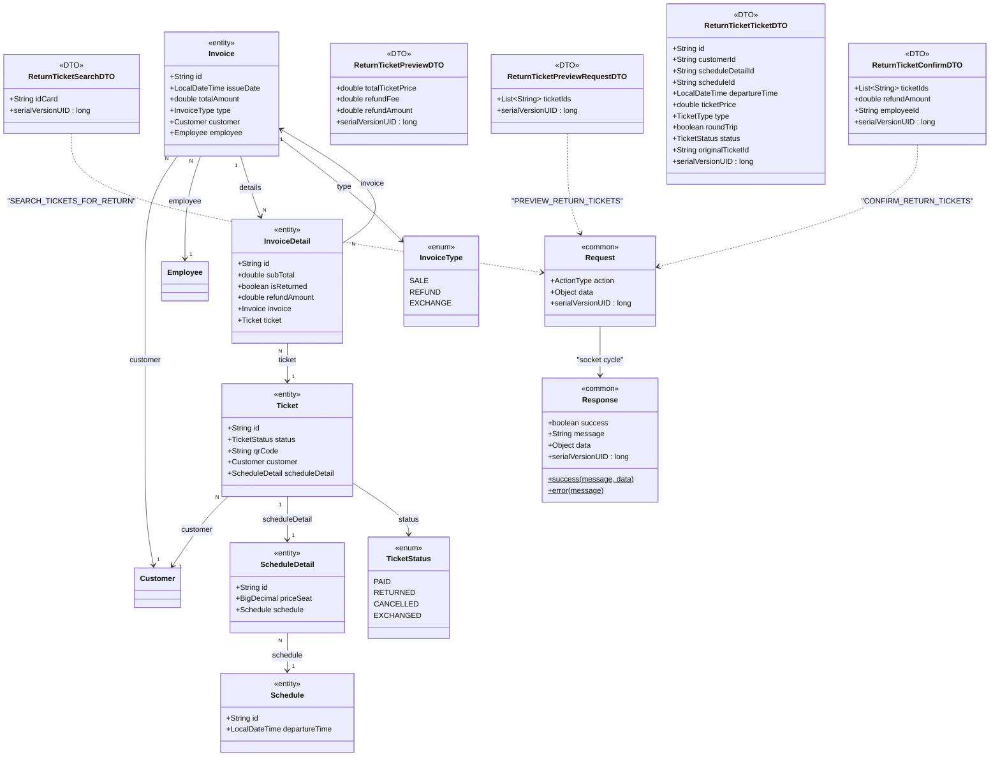

# Diagrams — UC003: Trả vé

---

## 1. System Architecture



---

## 2. Sequence Diagram

```mermaid
sequenceDiagram
    actor Clerk as 👤 Nhân viên bán vé
    participant UI as TicketReturnView
    participant Socket as SocketClient
    participant Server as Server.java
    participant Router as RequestRouter
    participant Service as TicketServiceImpl
    participant TicketRepo as TicketRepositoryImpl
    participant EmpRepo as EmployeeRepositoryImpl
    participant InvRepo as InvoiceRepositoryImpl
    participant InvDetRepo as InvoiceDetailRepositoryImpl
    participant DB as MariaDB

    opt Tìm vé theo CCCD/Hộ chiếu (SEARCH_TICKETS_FOR_RETURN)
        Clerk->>UI: Nhập CCCD/Hộ chiếu, bấm "Tìm kiếm"
        UI->>UI: new ReturnTicketSearchDTO(idCard)
        UI->>Socket: sendRequest(new Request(SEARCH_TICKETS_FOR_RETURN, searchDTO))
        Socket->>Server: ObjectOutputStream.writeObject(request)
        Server->>Router: route(request)
        Router->>Service: searchTicketsForReturn(searchDTO)

        Service->>Service: ValidationUtils.validate(searchDTO)
        alt Lỗi validation (@NotEmpty)
            Service-->>Router: Response.error(DATA_INVALID_PREFIX + errors)
        else Hợp lệ
            Service->>Service: JPAUtils.getEntityManager() → em
            Service->>TicketRepo: findTicketsByCustomerIdCardWithStatus(em, idCard, PAID)
            TicketRepo->>DB: JPQL SELECT Ticket t JOIN FETCH t.customer c JOIN FETCH t.scheduleDetail sd JOIN FETCH sd.schedule s WHERE (c.idCard=:idCard OR c.passport=:idCard) AND t.status=:status
            DB-->>TicketRepo: List<Ticket>
            TicketRepo-->>Service: tickets
            Service-->>Router: Response.success(FIND_SUCCESS, List<ReturnTicketTicketDTO>)
        end

        Router-->>Server: Response
        Server-->>Socket: Response + out.reset()
        Socket-->>UI: Response
    end

    opt Xem trước phí/tiền hoàn (PREVIEW_RETURN_TICKETS)
        Clerk->>UI: Chọn ticketIds, bấm "Xem trước"
        UI->>UI: new ReturnTicketPreviewRequestDTO(ticketIds)
        UI->>Socket: sendRequest(new Request(PREVIEW_RETURN_TICKETS, previewDTO))
        Socket->>Server: ObjectOutputStream.writeObject(request)
        Server->>Router: route(request)
        Router->>Service: previewReturnTickets(previewDTO)

        Service->>Service: ValidationUtils.validate(previewDTO)
        alt Lỗi validation (@NotEmpty)
            Service-->>Router: Response.error(DATA_INVALID_PREFIX + errors)
        else Hợp lệ
            Service->>Service: computeReturn(em, ticketIds)
            Service->>Service: validate distinctIds + load tickets
            Service->>TicketRepo: findTicketsByIdsWithSchedule(em, distinctIds)
            TicketRepo->>DB: JPQL SELECT Ticket t JOIN FETCH t.customer c JOIN FETCH t.scheduleDetail sd JOIN FETCH sd.schedule s WHERE t.id IN :ids
            DB-->>TicketRepo: List<Ticket> tickets
            TicketRepo-->>Service: tickets

            loop Mỗi ticket
                Service->>Service: status == PAID ?
                Service->>Service: scheduleDetail/schedule/departureTime != null ?
                Service->>Service: minutesToDeparture >= 4h ?
                Service->>Service: feeRate = (minutesToDeparture < 24h ? 20% : 10%)
                Service->>Service: fee = max(price*feeRate, 10_000); fee<=price
                Service->>Service: refundAmount = price - fee
            end
            Service-->>Router: Response.success(PREVIEW_SUCCESS, ReturnTicketPreviewDTO{totalTicketPrice,refundFee,refundAmount})
        end

        Router-->>Server: Response
        Server-->>Socket: Response + out.reset()
        Socket-->>UI: Response
    end

    Clerk->>UI: Bấm "Xác nhận trả vé" (CONFIRM_RETURN_TICKETS)
    UI->>UI: new ReturnTicketConfirmDTO(ticketIds, refundAmount, employeeId)
    UI->>Socket: sendRequest(new Request(CONFIRM_RETURN_TICKETS, confirmDTO))
    Socket->>Server: ObjectOutputStream.writeObject(request)
    Server->>Router: route(request)
    Router->>Service: confirmReturnTickets(confirmDTO)

    Service->>Service: ValidationUtils.validate(confirmDTO)
    alt Lỗi validation (@NotEmpty/@Min)
        Service-->>Router: Response.error(DATA_INVALID_PREFIX + errors)
    else Hợp lệ
        Service->>Service: JPAUtils.getEntityManager() → em
        Service->>Service: em.getTransaction().begin()

        Service->>Service: computeReturn(em, ticketIds)
        alt |confirm.refundAmount - computed.totalRefundAmount| > 1.0
            note over Service,DB: Early return trong try; transaction vẫn active (code không rollback tường minh).
            Service-->>Router: Response.error(REFUND_AMOUNT_MISMATCH)
        else refundAmount khớp
            Service->>EmpRepo: findEmployeeById(em, employeeId)
            EmpRepo->>DB: em.find(Employee, employeeId) → SELECT employees
            DB-->>EmpRepo: Employee? employee
            EmpRepo-->>Service: employee

            alt employee == null
                note over Service,DB: Early return; không rollback tường minh.
                Service-->>Router: Response.error(EmployeeMessages.notFoundById)
            else employee tồn tại
                Service->>Service: check tất cả ticket thuộc cùng customer
                alt Customer mismatch
                    note over Service,DB: Early return; không rollback tường minh.
                    Service-->>Router: Response.error(CUSTOMER_MISMATCH)
                else Cùng customer
                    Service->>InvRepo: createInvoice(em, Invoice{type=REFUND,totalAmount=totalRefundAmount,employee})
                    InvRepo->>DB: em.persist(Invoice) → INSERT invoices
                    DB-->>InvRepo: refundInvoiceId
                    InvRepo-->>Service: refundInvoice

                    loop Mỗi ticket (refund detail)
                        Service->>InvDetRepo: createInvoiceDetail(em, InvoiceDetail{isReturned=true, refundAmount, subTotal=ticketPrice})
                        InvDetRepo->>DB: em.persist(InvoiceDetail) → INSERT invoice_details
                        DB-->>InvDetRepo: ok
                        InvDetRepo-->>Service: ok
                    end

                    Service->>InvDetRepo: findInvoiceDetailsByTicketIdsAndInvoiceType(em, ticketIds, SALE)
                    InvDetRepo->>DB: JPQL SELECT d FROM InvoiceDetail d JOIN FETCH d.invoice i JOIN FETCH d.ticket t WHERE t.id IN :ticketIds AND i.type=:invoiceType
                    DB-->>InvDetRepo: List<InvoiceDetail> saleDetails
                    InvDetRepo-->>Service: saleDetails

                    loop Mỗi saleDetail
                        Service->>Service: saleDetail.returned=true; saleDetail.refundAmount=refundAmountByTicketId[ticketId]
                    end
                    Service->>InvDetRepo: updateInvoiceDetails(em, saleDetails)
                    InvDetRepo->>DB: em.merge(InvoiceDetail) x N → UPDATE invoice_details
                    DB-->>InvDetRepo: ok
                    InvDetRepo-->>Service: ok

                    loop Mỗi ticket
                        Service->>Service: ticket.status=RETURNED; ticket.qrCode="INVALID"
                    end
                    Service->>TicketRepo: updateTickets(em, tickets)
                    TicketRepo->>DB: em.merge(Ticket) x N → UPDATE tickets
                    DB-->>TicketRepo: ok
                    TicketRepo-->>Service: ok

                    Service->>Service: em.getTransaction().commit()
                    Service-->>Router: Response.success(RETURN_SUCCESS, refundInvoiceId)
                end
            end
        end

        Router-->>Server: Response
        Server-->>Socket: Response + out.reset()
        Socket-->>UI: Response
    end

    alt IllegalArgumentException (từ computeReturn: ids trống/trùng/không hợp lệ/không đủ điều kiện thời gian)
        Service->>Service: rollbackQuietly(tx)
        Service-->>Router: Response.error(e.message)
    else OptimisticLockException
        Service->>Service: rollbackQuietly(tx)
        Service-->>Router: Response.error(DATA_CONFLICT)
    else Exception khác
        Service->>Service: rollbackQuietly(tx)
        Service-->>Router: Response.error(RETURN_FAILED_PREFIX + e.message)
    end
```

---

## 3. Class Diagram


