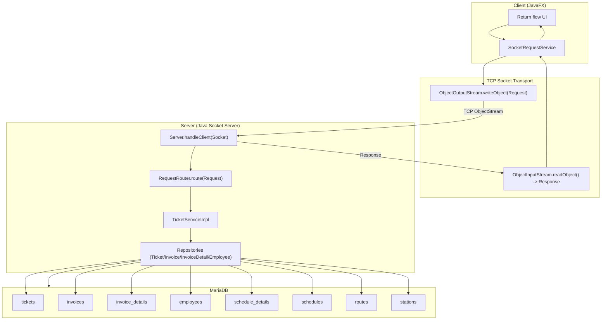
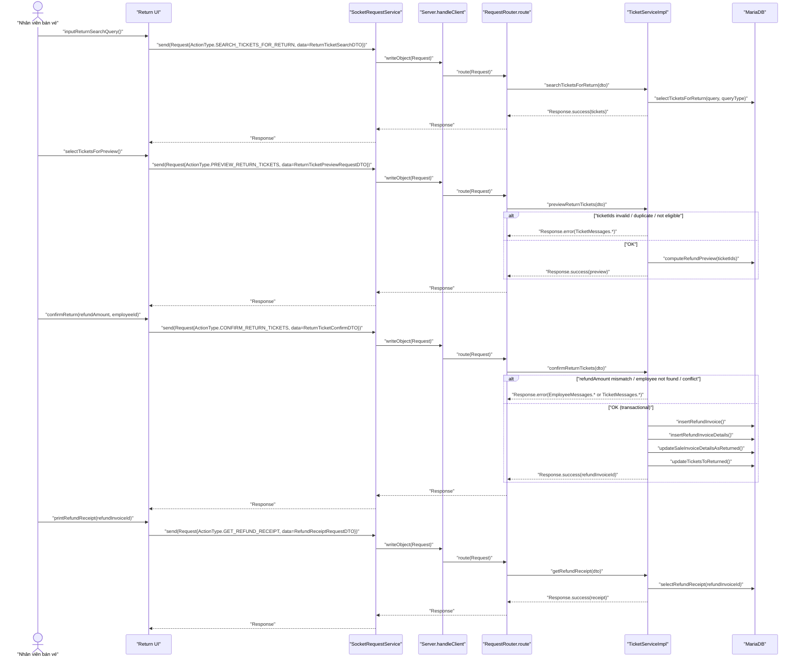

# Sequence Diagrams — UC003: Trả vé (Hoàn vé)

## 1) System Architecture

```mermaid
graph TB
  subgraph CLIENT["Client (JavaFX)"]
    UI["Return flow UI"]
    SocketSvc["SocketRequestService"]
  end

  subgraph TRANSPORT["TCP Socket Transport"]
    OOS["ObjectOutputStream.writeObject(Request)"]
    OIS["ObjectInputStream.readObject() -> Response"]
  end

  subgraph SERVER["Server (Java Socket Server)"]
    Handler["Server.handleClient(Socket)"]
    Router["RequestRouter.route(Request)"]
    TicketSvc["TicketServiceImpl"]
    Repos["Repositories (Ticket/Invoice/InvoiceDetail/Employee)"]
  end

  subgraph DB["MariaDB"]
    Tickets["tickets"]
    Invoices["invoices"]
    InvoiceDetails["invoice_details"]
    Employees["employees"]
    ScheduleDetails["schedule_details"]
    Schedules["schedules"]
    Routes["routes"]
    Stations["stations"]
  end

  UI --> SocketSvc --> OOS
  OOS -->|"TCP ObjectStream"| Handler --> Router --> TicketSvc
  TicketSvc --> Repos --> DB
  Repos --> Tickets
  Repos --> Invoices
  Repos --> InvoiceDetails
  Repos --> Employees
  Repos --> ScheduleDetails
  Repos --> Schedules
  Repos --> Routes
  Repos --> Stations
  Handler -->|"Response"| OIS --> SocketSvc --> UI
```

---

## 2) Sequence Diagram

```mermaid
sequenceDiagram
  actor Clerk as "Nhân viên bán vé"
  participant UI as "Return UI"
  participant Socket as "SocketRequestService"
  participant Server as "Server.handleClient"
  participant Router as "RequestRouter.route"
  participant TicketSvc as "TicketServiceImpl"
  participant DB as "MariaDB"

  Clerk->>UI: "inputReturnSearchQuery()"
  UI->>Socket: "send(Request{ActionType.SEARCH_TICKETS_FOR_RETURN, data=ReturnTicketSearchDTO})"
  Socket->>Server: "writeObject(Request)"
  Server->>Router: "route(Request)"
  Router->>TicketSvc: "searchTicketsForReturn(dto)"
  TicketSvc->>DB: "selectTicketsForReturn(query, queryType)"
  TicketSvc-->>Router: "Response.success(tickets)"
  Router-->>Socket: "Response"
  Socket-->>UI: "Response"

  Clerk->>UI: "selectTicketsForPreview()"
  UI->>Socket: "send(Request{ActionType.PREVIEW_RETURN_TICKETS, data=ReturnTicketPreviewRequestDTO})"
  Socket->>Server: "writeObject(Request)"
  Server->>Router: "route(Request)"
  Router->>TicketSvc: "previewReturnTickets(dto)"
  alt "ticketIds invalid / duplicate / not eligible"
    TicketSvc-->>Router: "Response.error(TicketMessages.*)"
  else "OK"
    TicketSvc->>DB: "computeRefundPreview(ticketIds)"
    TicketSvc-->>Router: "Response.success(preview)"
  end
  Router-->>Socket: "Response"
  Socket-->>UI: "Response"

  Clerk->>UI: "confirmReturn(refundAmount, employeeId)"
  UI->>Socket: "send(Request{ActionType.CONFIRM_RETURN_TICKETS, data=ReturnTicketConfirmDTO})"
  Socket->>Server: "writeObject(Request)"
  Server->>Router: "route(Request)"
  Router->>TicketSvc: "confirmReturnTickets(dto)"
  alt "refundAmount mismatch / employee not found / conflict"
    TicketSvc-->>Router: "Response.error(EmployeeMessages.* or TicketMessages.*)"
  else "OK (transactional)"
    TicketSvc->>DB: "insertRefundInvoice()"
    TicketSvc->>DB: "insertRefundInvoiceDetails()"
    TicketSvc->>DB: "updateSaleInvoiceDetailsAsReturned()"
    TicketSvc->>DB: "updateTicketsToReturned()"
    TicketSvc-->>Router: "Response.success(refundInvoiceId)"
  end
  Router-->>Socket: "Response"
  Socket-->>UI: "Response"

  Clerk->>UI: "printRefundReceipt(refundInvoiceId)"
  UI->>Socket: "send(Request{ActionType.GET_REFUND_RECEIPT, data=RefundReceiptRequestDTO})"
  Socket->>Server: "writeObject(Request)"
  Server->>Router: "route(Request)"
  Router->>TicketSvc: "getRefundReceipt(dto)"
  TicketSvc->>DB: "selectRefundReceipt(refundInvoiceId)"
  TicketSvc-->>Router: "Response.success(receipt)"
  Router-->>Socket: "Response"
  Socket-->>UI: "Response"
```
