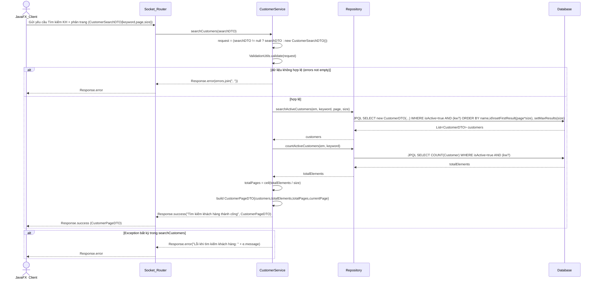

# Usecase 004: Quản lý Khách hàng (UC004)

Reverse-engineered từ:
- `src/main/java/vn/edu/iuh/fit/server/service/impl/CustomerServiceImpl.java`
- `src/main/java/vn/edu/iuh/fit/server/repository/CustomerRepository.java`
- `src/main/java/vn/edu/iuh/fit/server/repository/impl/CustomerRepositoryImpl.java`

> Lưu ý: Code hiện tại chưa thấy `ActionType`/`RequestRouter` mapping cho các API Customer. Các sequence dưới đây mô tả luồng chuẩn “JavaFX_Client → Socket_Router → CustomerService.*(...)” theo kiến trúc hệ thống.

## UC004-1: Thêm Khách hàng (check trùng `idCard`/`email`)

```mermaid
sequenceDiagram
    actor JavaFX_Client
    participant Socket_Router
    participant CustomerService
    participant Repository
    participant Database

    JavaFX_Client->>Socket_Router: Gửi yêu cầu Thêm khách hàng (CustomerDTO, customerId phải rỗng)
    Socket_Router->>CustomerService: createCustomer(customerDTO)

    CustomerService->>CustomerService: ValidationUtils.validate(customerDTO)
    alt dữ liệu không hợp lệ (errors not empty)
        CustomerService-->>Socket_Router: Response.error("Dữ liệu không hợp lệ: " + errors)
        Socket_Router-->>JavaFX_Client: Response.error
    else customerDTO.customerId != null && not blank
        CustomerService-->>Socket_Router: Response.error("Customer ID phải để trống khi thêm mới")
        Socket_Router-->>JavaFX_Client: Response.error
    else hợp lệ
        CustomerService->>Repository: existsByIdCard(em, idCard, excludeCustomerId=null)
        Repository->>Database: JPQL SELECT COUNT(Customer) WHERE idCard = :idCard
        Database-->>Repository: count
        Repository-->>CustomerService: true/false

        alt idCard đã tồn tại
            note over CustomerService,Database: Early return trong try; transaction chưa begin.
            CustomerService-->>Socket_Router: Response.error("Số CCCD này đã được đăng ký...")
            Socket_Router-->>JavaFX_Client: Response.error
        else idCard OK
            opt email != null && not blank
                CustomerService->>Repository: existsByEmail(em, email, excludeCustomerId=null)
                Repository->>Database: JPQL SELECT COUNT(Customer) WHERE email = :email
                Database-->>Repository: count
                Repository-->>CustomerService: emailExists (true/false)
            end

            alt email != null && not blank && emailExists == true
                note over CustomerService,Database: Early return trong try; transaction chưa begin.
                CustomerService-->>Socket_Router: Response.error("Email này đã được đăng ký...")
                Socket_Router-->>JavaFX_Client: Response.error
            else email trống hoặc không trùng
                CustomerService->>Database: EntityTransaction.begin()
                CustomerService->>CustomerService: CustomerMapper.toEntity(customerDTO); customer.active=true
                CustomerService->>Repository: createCustomer(em, customer)
                Repository->>Database: persist Customer
                Database-->>Repository: ok
                Repository-->>CustomerService: customer

                CustomerService->>Database: EntityTransaction.commit()
                CustomerService-->>Socket_Router: Response.success("Thêm khách hàng thành công", CustomerDTO)
                Socket_Router-->>JavaFX_Client: Response.success
            end
        end
    end

    alt Exception bất kỳ trong createCustomer
        CustomerService->>Database: rollbackQuietly(tx).rollback() (nếu tx active)
        CustomerService-->>Socket_Router: Response.error("Lỗi khi thêm khách hàng: " + e.message)
        Socket_Router-->>JavaFX_Client: Response.error
    end
```

## UC004-2: Sửa Khách hàng

```mermaid
sequenceDiagram
    actor JavaFX_Client
    participant Socket_Router
    participant CustomerService
    participant Repository
    participant Database

    JavaFX_Client->>Socket_Router: Gửi yêu cầu Cập nhật khách hàng (CustomerDTO, customerId bắt buộc)
    Socket_Router->>CustomerService: updateCustomer(customerDTO)

    CustomerService->>CustomerService: ValidationUtils.validate(customerDTO)
    alt dữ liệu không hợp lệ
        CustomerService-->>Socket_Router: Response.error("Dữ liệu không hợp lệ: " + errors)
        Socket_Router-->>JavaFX_Client: Response.error
    else customerId null/blank
        CustomerService-->>Socket_Router: Response.error("Customer ID không được để trống khi cập nhật")
        Socket_Router-->>JavaFX_Client: Response.error
    else hợp lệ
        CustomerService->>Repository: findCustomerById(em, customerId)
        Repository->>Database: em.find(Customer, customerId)
        Database-->>Repository: Customer? existing
        Repository-->>CustomerService: existing

        alt existing == null
            note over CustomerService,Database: Early return trong try; transaction chưa begin.
            CustomerService-->>Socket_Router: Response.error("Không tìm thấy khách hàng: id=...")
            Socket_Router-->>JavaFX_Client: Response.error
        else existing.isActive == false
            note over CustomerService,Database: Early return trong try; transaction chưa begin.
            CustomerService-->>Socket_Router: Response.error("Không thể cập nhật khách hàng đã bị vô hiệu hóa...")
            Socket_Router-->>JavaFX_Client: Response.error
        else tồn tại và active
            CustomerService->>Repository: existsByIdCard(em, idCard, excludeCustomerId=existing.id)
            Repository->>Database: JPQL SELECT COUNT(Customer) WHERE idCard=:idCard AND id<>:excludeId
            Database-->>Repository: count
            Repository-->>CustomerService: true/false
            alt idCard bị trùng
                note over CustomerService,Database: Early return trong try; transaction chưa begin.
                CustomerService-->>Socket_Router: Response.error("Số CCCD này đã được đăng ký...")
                Socket_Router-->>JavaFX_Client: Response.error
            else idCard OK
                opt email != null && not blank
                    CustomerService->>Repository: existsByEmail(em, email, excludeCustomerId=existing.id)
                    Repository->>Database: JPQL SELECT COUNT(Customer) WHERE email=:email AND id<>:excludeId
                    Database-->>Repository: count
                    Repository-->>CustomerService: emailExists (true/false)
                end

                alt email != null && not blank && emailExists == true
                    note over CustomerService,Database: Early return trong try; transaction chưa begin.
                    CustomerService-->>Socket_Router: Response.error("Email này đã được đăng ký...")
                    Socket_Router-->>JavaFX_Client: Response.error
                else email trống hoặc không trùng
                    CustomerService->>Database: EntityTransaction.begin()
                    CustomerService->>CustomerService: existing.name/idCard/phone/email = DTO (normalizeBlankToNull)
                    CustomerService->>Repository: updateCustomer(em, existing)
                    Repository->>Database: merge Customer
                    Database-->>Repository: ok
                    Repository-->>CustomerService: existing
                    CustomerService->>Database: EntityTransaction.commit()
                    CustomerService-->>Socket_Router: Response.success("Cập nhật khách hàng thành công", CustomerDTO)
                    Socket_Router-->>JavaFX_Client: Response.success
                end
            end
        end
    end

    alt Exception bất kỳ trong updateCustomer
        CustomerService->>Database: rollbackQuietly(tx).rollback() (nếu tx active)
        CustomerService-->>Socket_Router: Response.error("Lỗi khi cập nhật khách hàng: " + e.message)
        Socket_Router-->>JavaFX_Client: Response.error
    end
```

## UC004-3: Xóa Khách hàng (hard delete / soft delete theo dữ liệu liên quan)

```mermaid
sequenceDiagram
    actor JavaFX_Client
    participant Socket_Router
    participant CustomerService
    participant Repository
    participant Database

    JavaFX_Client->>Socket_Router: Gửi yêu cầu Xóa khách hàng (CustomerDeleteRequestDTO{customerId, requestEmployeeId})
    Socket_Router->>CustomerService: deleteCustomer(requestDTO)

    CustomerService->>CustomerService: ValidationUtils.validate(requestDTO)
    alt dữ liệu không hợp lệ
        CustomerService-->>Socket_Router: Response.error("Dữ liệu không hợp lệ: " + errors)
        Socket_Router-->>JavaFX_Client: Response.error
    else hợp lệ
        CustomerService->>Repository: EmployeeRepository.findEmployeeById(em, requestEmployeeId)
        Repository->>Database: em.find(Employee, requestEmployeeId)
        Database-->>Repository: Employee? requester
        Repository-->>CustomerService: requester

        alt requester == null
            note over CustomerService,Database: Early return trong try; transaction chưa begin.
            CustomerService-->>Socket_Router: Response.error("Không tìm thấy nhân viên: id=...")
            Socket_Router-->>JavaFX_Client: Response.error
        else requester.isManager != true
            note over CustomerService,Database: Early return trong try; transaction chưa begin.
            CustomerService-->>Socket_Router: Response.error("Bạn không có quyền thực hiện thao tác này")
            Socket_Router-->>JavaFX_Client: Response.error
        else requester là Manager
            CustomerService->>Repository: findCustomerById(em, customerId)
            Repository->>Database: em.find(Customer, customerId)
            Database-->>Repository: Customer? customer
            Repository-->>CustomerService: customer

            alt customer == null
                note over CustomerService,Database: Early return trong try; transaction chưa begin.
                CustomerService-->>Socket_Router: Response.error("Không tìm thấy khách hàng: id=...")
                Socket_Router-->>JavaFX_Client: Response.error
            else customer tồn tại
                CustomerService->>Repository: hasUpcomingPaidTicket(em, customerId, now)
                Repository->>Database: JPQL COUNT(Ticket) JOIN Schedule WHERE status=PAID AND departureTime > now
                Database-->>Repository: count>0?
                Repository-->>CustomerService: true/false

                alt có vé PAID sắp khởi hành
                    note over CustomerService,Database: Early return trong try; transaction chưa begin.
                    CustomerService-->>Socket_Router: Response.error("Không thể vô hiệu hóa khách hàng đang có vé tàu sắp khởi hành")
                    Socket_Router-->>JavaFX_Client: Response.error
                else không có vé sắp khởi hành
                    CustomerService->>Repository: hasAnyTicket(em, customerId)
                    Repository->>Database: JPQL SELECT COUNT(Ticket) WHERE customer.id=:customerId
                    Database-->>Repository: count>0?
                    Repository-->>CustomerService: hasTicket

                    CustomerService->>Repository: hasAnyInvoice(em, customerId)
                    Repository->>Database: JPQL SELECT COUNT(Invoice) WHERE customer.id=:customerId
                    Database-->>Repository: count>0?
                    Repository-->>CustomerService: hasInvoice

                    CustomerService->>Database: EntityTransaction.begin()
                    alt hasTicket == true OR hasInvoice == true (soft delete)
                        CustomerService->>CustomerService: customer.active=false
                        CustomerService->>Repository: updateCustomer(em, customer)
                        Repository->>Database: merge Customer
                        Database-->>Repository: ok
                        Repository-->>CustomerService: customer
                        CustomerService->>Database: EntityTransaction.commit()
                        CustomerService-->>Socket_Router: Response.success("Xóa khách hàng thành công", CustomerDTO)
                        Socket_Router-->>JavaFX_Client: Response.success
                    else không có dữ liệu liên quan (hard delete)
                        CustomerService->>Repository: deleteCustomer(em, customer)
                        Repository->>Database: remove Customer (merge nếu cần)
                        Database-->>Repository: ok
                        Repository-->>CustomerService: ok
                        CustomerService->>Database: EntityTransaction.commit()
                        CustomerService-->>Socket_Router: Response.success("Xóa khách hàng thành công", customerId)
                        Socket_Router-->>JavaFX_Client: Response.success
                    end
                end
            end
        end
    end

    alt Exception bất kỳ trong deleteCustomer
        CustomerService->>Database: rollbackQuietly(tx).rollback() (nếu tx active)
        CustomerService-->>Socket_Router: Response.error("Lỗi khi xóa khách hàng: " + e.message)
        Socket_Router-->>JavaFX_Client: Response.error
    end
```

## UC004-4: Tìm kiếm & Phân trang Khách hàng (trả về `CustomerPageDTO` / “CustomerPagedDTO”)


