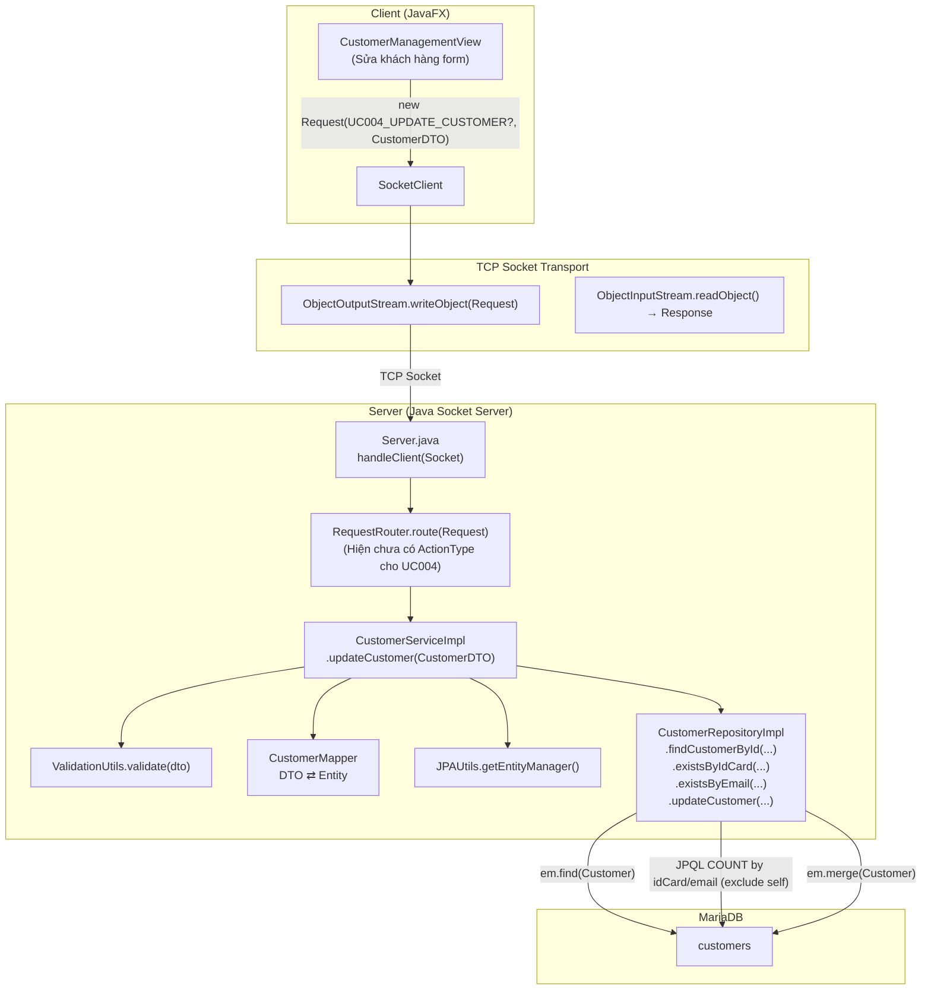
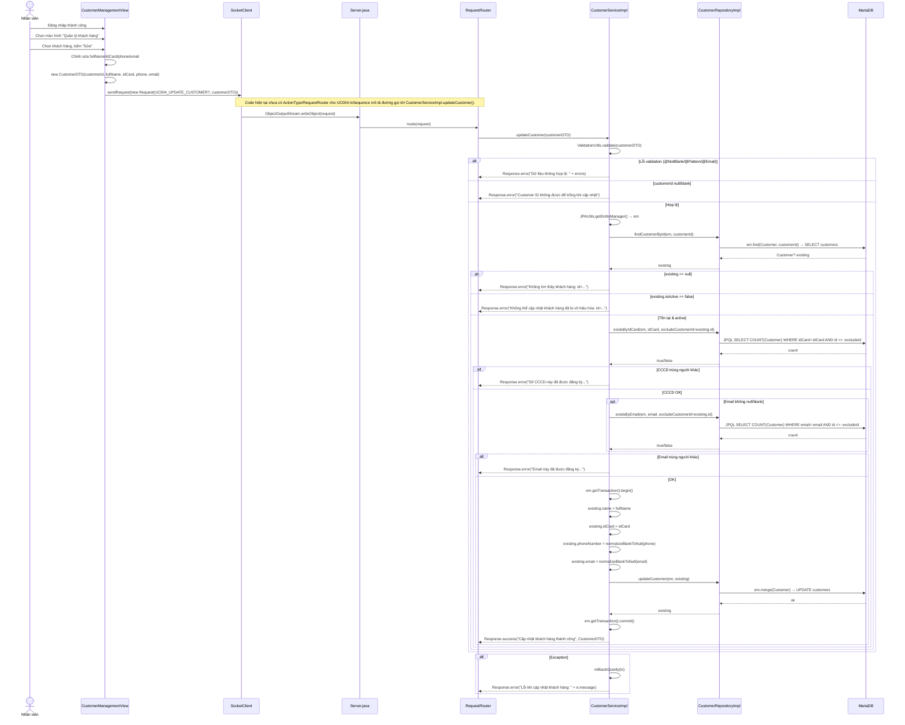
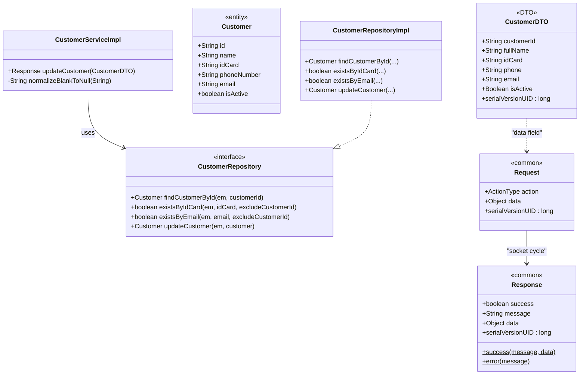

# Diagrams — UC004: Sửa khách hàng

---

## 1. System Architecture

```mermaid
graph TB
    subgraph CLIENT ["Client (JavaFX)"]
        UI["CustomerManagementView\n(Sửa khách hàng form)"]
        SC["SocketClient"]
    end

    subgraph TRANSPORT ["TCP Socket Transport"]
        OOS["ObjectOutputStream.writeObject(Request)"]
        OIS["ObjectInputStream.readObject() → Response"]
    end

    subgraph SERVER ["Server (Java Socket Server)"]
        SRV["Server.java\nhandleClient(Socket)"]
        RR["RequestRouter.route(Request)\n(Hiện chưa có ActionType cho UC004)"]
        SVC["CustomerServiceImpl\n.updateCustomer(CustomerDTO)"]
        VAL["ValidationUtils.validate(dto)"]
        MAP["CustomerMapper\nDTO ⇄ Entity"]
        JPA["JPAUtils.getEntityManager()"]
        REPO["CustomerRepositoryImpl\n.findCustomerById(...)\n.existsByIdCard(...)\n.existsByEmail(...)\n.updateCustomer(...)"]
    end

    subgraph DB ["MariaDB"]
        T_CUS["customers"]
    end

    UI -- "new Request(UC004_UPDATE_CUSTOMER?, CustomerDTO)" --> SC
    SC --> OOS
    OOS -- "TCP Socket" --> SRV
    SRV --> RR
    RR --> SVC

    SVC --> VAL
    SVC --> JPA
    SVC --> REPO
    SVC --> MAP

    REPO -- "em.find(Customer)" --> T_CUS
    REPO -- "JPQL COUNT by idCard/email (exclude self)" --> T_CUS
    REPO -- "em.merge(Customer)" --> T_CUS
```

---

## 2. Sequence Diagram

```mermaid
sequenceDiagram
    actor Clerk as Nhân viên
    participant UI as CustomerManagementView
    participant Socket as SocketClient
    participant Server as Server.java
    participant Router as RequestRouter
    participant Service as CustomerServiceImpl
    participant Repo as CustomerRepositoryImpl
    participant DB as MariaDB

    Clerk->>UI: Đăng nhập thành công
    Clerk->>UI: Chọn màn hình "Quản lý khách hàng"
    Clerk->>UI: Chọn khách hàng, bấm "Sửa"
    UI->>UI: Chỉnh sửa fullName/idCard/phone/email
    UI->>UI: new CustomerDTO(customerId, fullName, idCard, phone, email)
    UI->>Socket: sendRequest(new Request(UC004_UPDATE_CUSTOMER?, customerDTO))
    note over Socket,Router: Code hiện tại chưa có ActionType/RequestRouter cho UC004.\nSequence mô tả đường gọi tới CustomerServiceImpl.updateCustomer().
    Socket->>Server: ObjectOutputStream.writeObject(request)
    Server->>Router: route(request)
    Router->>Service: updateCustomer(customerDTO)

    Service->>Service: ValidationUtils.validate(customerDTO)
    alt Lỗi validation (@NotBlank/@Pattern/@Email)
        Service-->>Router: Response.error("Dữ liệu không hợp lệ: " + errors)
    else customerId null/blank
        Service-->>Router: Response.error("Customer ID không được để trống khi cập nhật")
    else Hợp lệ
        Service->>Service: JPAUtils.getEntityManager() → em

        Service->>Repo: findCustomerById(em, customerId)
        Repo->>DB: em.find(Customer, customerId) → SELECT customers
        DB-->>Repo: Customer? existing
        Repo-->>Service: existing

        alt existing == null
            Service-->>Router: Response.error("Không tìm thấy khách hàng: id=...")
        else existing.isActive == false
            Service-->>Router: Response.error("Không thể cập nhật khách hàng đã bị vô hiệu hóa: id=...")
        else Tồn tại & active
            Service->>Repo: existsByIdCard(em, idCard, excludeCustomerId=existing.id)
            Repo->>DB: JPQL SELECT COUNT(Customer) WHERE idCard=:idCard AND id <> :excludeId
            DB-->>Repo: count
            Repo-->>Service: true/false
            alt CCCD trùng người khác
                Service-->>Router: Response.error("Số CCCD này đã được đăng ký...")
            else CCCD OK
                opt Email không null/blank
                    Service->>Repo: existsByEmail(em, email, excludeCustomerId=existing.id)
                    Repo->>DB: JPQL SELECT COUNT(Customer) WHERE email=:email AND id <> :excludeId
                    DB-->>Repo: count
                    Repo-->>Service: true/false
                end
                alt Email trùng người khác
                    Service-->>Router: Response.error("Email này đã được đăng ký...")
                else OK
                    Service->>Service: em.getTransaction().begin()
                    Service->>Service: existing.name = fullName
                    Service->>Service: existing.idCard = idCard
                    Service->>Service: existing.phoneNumber = normalizeBlankToNull(phone)
                    Service->>Service: existing.email = normalizeBlankToNull(email)
                    Service->>Repo: updateCustomer(em, existing)
                    Repo->>DB: em.merge(Customer) → UPDATE customers
                    DB-->>Repo: ok
                    Repo-->>Service: existing
                    Service->>Service: em.getTransaction().commit()
                    Service-->>Router: Response.success("Cập nhật khách hàng thành công", CustomerDTO)
                end
            end
        end
    end

    alt Exception
        Service->>Service: rollbackQuietly(tx)
        Service-->>Router: Response.error("Lỗi khi cập nhật khách hàng: " + e.message)
    end
```

---

## 3. Class Diagram

```mermaid
classDiagram
    class CustomerDTO {
        <<DTO>>
        +String customerId
        +String fullName
        +String idCard
        +String phone
        +String email
        +Boolean isActive
        +serialVersionUID : long
    }

    class Customer {
        <<entity>>
        +String id
        +String name
        +String idCard
        +String phoneNumber
        +String email
        +boolean isActive
    }

    class CustomerServiceImpl {
        +Response updateCustomer(CustomerDTO)
        -String normalizeBlankToNull(String)
    }

    class CustomerRepository {
        <<interface>>
        +Customer findCustomerById(em, customerId)
        +boolean existsByIdCard(em, idCard, excludeCustomerId)
        +boolean existsByEmail(em, email, excludeCustomerId)
        +Customer updateCustomer(em, customer)
    }

    class CustomerRepositoryImpl {
        +Customer findCustomerById(...)
        +boolean existsByIdCard(...)
        +boolean existsByEmail(...)
        +Customer updateCustomer(...)
    }

    class Request {
        <<common>>
        +ActionType action
        +Object data
        +serialVersionUID : long
    }

    class Response {
        <<common>>
        +boolean success
        +String message
        +Object data
        +serialVersionUID : long
        +success(message, data)$
        +error(message)$
    }

    CustomerDTO ..> Request : "data field"
    Request --> Response : "socket cycle"

    CustomerServiceImpl --> CustomerRepository : uses
    CustomerRepositoryImpl ..|> CustomerRepository
```
