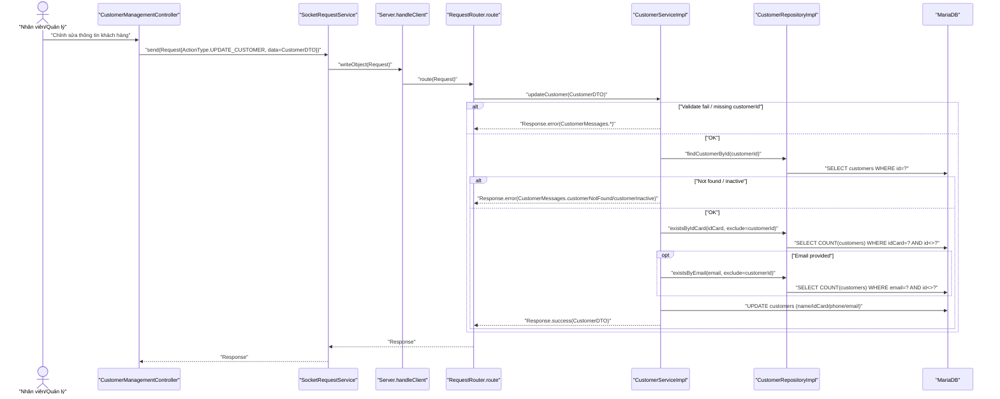

# Sequence Diagrams — UC004b: Sửa khách hàng

```mermaid
sequenceDiagram
  actor User as "Nhân viên/Quản lý"
  participant UI as "CustomerManagementController"
  participant Socket as "SocketRequestService"
  participant Server as "Server.handleClient"
  participant Router as "RequestRouter.route"
  participant Svc as "CustomerServiceImpl"
  participant Repo as "CustomerRepositoryImpl"
  participant DB as "MariaDB"

  User->>UI: "Chỉnh sửa thông tin khách hàng"
  UI->>Socket: "send(Request{ActionType.UPDATE_CUSTOMER, data=CustomerDTO})"
  Socket->>Server: "writeObject(Request)"
  Server->>Router: "route(Request)"
  Router->>Svc: "updateCustomer(CustomerDTO)"
  alt "Validate fail / missing customerId"
    Svc-->>Router: "Response.error(CustomerMessages.*)"
  else "OK"
    Svc->>Repo: "findCustomerById(customerId)"
    Repo->>DB: "SELECT customers WHERE id=?"
    alt "Not found / inactive"
      Svc-->>Router: "Response.error(CustomerMessages.customerNotFound/customerInactive)"
    else "OK"
      Svc->>Repo: "existsByIdCard(idCard, exclude=customerId)"
      Repo->>DB: "SELECT COUNT(customers) WHERE idCard=? AND id<>?"
      opt "Email provided"
        Svc->>Repo: "existsByEmail(email, exclude=customerId)"
        Repo->>DB: "SELECT COUNT(customers) WHERE email=? AND id<>?"
      end
      Svc->>DB: "UPDATE customers (name/idCard/phone/email)"
      Svc-->>Router: "Response.success(CustomerDTO)"
    end
  end
  Router-->>Socket: "Response"
  Socket-->>UI: "Response"
```

