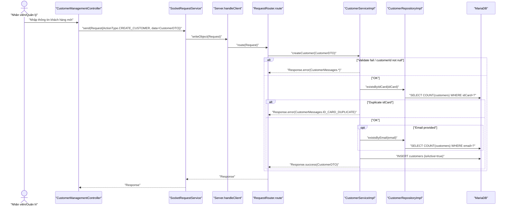

# Sequence Diagrams — UC004a: Thêm khách hàng

```mermaid
sequenceDiagram
  actor User as "Nhân viên/Quản lý"
  participant UI as "CustomerManagementController"
  participant Socket as "SocketRequestService"
  participant Server as "Server.handleClient"
  participant Router as "RequestRouter.route"
  participant Svc as "CustomerServiceImpl"
  participant Repo as "CustomerRepositoryImpl"
  participant DB as "MariaDB"

  User->>UI: "Nhập thông tin khách hàng mới"
  UI->>Socket: "send(Request{ActionType.CREATE_CUSTOMER, data=CustomerDTO})"
  Socket->>Server: "writeObject(Request)"
  Server->>Router: "route(Request)"
  Router->>Svc: "createCustomer(CustomerDTO)"
  alt "Validate fail / customerId not null"
    Svc-->>Router: "Response.error(CustomerMessages.*)"
  else "OK"
    Svc->>Repo: "existsByIdCard(idCard)"
    Repo->>DB: "SELECT COUNT(customers) WHERE idCard=?"
    alt "Duplicate idCard"
      Svc-->>Router: "Response.error(CustomerMessages.ID_CARD_DUPLICATE)"
    else "OK"
      opt "Email provided"
        Svc->>Repo: "existsByEmail(email)"
        Repo->>DB: "SELECT COUNT(customers) WHERE email=?"
      end
      Svc->>DB: "INSERT customers (isActive=true)"
      Svc-->>Router: "Response.success(CustomerDTO)"
    end
  end
  Router-->>Socket: "Response"
  Socket-->>UI: "Response"
```

