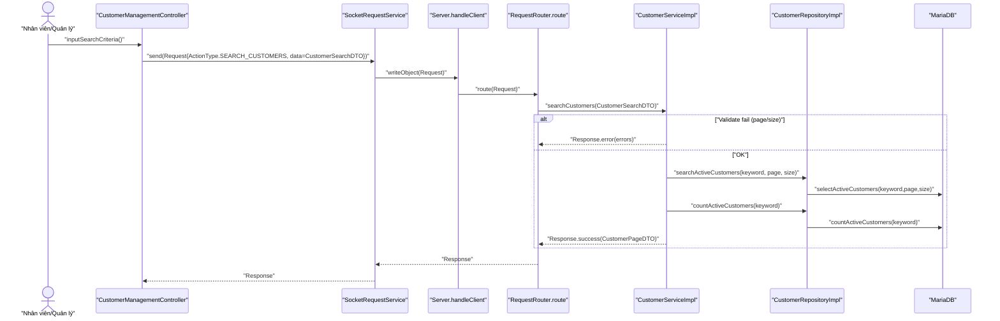

# Sequence Diagrams — UC004d: Tìm kiếm khách hàng

```mermaid
sequenceDiagram
  actor User as "Nhân viên/Quản lý"
  participant UI as "CustomerManagementController"
  participant Socket as "SocketRequestService"
  participant Server as "Server.handleClient"
  participant Router as "RequestRouter.route"
  participant Svc as "CustomerServiceImpl"
  participant Repo as "CustomerRepositoryImpl"
  participant DB as "MariaDB"

  User->>UI: "inputSearchCriteria()"
  UI->>Socket: "send(Request{ActionType.SEARCH_CUSTOMERS, data=CustomerSearchDTO})"
  Socket->>Server: "writeObject(Request)"
  Server->>Router: "route(Request)"
  Router->>Svc: "searchCustomers(CustomerSearchDTO)"
  alt "Validate fail (page/size)"
    Svc-->>Router: "Response.error(errors)"
  else "OK"
    Svc->>Repo: "searchActiveCustomers(keyword, page, size)"
    Repo->>DB: "selectActiveCustomers(keyword,page,size)"
    Svc->>Repo: "countActiveCustomers(keyword)"
    Repo->>DB: "countActiveCustomers(keyword)"
    Svc-->>Router: "Response.success(CustomerPageDTO)"
  end
  Router-->>Socket: "Response"
  Socket-->>UI: "Response"
```
