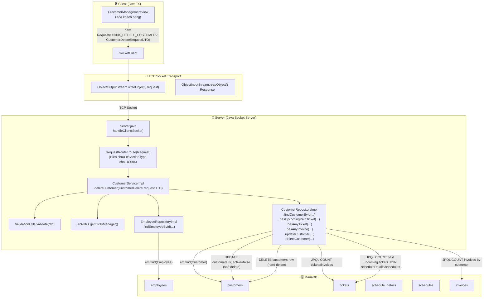
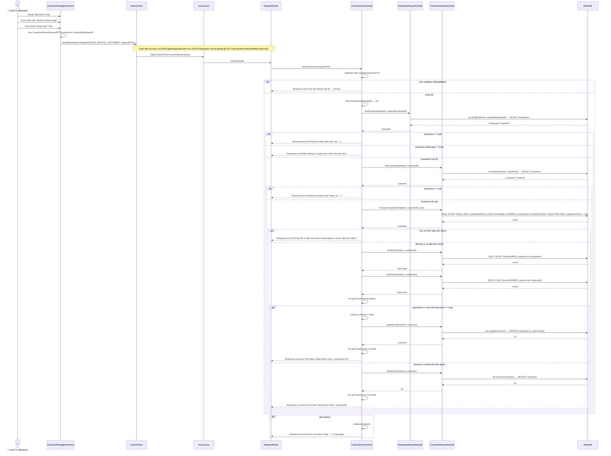
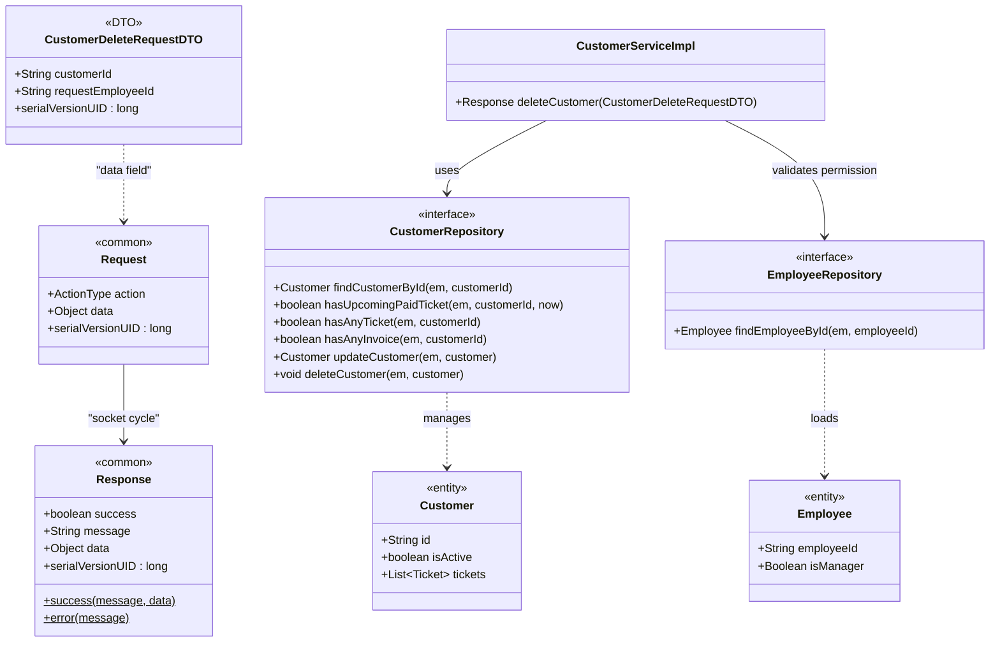

# Diagrams — UC004: Xóa khách hàng (vô hiệu hóa / xóa cứng)

---

## 1. System Architecture

```mermaid
graph TB
    subgraph CLIENT ["🖥️ Client (JavaFX)"]
        UI["CustomerManagementView\n(Xóa khách hàng)"]
        SC["SocketClient"]
    end

    subgraph TRANSPORT ["🔌 TCP Socket Transport"]
        OOS["ObjectOutputStream.writeObject(Request)"]
        OIS["ObjectInputStream.readObject() → Response"]
    end

    subgraph SERVER ["⚙️ Server (Java Socket Server)"]
        SRV["Server.java\nhandleClient(Socket)"]
        RR["RequestRouter.route(Request)\n(Hiện chưa có ActionType cho UC004)"]
        SVC["CustomerServiceImpl\n.deleteCustomer(CustomerDeleteRequestDTO)"]
        VAL["ValidationUtils.validate(dto)"]
        JPA["JPAUtils.getEntityManager()"]
        C_REPO["CustomerRepositoryImpl\n.findCustomerById(...)\n.hasUpcomingPaidTicket(...)\n.hasAnyTicket(...)\n.hasAnyInvoice(...)\n.updateCustomer(...)\n.deleteCustomer(...)"]
        E_REPO["EmployeeRepositoryImpl\n.findEmployeeById(...)"]
    end

    subgraph DB ["🗄️ MariaDB"]
        T_EMP["employees"]
        T_CUS["customers"]
        T_TICKET["tickets"]
        T_SD["schedule_details"]
        T_SCH["schedules"]
        T_INV["invoices"]
    end

    UI -- "new Request(UC004_DELETE_CUSTOMER?, CustomerDeleteRequestDTO)" --> SC
    SC --> OOS
    OOS -- "TCP Socket" --> SRV
    SRV --> RR
    RR --> SVC

    SVC --> VAL
    SVC --> JPA
    SVC --> E_REPO
    SVC --> C_REPO

    E_REPO -- "em.find(Employee)" --> T_EMP
    C_REPO -- "em.find(Customer)" --> T_CUS
    C_REPO -- "JPQL COUNT tickets/invoices" --> T_TICKET
    C_REPO -- "JPQL COUNT invoices by customer" --> T_INV
    C_REPO -- "JPQL COUNT paid upcoming tickets JOIN scheduleDetails/schedules" --> T_TICKET
    C_REPO -- "UPDATE customers.is_active=false (soft delete)" --> T_CUS
    C_REPO -- "DELETE customers row (hard delete)" --> T_CUS
```

---

## 2. Sequence Diagram

```mermaid
sequenceDiagram
    actor Manager as 👤 Quản lý (Manager)
    participant UI as CustomerManagementView
    participant Socket as SocketClient
    participant Server as Server.java
    participant Router as RequestRouter
    participant Service as CustomerServiceImpl
    participant EmpRepo as EmployeeRepositoryImpl
    participant CusRepo as CustomerRepositoryImpl
    participant DB as MariaDB

    Manager->>UI: Đăng nhập thành công
    Manager->>UI: Chọn màn hình "Quản lý khách hàng"
    Manager->>UI: Chọn khách hàng, bấm "Xóa"
    UI->>UI: new CustomerDeleteRequestDTO(customerId, requestEmployeeId)
    UI->>Socket: sendRequest(new Request(UC004_DELETE_CUSTOMER?, requestDTO))
    note over Socket,Router: Code hiện tại chưa có ActionType/RequestRouter cho UC004.\nSequence mô tả đường gọi tới CustomerServiceImpl.deleteCustomer().
    Socket->>Server: ObjectOutputStream.writeObject(request)
    Server->>Router: route(request)
    Router->>Service: deleteCustomer(requestDTO)

    Service->>Service: ValidationUtils.validate(requestDTO)
    alt Lỗi validation (@NotBlank)
        Service-->>Router: Response.error("Dữ liệu không hợp lệ: " + errors)
    else Hợp lệ
        Service->>Service: JPAUtils.getEntityManager() → em

        Service->>EmpRepo: findEmployeeById(em, requestEmployeeId)
        EmpRepo->>DB: em.find(Employee, requestEmployeeId) → SELECT employees
        DB-->>EmpRepo: Employee? requester
        EmpRepo-->>Service: requester

        alt requester == null
            Service-->>Router: Response.error("Không tìm thấy nhân viên: id=...")
        else requester.isManager != true
            Service-->>Router: Response.error("Bạn không có quyền thực hiện thao tác này")
        else requester hợp lệ
            Service->>CusRepo: findCustomerById(em, customerId)
            CusRepo->>DB: em.find(Customer, customerId) → SELECT customers
            DB-->>CusRepo: Customer? customer
            CusRepo-->>Service: customer

            alt customer == null
                Service-->>Router: Response.error("Không tìm thấy khách hàng: id=...")
            else customer tồn tại
                Service->>CusRepo: hasUpcomingPaidTicket(em, customerId, now)
                CusRepo->>DB: JPQL COUNT Ticket t JOIN t.scheduleDetail sd JOIN sd.schedule s WHERE t.customer.id=:customerId AND t.status=PAID AND s.departureTime > :now
                DB-->>CusRepo: count
                CusRepo-->>Service: true/false

                alt Có vé PAID sắp khởi hành
                    Service-->>Router: Response.error("Không thể vô hiệu hóa khách hàng đang có vé tàu sắp khởi hành")
                else Không có vé sắp khởi hành
                    Service->>CusRepo: hasAnyTicket(em, customerId)
                    CusRepo->>DB: JPQL COUNT Ticket WHERE customer.id=:customerId
                    DB-->>CusRepo: count
                    CusRepo-->>Service: hasTicket

                    Service->>CusRepo: hasAnyInvoice(em, customerId)
                    CusRepo->>DB: JPQL COUNT Invoice WHERE customer.id=:customerId
                    DB-->>CusRepo: count
                    CusRepo-->>Service: hasInvoice

                    Service->>Service: em.getTransaction().begin()
                    alt hasTicket == true OR hasInvoice == true
                        Service->>Service: customer.isActive = false
                        Service->>CusRepo: updateCustomer(em, customer)
                        CusRepo->>DB: em.merge(Customer) → UPDATE customers (is_active=false)
                        DB-->>CusRepo: ok
                        CusRepo-->>Service: customer
                        Service->>Service: em.getTransaction().commit()
                        Service-->>Router: Response.success("Xóa khách hàng thành công", CustomerDTO)
                    else Không có vé/hóa đơn liên quan
                        Service->>CusRepo: deleteCustomer(em, customer)
                        CusRepo->>DB: em.remove(Customer) → DELETE customers
                        DB-->>CusRepo: ok
                        CusRepo-->>Service: ok
                        Service->>Service: em.getTransaction().commit()
                        Service-->>Router: Response.success("Xóa khách hàng thành công", customerId)
                    end
                end
            end
        end
    end

    alt Exception
        Service->>Service: rollbackQuietly(tx)
        Service-->>Router: Response.error("Lỗi khi xóa khách hàng: " + e.message)
    end
```

---

## 3. Class Diagram

```mermaid
classDiagram
    class CustomerDeleteRequestDTO {
        <<DTO>>
        +String customerId
        +String requestEmployeeId
        +serialVersionUID : long
    }

    class Customer {
        <<entity>>
        +String id
        +boolean isActive
        +List~Ticket~ tickets
    }

    class Employee {
        <<entity>>
        +String employeeId
        +Boolean isManager
    }

    class CustomerServiceImpl {
        +Response deleteCustomer(CustomerDeleteRequestDTO)
    }

    class CustomerRepository {
        <<interface>>
        +Customer findCustomerById(em, customerId)
        +boolean hasUpcomingPaidTicket(em, customerId, now)
        +boolean hasAnyTicket(em, customerId)
        +boolean hasAnyInvoice(em, customerId)
        +Customer updateCustomer(em, customer)
        +void deleteCustomer(em, customer)
    }

    class EmployeeRepository {
        <<interface>>
        +Employee findEmployeeById(em, employeeId)
    }

    class Request {
        <<common>>
        +ActionType action
        +Object data
        +serialVersionUID : long
    }

    class Response {
        <<common>>
        +boolean success
        +String message
        +Object data
        +serialVersionUID : long
        +success(message, data)$
        +error(message)$
    }

    CustomerDeleteRequestDTO ..> Request : "data field"
    Request --> Response : "socket cycle"

    CustomerServiceImpl --> CustomerRepository : uses
    CustomerServiceImpl --> EmployeeRepository : validates permission
    CustomerRepository ..> Customer : manages
    EmployeeRepository ..> Employee : loads
```
