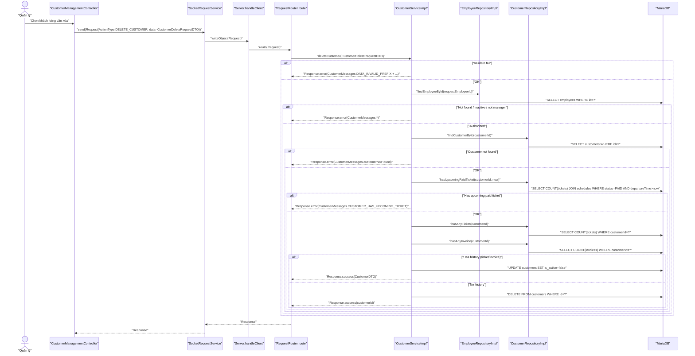

# Sequence Diagrams — UC004c: Xóa/Vô hiệu hóa khách hàng

```mermaid
sequenceDiagram
  actor Manager as "Quản lý"
  participant UI as "CustomerManagementController"
  participant Socket as "SocketRequestService"
  participant Server as "Server.handleClient"
  participant Router as "RequestRouter.route"
  participant Svc as "CustomerServiceImpl"
  participant EmpRepo as "EmployeeRepositoryImpl"
  participant CusRepo as "CustomerRepositoryImpl"
  participant DB as "MariaDB"

  Manager->>UI: "Chọn khách hàng cần xóa"
  UI->>Socket: "send(Request{ActionType.DELETE_CUSTOMER, data=CustomerDeleteRequestDTO})"
  Socket->>Server: "writeObject(Request)"
  Server->>Router: "route(Request)"
  Router->>Svc: "deleteCustomer(CustomerDeleteRequestDTO)"
  alt "Validate fail"
    Svc-->>Router: "Response.error(CustomerMessages.DATA_INVALID_PREFIX + ...)"
  else "OK"
    Svc->>EmpRepo: "findEmployeeById(requestEmployeeId)"
    EmpRepo->>DB: "SELECT employees WHERE id=?"
    alt "Not found / inactive / not manager"
      Svc-->>Router: "Response.error(CustomerMessages.*)"
    else "Authorized"
      Svc->>CusRepo: "findCustomerById(customerId)"
      CusRepo->>DB: "SELECT customers WHERE id=?"
      alt "Customer not found"
        Svc-->>Router: "Response.error(CustomerMessages.customerNotFound)"
      else "OK"
        Svc->>CusRepo: "hasUpcomingPaidTicket(customerId, now)"
        CusRepo->>DB: "SELECT COUNT(tickets) JOIN schedules WHERE status=PAID AND departureTime>now"
        alt "Has upcoming paid ticket"
          Svc-->>Router: "Response.error(CustomerMessages.CUSTOMER_HAS_UPCOMING_TICKET)"
        else "OK"
          Svc->>CusRepo: "hasAnyTicket(customerId)"
          CusRepo->>DB: "SELECT COUNT(tickets) WHERE customerId=?"
          Svc->>CusRepo: "hasAnyInvoice(customerId)"
          CusRepo->>DB: "SELECT COUNT(invoices) WHERE customerId=?"
          alt "Has history (ticket/invoice)"
            Svc->>DB: "UPDATE customers SET is_active=false"
            Svc-->>Router: "Response.success(CustomerDTO)"
          else "No history"
            Svc->>DB: "DELETE FROM customers WHERE id=?"
            Svc-->>Router: "Response.success(customerId)"
          end
        end
      end
    end
  end
  Router-->>Socket: "Response"
  Socket-->>UI: "Response"
```

