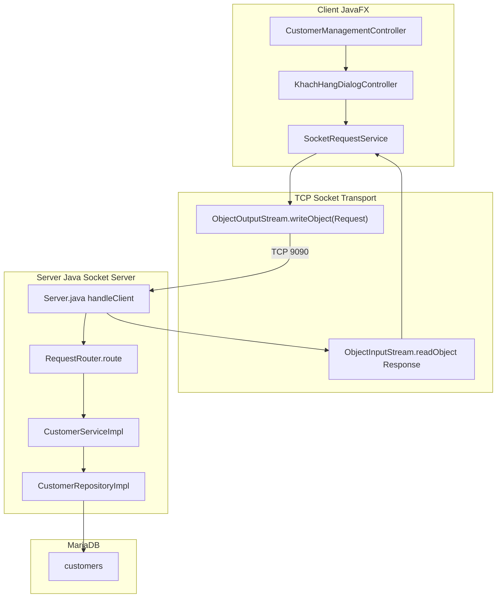
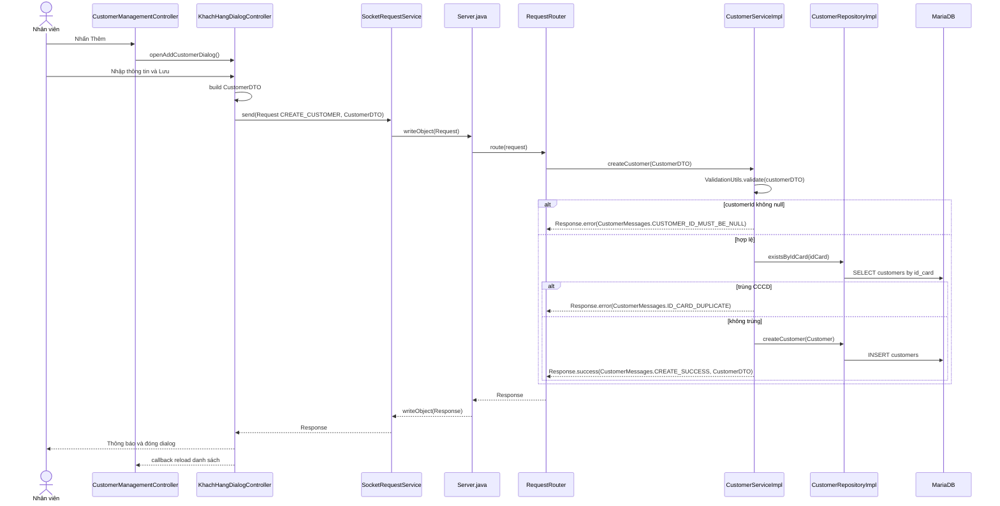
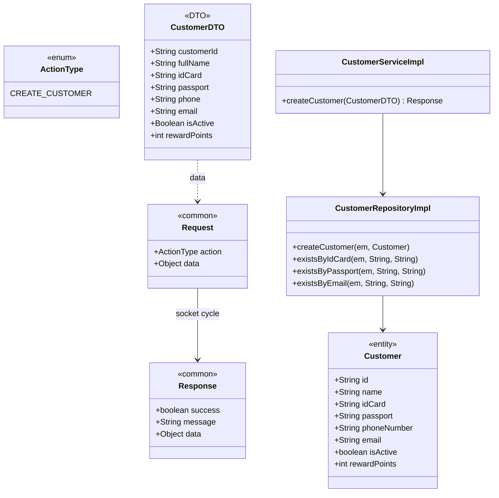

# Diagrams — UC004A: Thêm khách hàng

---

## 1. System Architecture

```mermaid
graph TB
    subgraph CLIENT ["Client JavaFX"]
        UI1["CustomerManagementController"]
        UI2["KhachHangDialogController"]
        SC["SocketRequestService"]
    end

    subgraph TRANSPORT ["TCP Socket Transport"]
        OOS["ObjectOutputStream.writeObject(Request)"]
        OIS["ObjectInputStream.readObject Response"]
    end

    subgraph SERVER ["Server Java Socket Server"]
        SRV["Server.java handleClient"]
        RR["RequestRouter.route"]
        SVC["CustomerServiceImpl"]
        REPO["CustomerRepositoryImpl"]
    end

    subgraph DB ["MariaDB"]
        T_CUS["customers"]
    end

    UI1 --> UI2
    UI2 --> SC
    SC --> OOS
    OOS -- "TCP 9090" --> SRV
    SRV --> RR
    RR --> SVC
    SVC --> REPO
    REPO --> T_CUS
    SRV --> OIS
    OIS --> SC
```

---

## 2. Sequence Diagram

```mermaid
sequenceDiagram
    actor Staff as Nhân viên
    participant UI1 as CustomerManagementController
    participant UI2 as KhachHangDialogController
    participant Socket as SocketRequestService
    participant Server as Server.java
    participant Router as RequestRouter
    participant Service as CustomerServiceImpl
    participant Repo as CustomerRepositoryImpl
    participant DB as MariaDB

    Staff->>UI1: Nhấn Thêm
    UI1->>UI2: openAddCustomerDialog()
    Staff->>UI2: Nhập thông tin và Lưu
    UI2->>UI2: build CustomerDTO
    UI2->>Socket: send(Request CREATE_CUSTOMER, CustomerDTO)
    Socket->>Server: writeObject(Request)
    Server->>Router: route(request)
    Router->>Service: createCustomer(CustomerDTO)
    Service->>Service: ValidationUtils.validate(customerDTO)
    alt customerId không null
        Service-->>Router: Response.error(CustomerMessages.CUSTOMER_ID_MUST_BE_NULL)
    else hợp lệ
        Service->>Repo: existsByIdCard(idCard)
        Repo->>DB: SELECT customers by id_card
        alt trùng CCCD
            Service-->>Router: Response.error(CustomerMessages.ID_CARD_DUPLICATE)
        else không trùng
            Service->>Repo: createCustomer(Customer)
            Repo->>DB: INSERT customers
            Service-->>Router: Response.success(CustomerMessages.CREATE_SUCCESS, CustomerDTO)
        end
    end
    Router-->>Server: Response
    Server-->>Socket: writeObject(Response)
    Socket-->>UI2: Response
    UI2-->>Staff: Thông báo và đóng dialog
    UI2-->>UI1: callback reload danh sách
```

---

## 3. Class Diagram

```mermaid
classDiagram
    class ActionType {
        <<enum>>
        CREATE_CUSTOMER
    }

    class Request {
        <<common>>
        +ActionType action
        +Object data
    }

    class Response {
        <<common>>
        +boolean success
        +String message
        +Object data
    }

    class CustomerDTO {
        <<DTO>>
        +String customerId
        +String fullName
        +String idCard
        +String passport
        +String phone
        +String email
        +Boolean isActive
        +int rewardPoints
    }

    class Customer {
        <<entity>>
        +String id
        +String name
        +String idCard
        +String passport
        +String phoneNumber
        +String email
        +boolean isActive
        +int rewardPoints
    }

    class CustomerServiceImpl {
        +createCustomer(CustomerDTO) Response
    }

    class CustomerRepositoryImpl {
        +createCustomer(em, Customer)
        +existsByIdCard(em, String, String)
        +existsByPassport(em, String, String)
        +existsByEmail(em, String, String)
    }

    CustomerDTO ..> Request : data
    Request --> Response : socket cycle
    CustomerServiceImpl --> CustomerRepositoryImpl
    CustomerRepositoryImpl --> Customer
```

---

## Notes
- Không có uncertainty đáng kể.

