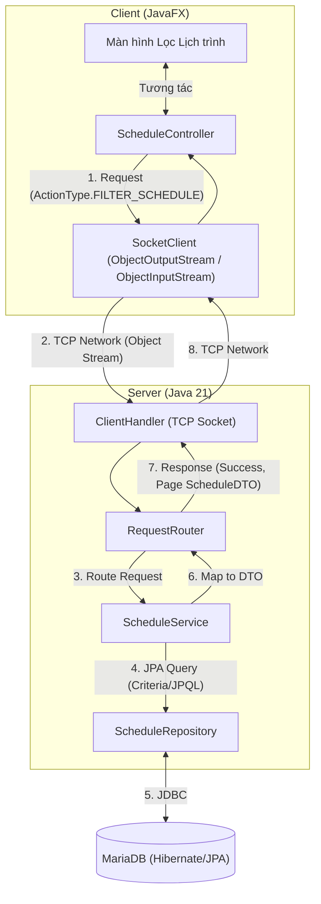
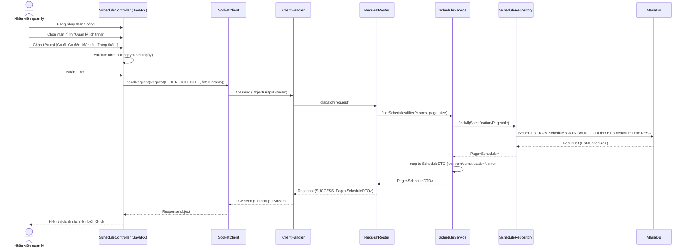
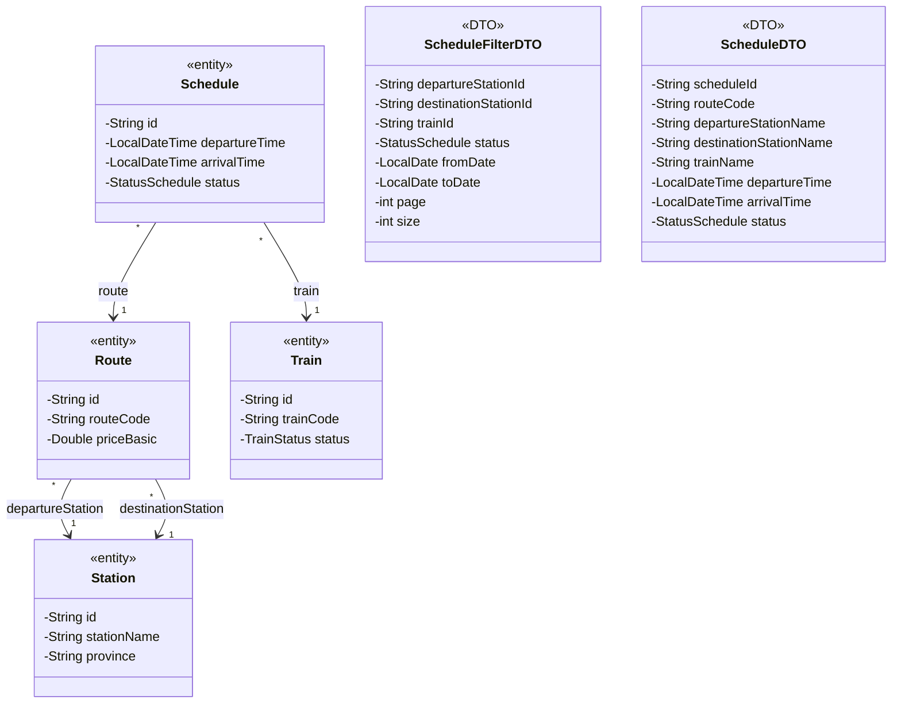

# Sơ đồ Usecase 005: Lọc lịch trình tàu

## 1. System Architecture

```mermaid
graph TD
    subgraph Client ["Client (JavaFX)"]
        UI["Màn hình Lọc Lịch trình"]
        Controller["ScheduleController"]
        ClientSocket["SocketClient (ObjectOutputStream / ObjectInputStream)"]
    end

    subgraph Server ["Server (Java 21)"]
        ServerSocket["ClientHandler (TCP Socket)"]
        Router["RequestRouter"]
        Service["ScheduleService"]
        Repo["ScheduleRepository"]
    end

    DB[("MariaDB (Hibernate/JPA)")]

    UI <-->|"Tương tác"| Controller
    Controller -->|"1. Request (ActionType.FILTER_SCHEDULE)"| ClientSocket
    ClientSocket -->|"2. TCP Network (Object Stream)"| ServerSocket
    ServerSocket --> Router
    Router -->|"3. Route Request"| Service
    Service -->|"4. JPA Query (Criteria/JPQL)"| Repo
    Repo <-->|"5. JDBC"| DB
    Service -->|"6. Map to DTO"| Router
    Router -->|"7. Response (Success, Page ScheduleDTO)"| ServerSocket
    ServerSocket -->|"8. TCP Network"| ClientSocket
    ClientSocket --> Controller
```

## 2. Sequence Diagram

```mermaid
sequenceDiagram
    actor User as Nhân viên quản lý
    participant UI as ScheduleController (JavaFX)
    participant ClientNet as SocketClient
    participant ServerNet as ClientHandler
    participant Router as RequestRouter
    participant Svc as ScheduleService
    participant Repo as ScheduleRepository
    participant DB as MariaDB

    User->>UI: Đăng nhập thành công
    User->>UI: Chọn màn hình "Quản lý lịch trình"
    User->>UI: Chọn tiêu chí (Ga đi, Ga đến, Mác tàu, Trạng thái...)
    UI->>UI: Validate form (Từ ngày < Đến ngày)
    User->>UI: Nhấn "Lọc"
    UI->>ClientNet: sendRequest(Request(FILTER_SCHEDULE, filterParams))
    ClientNet->>ServerNet: TCP send (ObjectOutputStream)
    ServerNet->>Router: dispatch(request)
    Router->>Svc: filterSchedules(filterParams, page, size)
    
    Svc->>Repo: findAll(Specification/Pageable)
    Repo->>DB: SELECT s FROM Schedule s JOIN Route ... ORDER BY s.departureTime DESC
    DB-->>Repo: ResultSet (List<Schedule>)
    Repo-->>Svc: Page<Schedule>
    
    Svc->>Svc: map to ScheduleDTO (join trainName, stationName)
    Svc-->>Router: Page<ScheduleDTO>
    Router-->>ServerNet: Response(SUCCESS, Page<ScheduleDTO>)
    ServerNet-->>ClientNet: TCP send (ObjectInputStream)
    ClientNet-->>UI: Response object
    UI-->>User: Hiển thị danh sách lên lưới (Grid)
```

## 3. Class Diagram

```mermaid
classDiagram
    %% Entities
    class Schedule {
        <<entity>>
        -String id
        -LocalDateTime departureTime
        -LocalDateTime arrivalTime
        -StatusSchedule status
    }
    class Route {
        <<entity>>
        -String id
        -String routeCode
        -Double priceBasic
    }
    class Train {
        <<entity>>
        -String id
        -String trainCode
        -TrainStatus status
    }
    class Station {
        <<entity>>
        -String id
        -String stationName
        -String province
    }

    %% Relationships
    Schedule "*" --> "1" Route : route
    Schedule "*" --> "1" Train : train
    Route "*" --> "1" Station : departureStation
    Route "*" --> "1" Station : destinationStation

    %% DTOs
    class ScheduleFilterDTO {
        <<DTO>>
        -String departureStationId
        -String destinationStationId
        -String trainId
        -StatusSchedule status
        -LocalDate fromDate
        -LocalDate toDate
        -int page
        -int size
    }

    class ScheduleDTO {
        <<DTO>>
        -String scheduleId
        -String routeCode
        -String departureStationName
        -String destinationStationName
        -String trainName
        -LocalDateTime departureTime
        -LocalDateTime arrivalTime
        -StatusSchedule status
    }
```
