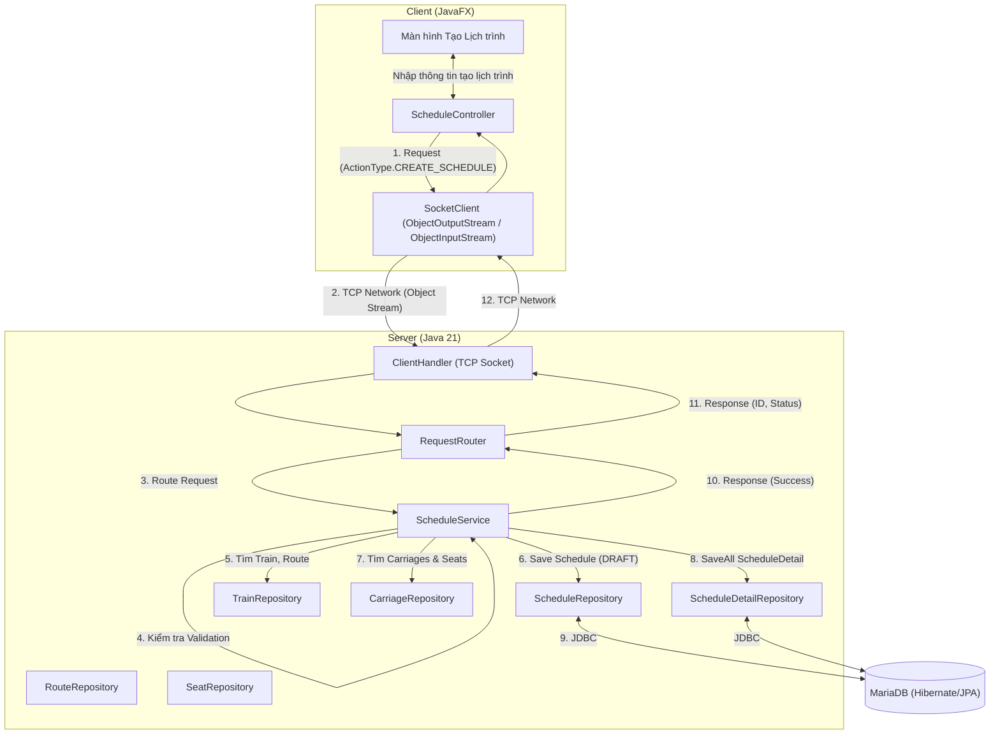
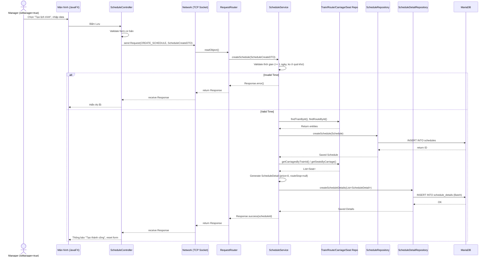
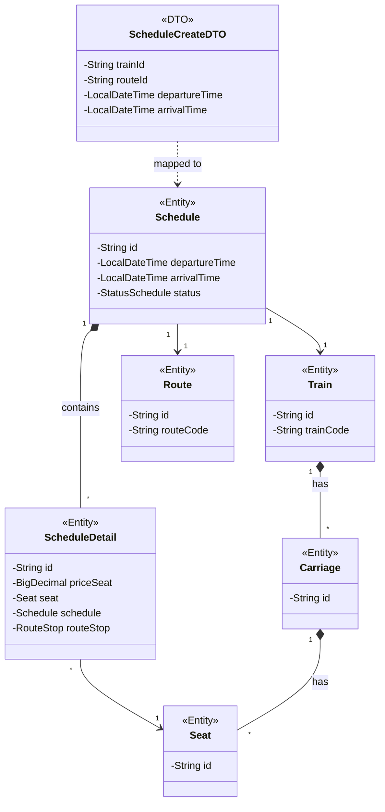

# Diagrams for UC-006: Tạo lịch trình tàu

## 1. System Architecture

```mermaid
graph TD
    subgraph Client ["Client (JavaFX)"]
        UI["Màn hình Tạo Lịch trình"]
        Controller["ScheduleController"]
        ClientSocket["SocketClient (ObjectOutputStream / ObjectInputStream)"]
    end

    subgraph Server ["Server (Java 21)"]
        ServerSocket["ClientHandler (TCP Socket)"]
        Router["RequestRouter"]
        Service["ScheduleService"]
        RepoSchedule["ScheduleRepository"]
        RepoTrain["TrainRepository"]
        RepoRoute["RouteRepository"]
        RepoCarriage["CarriageRepository"]
        RepoSeat["SeatRepository"]
        RepoDetail["ScheduleDetailRepository"]
    end

    DB[("MariaDB (Hibernate/JPA)")]

    UI <-->|"Nhập thông tin tạo lịch trình"| Controller
    Controller -->|"1. Request (ActionType.CREATE_SCHEDULE)"| ClientSocket
    ClientSocket -->|"2. TCP Network (Object Stream)"| ServerSocket
    ServerSocket --> Router
    Router -->|"3. Route Request"| Service
    Service -->|"4. Kiểm tra Validation"| Service
    Service -->|"5. Tìm Train, Route"| RepoTrain
    Service -->|"6. Save Schedule (DRAFT)"| RepoSchedule
    Service -->|"7. Tìm Carriages & Seats"| RepoCarriage
    Service -->|"8. SaveAll ScheduleDetail"| RepoDetail
    
    RepoSchedule <-->|"9. JDBC"| DB
    RepoDetail <-->|"JDBC"| DB

    Service -->|"10. Response (Success)"| Router
    Router -->|"11. Response (ID, Status)"| ServerSocket
    ServerSocket -->|"12. TCP Network"| ClientSocket
    ClientSocket --> Controller
```

## 2. Sequence Diagram

```mermaid
sequenceDiagram
    actor M as Manager (isManager=true)
    participant UI as Màn hình (JavaFX)
    participant C as ScheduleController
    participant Net as Network (TCP Socket)
    participant R as RequestRouter
    participant S as ScheduleService
    participant RepoT as Train/Route/Carriage/Seat Repo
    participant RepoSch as ScheduleRepository
    participant RepoDet as ScheduleDetailRepository
    participant DB as MariaDB

    M->>UI: Chọn "Tạo lịch trình", nhập data
    UI->>C: Bấm Lưu
    C->>C: Validate form cơ bản
    C->>Net: send Request(CREATE_SCHEDULE, ScheduleCreateDTO)
    Net->>R: readObject()
    R->>S: createSchedule(ScheduleCreateDTO)
    
    S->>S: Validate thời gian (>= 1 ngày, ko ở quá khứ)
    alt Invalid Time
        S-->>R: Response.error()
        R-->>Net: return Response
        Net-->>C: receive Response
        C-->>UI: Hiển thị lỗi
    else Valid Time
        S->>RepoT: findTrainById(), findRouteById()
        RepoT-->>S: Return entities
        
        S->>RepoSch: createSchedule(Schedule)
        RepoSch->>DB: INSERT INTO schedules
        DB-->>RepoSch: return ID
        RepoSch-->>S: Saved Schedule
        
        S->>RepoT: getCarriagesByTrainId() / getSeatsByCarriage()
        RepoT-->>S: List<Seat>
        
        S->>S: Generate ScheduleDetail (price=0, routeStop=null)
        S->>RepoDet: createScheduleDetails(List<ScheduleDetail>)
        RepoDet->>DB: INSERT INTO schedule_details (Batch)
        DB-->>RepoDet: OK
        RepoDet-->>S: Saved Details
        
        S-->>R: Response.success(scheduleId)
        R-->>Net: return Response
        Net-->>C: receive Response
        C-->>UI: Thông báo "Tạo thành công", reset form
    end
```

## 3. Class Diagram

```mermaid
classDiagram
    class ScheduleCreateDTO {
        <<DTO>>
        -String trainId
        -String routeId
        -LocalDateTime departureTime
        -LocalDateTime arrivalTime
    }

    class Schedule {
        <<Entity>>
        -String id
        -LocalDateTime departureTime
        -LocalDateTime arrivalTime
        -StatusSchedule status
    }

    class ScheduleDetail {
        <<Entity>>
        -String id
        -BigDecimal priceSeat
        -Seat seat
        -Schedule schedule
        -RouteStop routeStop
    }

    class Train {
        <<Entity>>
        -String id
        -String trainCode
    }

    class Route {
        <<Entity>>
        -String id
        -String routeCode
    }

    class Carriage {
        <<Entity>>
        -String id
    }

    class Seat {
        <<Entity>>
        -String id
    }

    ScheduleCreateDTO ..> Schedule : mapped to
    Schedule "1" --> "1" Train
    Schedule "1" --> "1" Route
    Schedule "1" *-- "*" ScheduleDetail : contains
    ScheduleDetail "*" --> "1" Seat
    Train "1" *-- "*" Carriage : has
    Carriage "1" *-- "*" Seat : has
```
