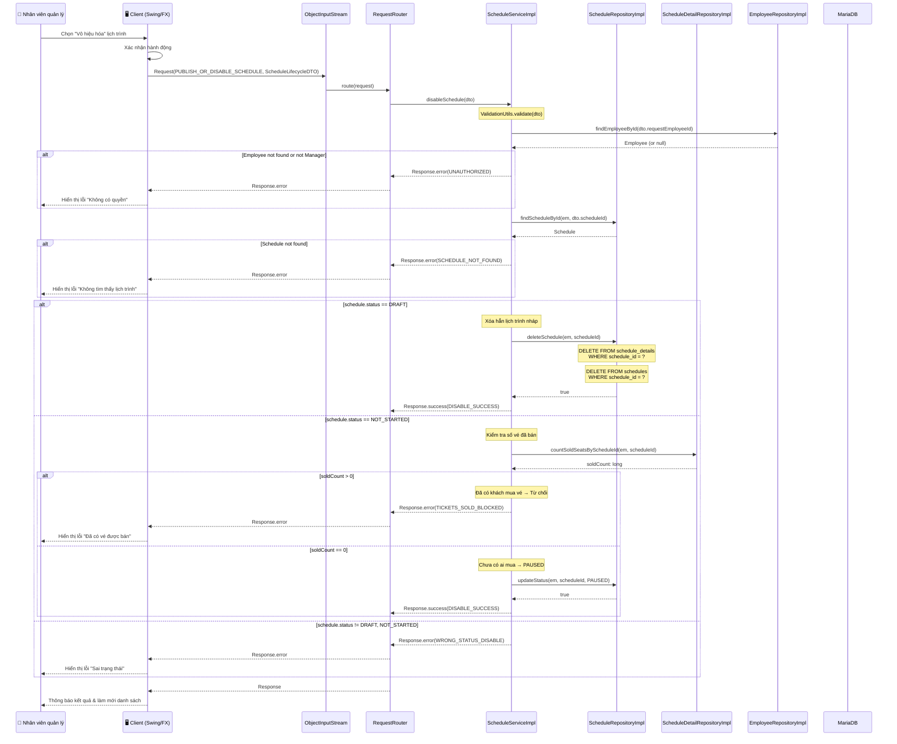
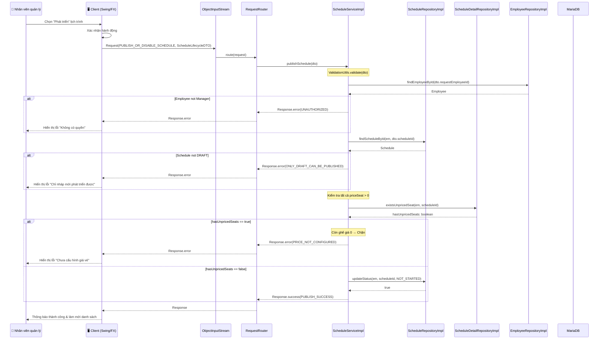
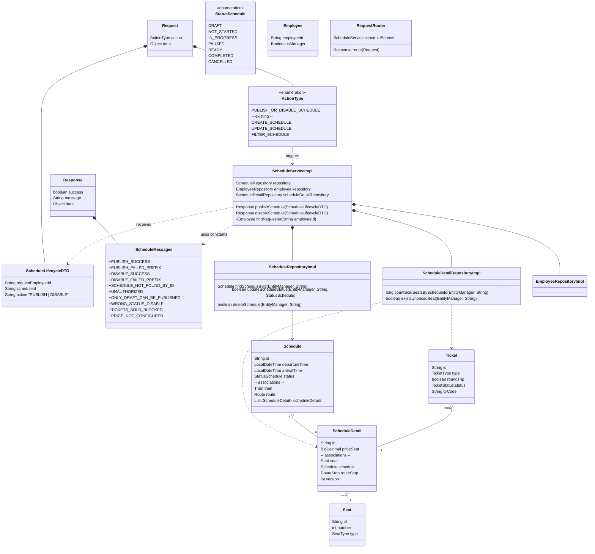

# Diagrams — UC008: Vô hiệu hoá và Phát triển lịch trình tàu

---

## 1. System Architecture

```mermaid
flowchart TB
    subgraph Client ["🖥️ Client (Java Swing / JavaFX)"]
        UI[("Màn hình\nQuản lý lịch trình")]
    end

    subgraph SocketLayer ["🔌 TCP Socket Layer"]
        OOS["ObjectOutputStream"]
        OIS["ObjectInputStream"]
    end

    subgraph NetworkLayer ["🌐 Network Layer"]
        RH["NetworkHandler\n.handleConnection()"]
        RR["RequestRouter.route()"]
    end

    subgraph ServiceLayer ["⚙️ Service Layer"]
        SS["ScheduleServiceImpl"]
        ES["EmployeeServiceImpl"]
    end

    subgraph RepositoryLayer ["💾 Repository Layer"]
        SR["ScheduleRepositoryImpl"]
        TR["TicketRepository"]
        SDR["ScheduleDetailRepository"]
        ER["EmployeeRepositoryImpl"]
    end

    subgraph Persistence ["🗄️ JPA / Hibernate"]
        EMF["EntityManagerFactory\n(Hibernate)"]
    end

    subgraph Database ["🗃️ MariaDB"]
        SCH["schedules"]
        SD["schedule_details"]
        TKT["tickets"]
        EMP["employees"]
    end

    UI --> OOS
    OOS --> OIS
    OIS -->|Request [action, data]| RR
    RR -->|ScheduleLifecycleDTO| SS
    SS -->|findScheduleById| SR
    SS -->|findSoldSeatCount| SDR
    SS -->|findEmployeeById| ER
    SR -->|SELECT / UPDATE| EMF
    SDR -->|SELECT COUNT| EMF
    ER -->|SELECT| EMF
    EMF --> SCH
    EMF --> SD
    EMF --> TKT
    EMF --> EMP
```

---

## 2. Sequence Diagram

### Luồng DISABLE (Vô hiệu hoá)



### Luồng PUBLISH (Phát triển)



---

## 3. Class Diagram


