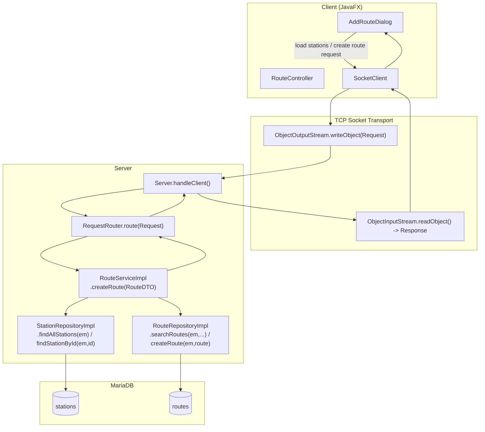
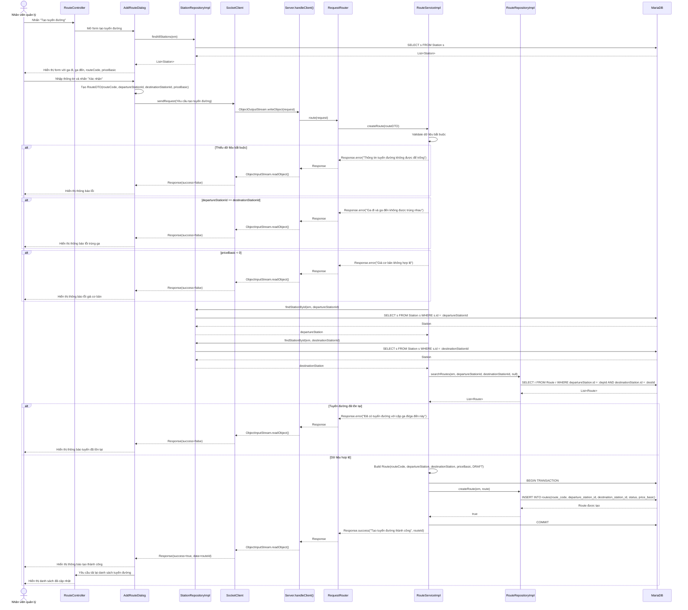
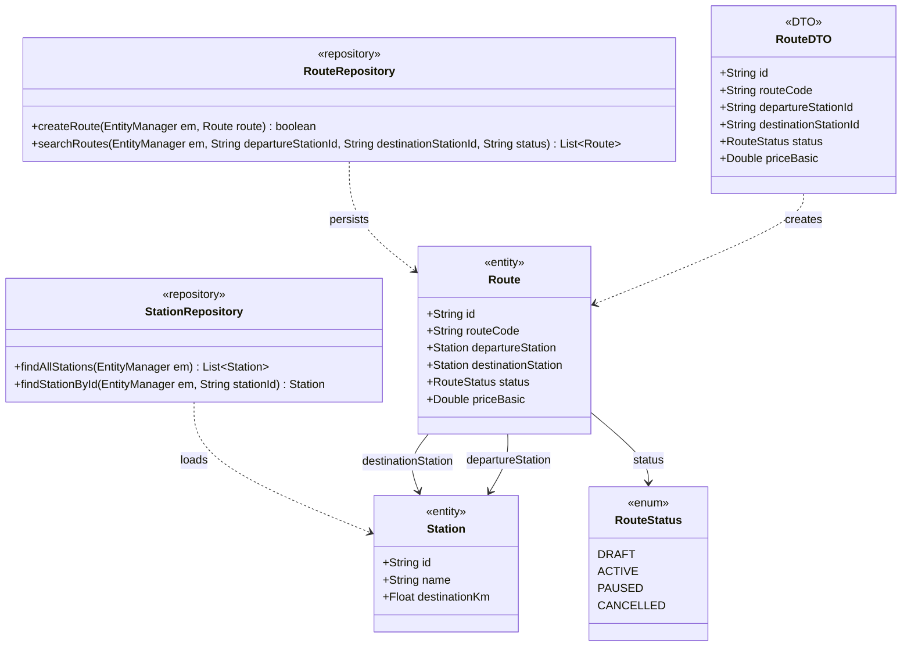

# Diagrams — UC010: Tạo tuyến đường

---

## 1. System Architecture

```mermaid
graph TB
    subgraph CLIENT ["Client (JavaFX)"]
        UI["RouteController"]
        Dialog["AddRouteDialog"]
        SC["SocketClient"]
    end

    subgraph TRANSPORT ["TCP Socket Transport"]
        OOS["ObjectOutputStream.writeObject(Request)"]
        OIS["ObjectInputStream.readObject() -> Response"]
    end

    subgraph SERVER ["Server"]
        SRV["Server.handleClient()"]
        RR["RequestRouter.route(Request)"]
        SVC["RouteServiceImpl\n.createRoute(RouteDTO)"]
        ST_REPO["StationRepositoryImpl\n.findAllStations(em) / findStationById(em,id)"]
        RT_REPO["RouteRepositoryImpl\n.searchRoutes(em,...) / createRoute(em,route)"]
    end

    subgraph DB ["MariaDB"]
        T_STATION[("stations")]
        T_ROUTE[("routes")]
    end

    Dialog -- "load stations / create route request" --> SC
    SC --> OOS
    OOS --> SRV
    SRV --> RR
    RR --> SVC
    SVC --> ST_REPO
    SVC --> RT_REPO
    ST_REPO --> T_STATION
    RT_REPO --> T_ROUTE
    SVC --> RR
    RR --> SRV
    SRV --> OIS
    OIS --> SC
    SC --> Dialog
```

---

## 2. Sequence Diagram

```mermaid
sequenceDiagram
    actor Manager as Nhân viên quản lý
    participant UI as RouteController
    participant Dialog as AddRouteDialog
    participant StationRepo as StationRepositoryImpl
    participant SC as SocketClient
    participant SRV as Server.handleClient()
    participant RR as RequestRouter
    participant SVC as RouteServiceImpl
    participant RouteRepo as RouteRepositoryImpl
    participant DB as MariaDB

    Manager->>UI: Nhấn "Tạo tuyến đường"
    UI->>Dialog: Mở form tạo tuyến đường

    Dialog->>StationRepo: findAllStations(em)
    StationRepo->>DB: SELECT s FROM Station s
    DB-->>StationRepo: List<Station>
    StationRepo-->>Dialog: List<Station>
    Dialog-->>Manager: Hiển thị form với ga đi, ga đến, routeCode, priceBasic

    Manager->>Dialog: Nhập thông tin và nhấn "Xác nhận"
    Dialog->>Dialog: Tạo RouteDTO(routeCode, departureStationId, destinationStationId, priceBasic)
    Dialog->>SC: sendRequest(Yêu cầu tạo tuyến đường)
    SC->>SRV: ObjectOutputStream.writeObject(request)
    SRV->>RR: route(request)
    RR->>SVC: createRoute(routeDTO)

    SVC->>SVC: Validate dữ liệu bắt buộc
    alt Thiếu dữ liệu bắt buộc
        SVC-->>RR: Response.error("Thông tin tuyến đường không được để trống")
        RR-->>SRV: Response
        SRV-->>SC: ObjectInputStream.readObject()
        SC-->>Dialog: Response(success=false)
        Dialog-->>Manager: Hiển thị thông báo lỗi
    end

    alt departureStationId == destinationStationId
        SVC-->>RR: Response.error("Ga đi và ga đến không được trùng nhau")
        RR-->>SRV: Response
        SRV-->>SC: ObjectInputStream.readObject()
        SC-->>Dialog: Response(success=false)
        Dialog-->>Manager: Hiển thị thông báo lỗi trùng ga
    end

    alt priceBasic < 0
        SVC-->>RR: Response.error("Giá cơ bản không hợp lệ")
        RR-->>SRV: Response
        SRV-->>SC: ObjectInputStream.readObject()
        SC-->>Dialog: Response(success=false)
        Dialog-->>Manager: Hiển thị thông báo lỗi giá cơ bản
    end

    SVC->>StationRepo: findStationById(em, departureStationId)
    StationRepo->>DB: SELECT s FROM Station s WHERE s.id = :departureStationId
    DB-->>StationRepo: Station
    StationRepo-->>SVC: departureStation

    SVC->>StationRepo: findStationById(em, destinationStationId)
    StationRepo->>DB: SELECT s FROM Station s WHERE s.id = :destinationStationId
    DB-->>StationRepo: Station
    StationRepo-->>SVC: destinationStation

    SVC->>RouteRepo: searchRoutes(em, departureStationId, destinationStationId, null)
    RouteRepo->>DB: SELECT r FROM Route r WHERE departureStation.id = :depId AND destinationStation.id = :destId
    DB-->>RouteRepo: List<Route>
    RouteRepo-->>SVC: List<Route>

    alt Tuyến đường đã tồn tại
        SVC-->>RR: Response.error("Đã có tuyến đường với cặp ga đi/ga đến này")
        RR-->>SRV: Response
        SRV-->>SC: ObjectInputStream.readObject()
        SC-->>Dialog: Response(success=false)
        Dialog-->>Manager: Hiển thị thông báo tuyến đã tồn tại
    else Dữ liệu hợp lệ
        SVC->>SVC: Build Route(routeCode, departureStation, destinationStation, priceBasic, DRAFT)
        SVC->>DB: BEGIN TRANSACTION
        SVC->>RouteRepo: createRoute(em, route)
        RouteRepo->>DB: INSERT INTO routes(route_code, departure_station_id, destination_station_id, status, price_basic)
        DB-->>RouteRepo: Route được tạo
        RouteRepo-->>SVC: true
        SVC->>DB: COMMIT
        SVC-->>RR: Response.success("Tạo tuyến đường thành công", routeId)
        RR-->>SRV: Response
        SRV-->>SC: ObjectInputStream.readObject()
        SC-->>Dialog: Response(success=true, data=routeId)
        Dialog-->>Manager: Hiển thị thông báo tạo thành công
        Dialog->>UI: Yêu cầu tải lại danh sách tuyến đường
        UI-->>Manager: Hiển thị danh sách đã cập nhật
    end
```

---

## 3. Class Diagram

```mermaid
classDiagram
    class Route {
        <<entity>>
        +String id
        +String routeCode
        +Station departureStation
        +Station destinationStation
        +RouteStatus status
        +Double priceBasic
    }

    class Station {
        <<entity>>
        +String id
        +String name
        +Float destinationKm
    }

    class RouteDTO {
        <<DTO>>
        +String id
        +String routeCode
        +String departureStationId
        +String destinationStationId
        +RouteStatus status
        +Double priceBasic
    }

    class RouteRepository {
        <<repository>>
        +createRoute(EntityManager em, Route route) boolean
        +searchRoutes(EntityManager em, String departureStationId, String destinationStationId, String status) List~Route~
    }

    class StationRepository {
        <<repository>>
        +findAllStations(EntityManager em) List~Station~
        +findStationById(EntityManager em, String stationId) Station
    }

    class RouteStatus {
        <<enum>>
        DRAFT
        ACTIVE
        PAUSED
        CANCELLED
    }

    Route --> Station : departureStation
    Route --> Station : destinationStation
    Route --> RouteStatus : status
    RouteDTO ..> Route : creates
    RouteRepository ..> Route : persists
    StationRepository ..> Station : loads
```
