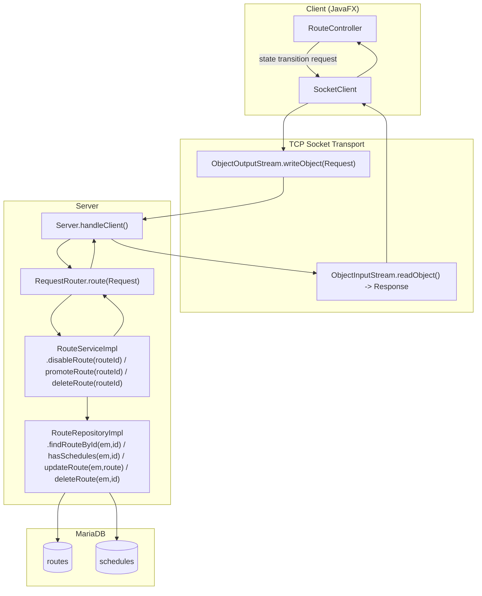
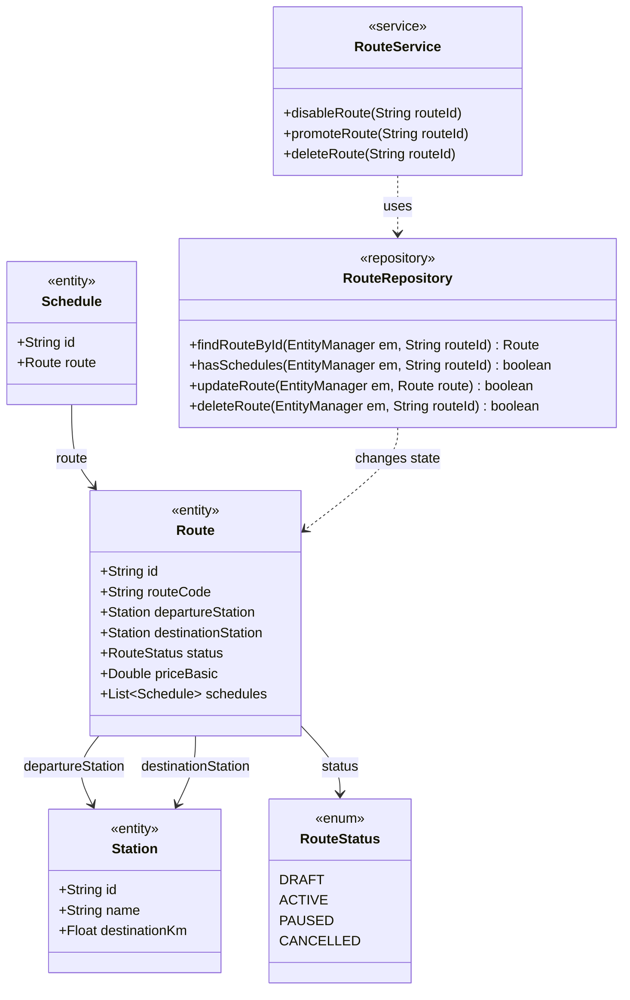

# Diagrams — UC012: Vô hiệu hoá và phát triển tuyến đường

---

## 1. System Architecture

```mermaid
graph TB
    subgraph CLIENT ["Client (JavaFX)"]
        UI["RouteController"]
        SC["SocketClient"]
    end

    subgraph TRANSPORT ["TCP Socket Transport"]
        OOS["ObjectOutputStream.writeObject(Request)"]
        OIS["ObjectInputStream.readObject() -> Response"]
    end

    subgraph SERVER ["Server"]
        SRV["Server.handleClient()"]
        RR["RequestRouter.route(Request)"]
        SVC["RouteServiceImpl\n.disableRoute(routeId) / promoteRoute(routeId) / deleteRoute(routeId)"]
        RT_REPO["RouteRepositoryImpl\n.findRouteById(em,id) / hasSchedules(em,id) / updateRoute(em,route) / deleteRoute(em,id)"]
    end

    subgraph DB ["MariaDB"]
        T_ROUTE[("routes")]
        T_SCHEDULE[("schedules")]
    end

    UI -- "state transition request" --> SC
    SC --> OOS
    OOS --> SRV
    SRV --> RR
    RR --> SVC
    SVC --> RT_REPO
    RT_REPO --> T_ROUTE
    RT_REPO --> T_SCHEDULE
    SVC --> RR
    RR --> SRV
    SRV --> OIS
    OIS --> SC
    SC --> UI
```

---

## 2. Sequence Diagram

```mermaid
sequenceDiagram
    actor Manager as Nhân viên quản lý
    participant UI as RouteController
    participant SC as SocketClient
    participant SRV as Server.handleClient()
    participant RR as RequestRouter
    participant SVC as RouteServiceImpl
    participant RouteRepo as RouteRepositoryImpl
    participant DB as MariaDB

    rect rgb(245, 245, 245)
        Note over Manager,DB: Luồng A — Vô hiệu hoá tuyến đường đang ACTIVE
        Manager->>UI: Chọn tuyến đường ACTIVE và nhấn "Vô hiệu hoá"
        UI->>SC: sendRequest(Yêu cầu vô hiệu hoá tuyến đường)
        SC->>SRV: ObjectOutputStream.writeObject(request)
        SRV->>RR: route(request)
        RR->>SVC: disableRoute(routeId)

        SVC->>RouteRepo: findRouteById(em, routeId)
        RouteRepo->>DB: SELECT r FROM Route r WHERE r.id = :routeId
        DB-->>RouteRepo: Route
        RouteRepo-->>SVC: route

        alt Không tìm thấy tuyến đường
            SVC-->>RR: Response.error("Không tìm thấy tuyến đường")
            RR-->>SRV: Response
            SRV-->>SC: ObjectInputStream.readObject()
            SC-->>UI: Response(success=false)
            UI-->>Manager: Hiển thị thông báo lỗi
        else route.status != ACTIVE
            SVC-->>RR: Response.error("Chỉ có thể vô hiệu hoá tuyến đang hoạt động")
            RR-->>SRV: Response
            SRV-->>SC: ObjectInputStream.readObject()
            SC-->>UI: Response(success=false)
            UI-->>Manager: Hiển thị thông báo sai trạng thái
        else route.status == ACTIVE
            SVC->>RouteRepo: hasSchedules(em, routeId)
            RouteRepo->>DB: SELECT COUNT(s) FROM Schedule s WHERE s.route.id = :routeId
            DB-->>RouteRepo: count schedules
            RouteRepo-->>SVC: hasSchedules

            alt Tuyến đường đã kết nối với lịch trình
                SVC-->>RR: Response.error("Không thể vô hiệu hoá tuyến đường đã có lịch trình")
                RR-->>SRV: Response
                SRV-->>SC: ObjectInputStream.readObject()
                SC-->>UI: Response(success=false)
                UI-->>Manager: Hiển thị thông báo không thể vô hiệu hoá
            else Chưa có lịch trình ràng buộc
                SVC->>SVC: route.setStatus(PAUSED)
                SVC->>DB: BEGIN TRANSACTION
                SVC->>RouteRepo: updateRoute(em, route)
                RouteRepo->>DB: UPDATE routes SET status = 'PAUSED' WHERE route_id = :routeId
                DB-->>RouteRepo: 1 row updated
                RouteRepo-->>SVC: true
                SVC->>DB: COMMIT
                SVC-->>RR: Response.success("Vô hiệu hoá tuyến đường thành công", routeId)
                RR-->>SRV: Response
                SRV-->>SC: ObjectInputStream.readObject()
                SC-->>UI: Response(success=true)
                UI-->>Manager: Hiển thị thông báo thành công và tải lại bảng
            end
        end
    end

    rect rgb(250, 250, 250)
        Note over Manager,DB: Luồng B — Phát triển tuyến đường nháp
        Manager->>UI: Chọn tuyến đường DRAFT và nhấn "Phát triển"
        UI->>SC: sendRequest(Yêu cầu phát triển tuyến đường)
        SC->>SRV: ObjectOutputStream.writeObject(request)
        SRV->>RR: route(request)
        RR->>SVC: promoteRoute(routeId)

        SVC->>RouteRepo: findRouteById(em, routeId)
        RouteRepo->>DB: SELECT r FROM Route r WHERE r.id = :routeId
        DB-->>RouteRepo: Route
        RouteRepo-->>SVC: route

        alt Không tìm thấy tuyến đường
            SVC-->>RR: Response.error("Không tìm thấy tuyến đường")
            RR-->>SRV: Response
            SRV-->>SC: ObjectInputStream.readObject()
            SC-->>UI: Response(success=false)
            UI-->>Manager: Hiển thị thông báo lỗi
        else route.status != DRAFT
            SVC-->>RR: Response.error("Chỉ có thể phát triển tuyến đường đang ở trạng thái Nháp")
            RR-->>SRV: Response
            SRV-->>SC: ObjectInputStream.readObject()
            SC-->>UI: Response(success=false)
            UI-->>Manager: Hiển thị thông báo sai trạng thái
        else route.status == DRAFT
            SVC->>SVC: route.setStatus(ACTIVE)
            SVC->>DB: BEGIN TRANSACTION
            SVC->>RouteRepo: updateRoute(em, route)
            RouteRepo->>DB: UPDATE routes SET status = 'ACTIVE' WHERE route_id = :routeId
            DB-->>RouteRepo: 1 row updated
            RouteRepo-->>SVC: true
            SVC->>DB: COMMIT
            SVC-->>RR: Response.success("Phát triển tuyến đường thành công", routeId)
            RR-->>SRV: Response
            SRV-->>SC: ObjectInputStream.readObject()
            SC-->>UI: Response(success=true)
            UI-->>Manager: Hiển thị thông báo thành công và tải lại bảng
        end
    end

    rect rgb(245, 250, 245)
        Note over Manager,DB: Luồng C — Xoá tuyến đường nháp
        Manager->>UI: Chọn tuyến đường DRAFT và nhấn "Xoá"
        UI->>SC: sendRequest(Yêu cầu xoá tuyến đường nháp)
        SC->>SRV: ObjectOutputStream.writeObject(request)
        SRV->>RR: route(request)
        RR->>SVC: deleteRoute(routeId)

        SVC->>RouteRepo: findRouteById(em, routeId)
        RouteRepo->>DB: SELECT r FROM Route r WHERE r.id = :routeId
        DB-->>RouteRepo: Route
        RouteRepo-->>SVC: route

        alt Không tìm thấy tuyến đường
            SVC-->>RR: Response.error("Không tìm thấy tuyến đường")
            RR-->>SRV: Response
            SRV-->>SC: ObjectInputStream.readObject()
            SC-->>UI: Response(success=false)
            UI-->>Manager: Hiển thị thông báo lỗi
        else route.status != DRAFT
            SVC-->>RR: Response.error("Chỉ được xoá tuyến đường ở trạng thái Nháp")
            RR-->>SRV: Response
            SRV-->>SC: ObjectInputStream.readObject()
            SC-->>UI: Response(success=false)
            UI-->>Manager: Hiển thị thông báo sai trạng thái
        else route.status == DRAFT
            SVC->>RouteRepo: hasSchedules(em, routeId)
            RouteRepo->>DB: SELECT COUNT(s) FROM Schedule s WHERE s.route.id = :routeId
            DB-->>RouteRepo: count schedules
            RouteRepo-->>SVC: hasSchedules

            alt Tuyến đường nháp đã bị ràng buộc lịch trình
                SVC-->>RR: Response.error("Không thể xoá tuyến đường đã có lịch trình")
                RR-->>SRV: Response
                SRV-->>SC: ObjectInputStream.readObject()
                SC-->>UI: Response(success=false)
                UI-->>Manager: Hiển thị thông báo lỗi
            else Có thể xoá
                SVC->>DB: BEGIN TRANSACTION
                SVC->>RouteRepo: deleteRoute(em, routeId)
                RouteRepo->>DB: DELETE FROM routes WHERE route_id = :routeId
                DB-->>RouteRepo: 1 row deleted
                RouteRepo-->>SVC: true
                SVC->>DB: COMMIT
                SVC-->>RR: Response.success("Xoá tuyến đường nháp thành công", routeId)
                RR-->>SRV: Response
                SRV-->>SC: ObjectInputStream.readObject()
                SC-->>UI: Response(success=true)
                UI-->>Manager: Hiển thị thông báo thành công và tải lại bảng
            end
        end
    end
```

---

## 3. Class Diagram

```mermaid
classDiagram
    class Route {
        <<entity>>
        +String id
        +String routeCode
        +Station departureStation
        +Station destinationStation
        +RouteStatus status
        +Double priceBasic
        +List~Schedule~ schedules
    }

    class Station {
        <<entity>>
        +String id
        +String name
        +Float destinationKm
    }

    class Schedule {
        <<entity>>
        +String id
        +Route route
    }

    class RouteStatus {
        <<enum>>
        DRAFT
        ACTIVE
        PAUSED
        CANCELLED
    }

    class RouteRepository {
        <<repository>>
        +findRouteById(EntityManager em, String routeId) Route
        +hasSchedules(EntityManager em, String routeId) boolean
        +updateRoute(EntityManager em, Route route) boolean
        +deleteRoute(EntityManager em, String routeId) boolean
    }

    class RouteService {
        <<service>>
        +disableRoute(String routeId)
        +promoteRoute(String routeId)
        +deleteRoute(String routeId)
    }

    Route --> Station : departureStation
    Route --> Station : destinationStation
    Route --> RouteStatus : status
    Schedule --> Route : route
    RouteService ..> RouteRepository : uses
    RouteRepository ..> Route : changes state
```
