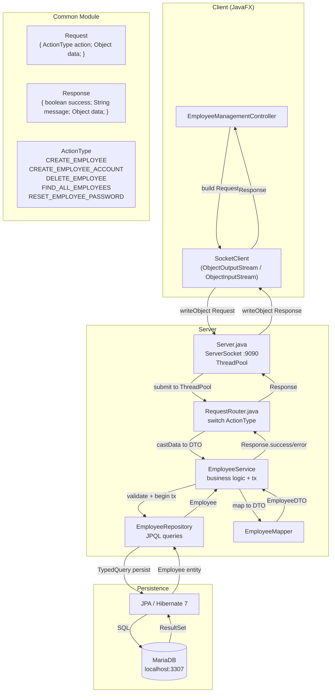
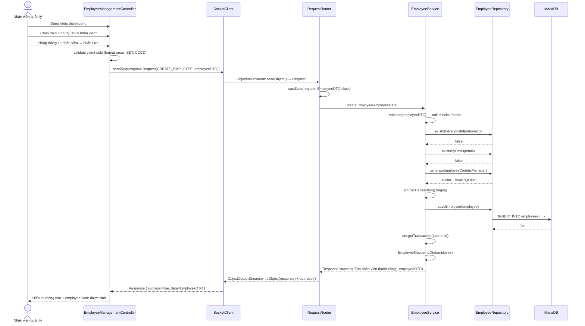
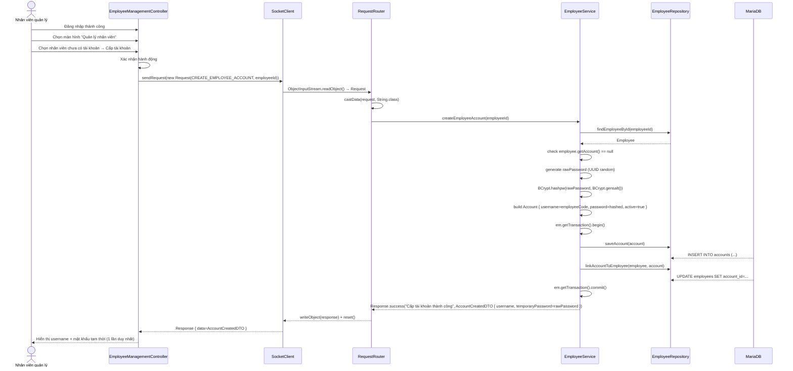
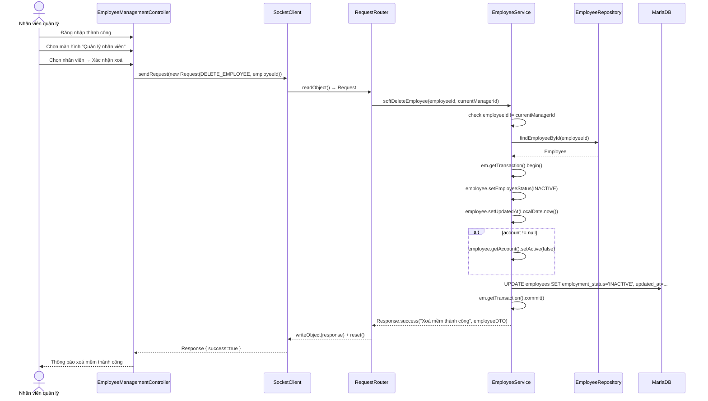
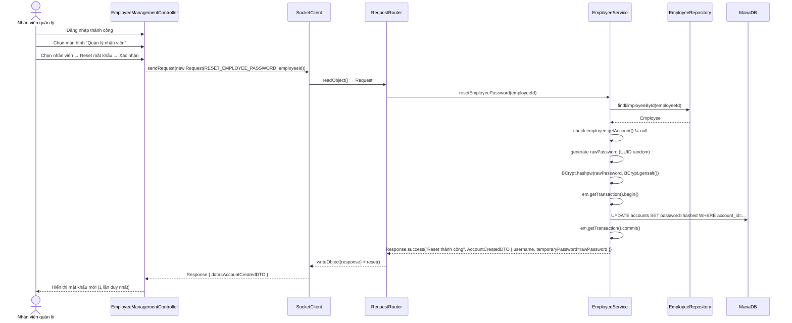
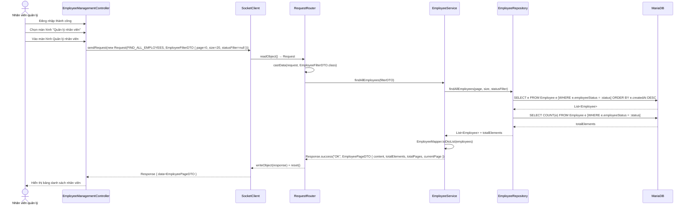
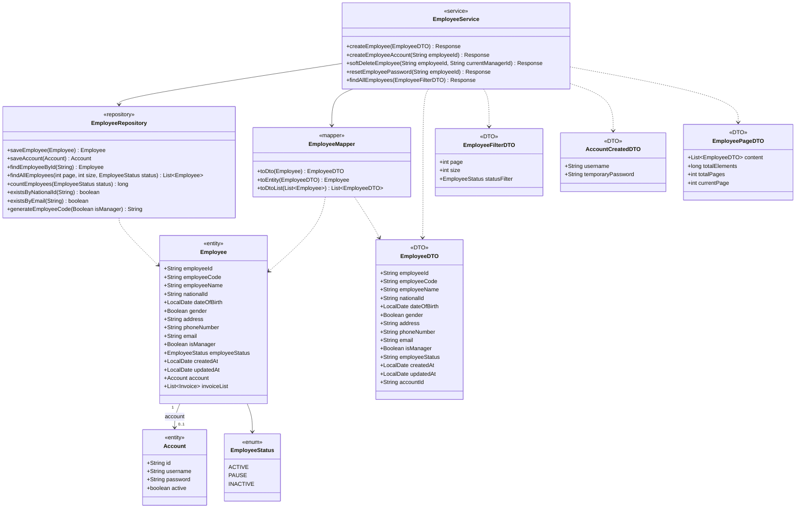

# UC013 — Quản lý nhân viên

## 1. System Architecture Diagram

---

## 2. Sequence Diagrams

### Luồng A — Tạo hồ sơ nhân viên

### Luồng B — Cấp tài khoản

### Luồng C — Xoá mềm nhân viên

### Luồng D — Reset mật khẩu

### Luồng E — Xem danh sách nhân viên

---

## 3. Class Diagram

