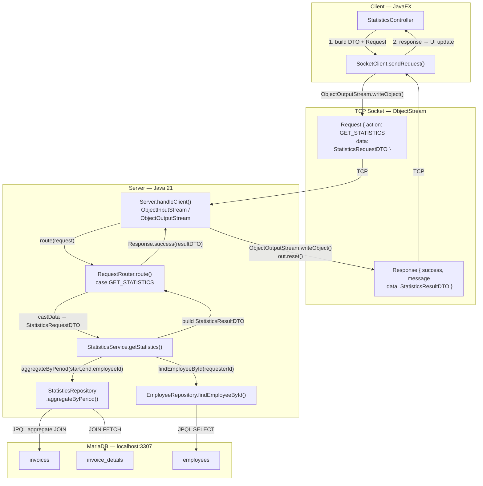
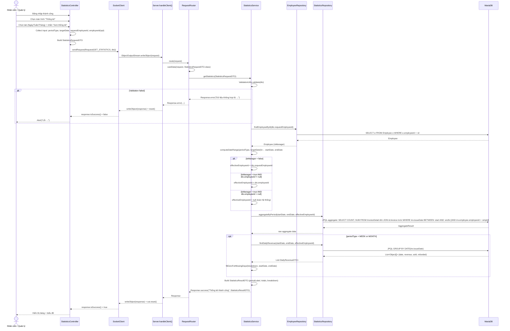
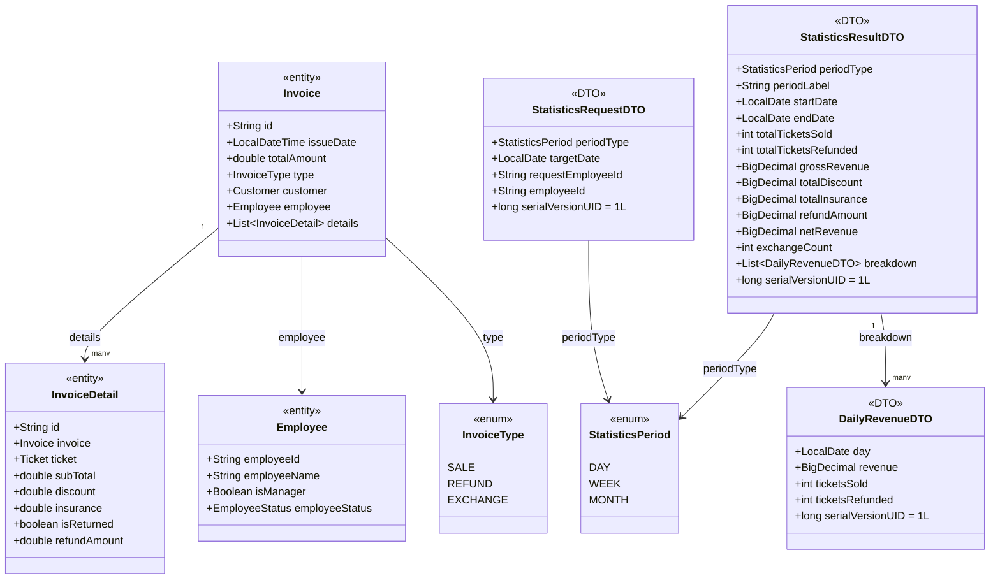

# UC014 — Quản lý thống kê

## 1. System Architecture

```mermaid
graph TB
    subgraph CLIENT ["Client — JavaFX"]
        UI["StatisticsController"]
        SC["SocketClient.sendRequest()"]
    end

    subgraph TRANSPORT ["TCP Socket — ObjectStream"]
        REQ["Request { action: GET_STATISTICS\n data: StatisticsRequestDTO }"]
        RES["Response { success, message\n data: StatisticsResultDTO }"]
    end

    subgraph SERVER ["Server — Java 21"]
        SV["Server.handleClient()\n ObjectInputStream / ObjectOutputStream"]
        RR["RequestRouter.route()\n case GET_STATISTICS"]
        SS["StatisticsService.getStatistics()"]
        ER["EmployeeRepository.findEmployeeById()"]
        SR["StatisticsRepository\n .aggregateByPeriod()"]
    end

    subgraph DB ["MariaDB — localhost:3307"]
        INV["invoices"]
        INVD["invoice_details"]
        EMP["employees"]
    end

    UI -->|"1. build DTO + Request"| SC
    SC -->|"ObjectOutputStream.writeObject()"| REQ
    REQ -->|"TCP"| SV
    SV -->|"route(request)"| RR
    RR -->|"castData → StatisticsRequestDTO"| SS
    SS -->|"findEmployeeById(requesterId)"| ER
    ER -->|"JPQL SELECT"| EMP
    SS -->|"aggregateByPeriod(start,end,employeeId)"| SR
    SR -->|"JPQL aggregate JOIN"| INV
    SR -->|"JOIN FETCH"| INVD
    SS -->|"build StatisticsResultDTO"| RR
    RR -->|"Response.success(resultDTO)"| SV
    SV -->|"ObjectOutputStream.writeObject()\nout.reset()"| RES
    RES -->|"TCP"| SC
    SC -->|"2. response → UI update"| UI
```

---

## 2. Sequence Diagram

```mermaid
sequenceDiagram
    actor User as Nhân viên / Quản lý
    participant UI as StatisticsController
    participant SC as SocketClient
    participant SV as Server.handleClient()
    participant RR as RequestRouter
    participant SS as StatisticsService
    participant ER as EmployeeRepository
    participant SR as StatisticsRepository
    participant DB as MariaDB

    User->>UI: Đăng nhập thành công
    User->>UI: Chọn màn hình "Thống kê"
    User->>UI: Chọn tab (Ngày/Tuần/Tháng) + nhấn "Xem thống kê"
    UI->>UI: Collect input: periodType, targetDate, requestEmployeeId, employeeId(opt)
    UI->>UI: Build StatisticsRequestDTO
    UI->>SC: sendRequest(Request(GET_STATISTICS, dto))
    SC->>SV: ObjectOutputStream.writeObject(request)

    SV->>RR: route(request)
    RR->>RR: castData(request, StatisticsRequestDTO.class)
    RR->>SS: getStatistics(StatisticsRequestDTO)

    SS->>SS: ValidationUtils.validate(dto)
    alt Validation failed
        SS-->>RR: Response.error("Dữ liệu không hợp lệ: ...")
        RR-->>SV: Response.error(...)
        SV-->>SC: writeObject(response) + reset()
        SC-->>UI: response.isSuccess() = false
        UI-->>User: Alert("Lỗi: ...")
    end

    SS->>ER: findEmployeeById(dto.requestEmployeeId)
    ER->>DB: SELECT e FROM Employee e WHERE e.employeeId = :id
    DB-->>ER: Employee
    ER-->>SS: Employee (isManager)

    SS->>SS: computeDateRange(periodType, targetDate)\n→ startDate, endDate

    alt isManager = false
        SS->>SS: effectiveEmployeeId = dto.requestEmployeeId
    else isManager = true AND dto.employeeId != null
        SS->>SS: effectiveEmployeeId = dto.employeeId
    else isManager = true AND dto.employeeId = null
        SS->>SS: effectiveEmployeeId = null (toàn hệ thống)
    end

    SS->>SR: aggregateByPeriod(startDate, endDate, effectiveEmployeeId)
    SR->>DB: JPQL aggregate: SELECT COUNT, SUM FROM InvoiceDetail id\n JOIN id.invoice inv\n WHERE inv.issueDate BETWEEN :start AND :end\n [AND inv.employee.employeeId = :empId]
    DB-->>SR: AggregateResult
    SR-->>SS: raw aggregate data

    opt periodType = WEEK or MONTH
        SS->>SR: findDailyRevenue(startDate, endDate, effectiveEmployeeId)
        SR->>DB: JPQL GROUP BY DATE(inv.issueDate)
        DB-->>SR: List<Object[]> (date, revenue, sold, refunded)
        SR-->>SS: List<DailyRevenueDTO>
        SS->>SS: fillZeroForMissingDays(breakdown, startDate, endDate)
    end

    SS->>SS: Build StatisticsResultDTO (periodLabel, totals, breakdown)
    SS-->>RR: Response.success("Thống kê thành công", StatisticsResultDTO)
    RR-->>SV: Response
    SV-->>SC: writeObject(response) + out.reset()
    SC-->>UI: response.isSuccess() = true
    UI-->>User: Hiển thị bảng + biểu đồ
```

---

## 3. Class Diagram

```mermaid
classDiagram
    class Invoice {
        <<entity>>
        +String id
        +LocalDateTime issueDate
        +double totalAmount
        +InvoiceType type
        +Customer customer
        +Employee employee
        +List~InvoiceDetail~ details
    }

    class InvoiceDetail {
        <<entity>>
        +String id
        +Invoice invoice
        +Ticket ticket
        +double subTotal
        +double discount
        +double insurance
        +boolean isReturned
        +double refundAmount
    }

    class Employee {
        <<entity>>
        +String employeeId
        +String employeeName
        +Boolean isManager
        +EmployeeStatus employeeStatus
    }

    class InvoiceType {
        <<enum>>
        SALE
        REFUND
        EXCHANGE
    }

    class StatisticsPeriod {
        <<enum>>
        DAY
        WEEK
        MONTH
    }

    class StatisticsRequestDTO {
        <<DTO>>
        +StatisticsPeriod periodType
        +LocalDate targetDate
        +String requestEmployeeId
        +String employeeId
        +long serialVersionUID = 1L
    }

    class StatisticsResultDTO {
        <<DTO>>
        +StatisticsPeriod periodType
        +String periodLabel
        +LocalDate startDate
        +LocalDate endDate
        +int totalTicketsSold
        +int totalTicketsRefunded
        +BigDecimal grossRevenue
        +BigDecimal totalDiscount
        +BigDecimal totalInsurance
        +BigDecimal refundAmount
        +BigDecimal netRevenue
        +int exchangeCount
        +List~DailyRevenueDTO~ breakdown
        +long serialVersionUID = 1L
    }

    class DailyRevenueDTO {
        <<DTO>>
        +LocalDate day
        +BigDecimal revenue
        +int ticketsSold
        +int ticketsRefunded
        +long serialVersionUID = 1L
    }

    Invoice "1" --> "many" InvoiceDetail : details
    Invoice --> Employee : employee
    Invoice --> InvoiceType : type
    StatisticsRequestDTO --> StatisticsPeriod : periodType
    StatisticsResultDTO --> StatisticsPeriod : periodType
    StatisticsResultDTO "1" --> "many" DailyRevenueDTO : breakdown
```
