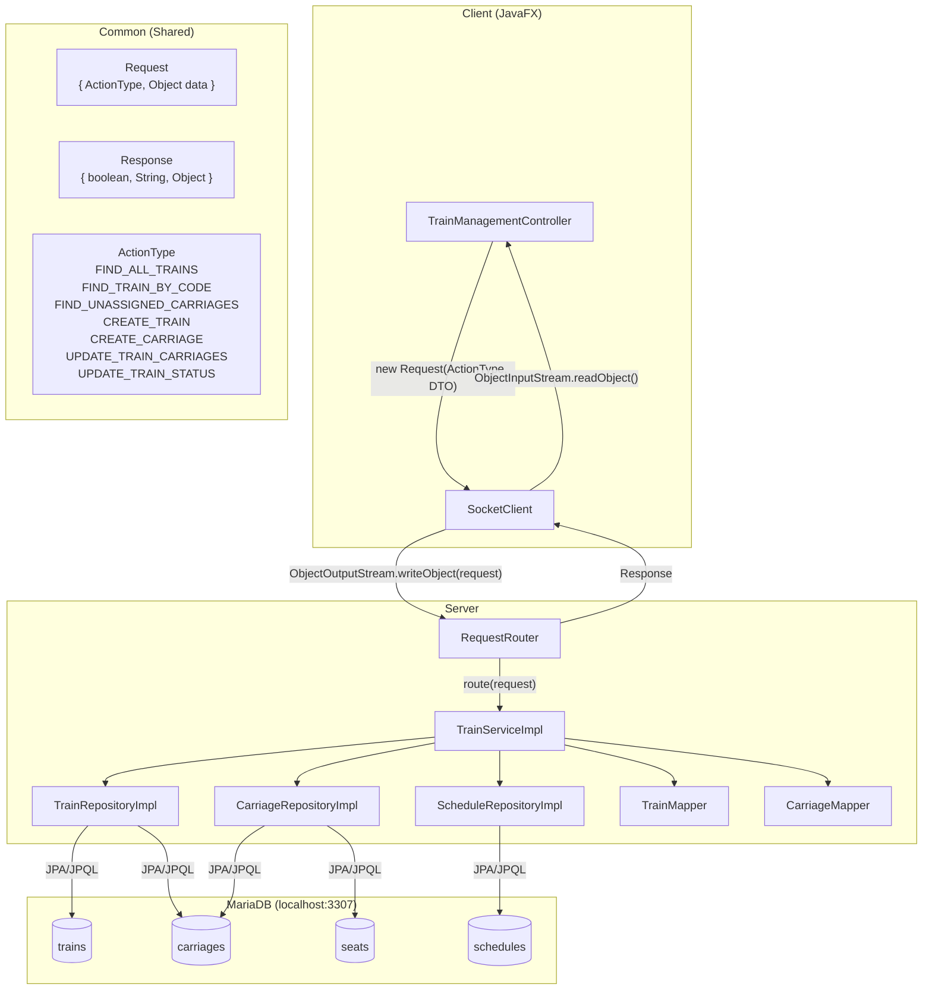
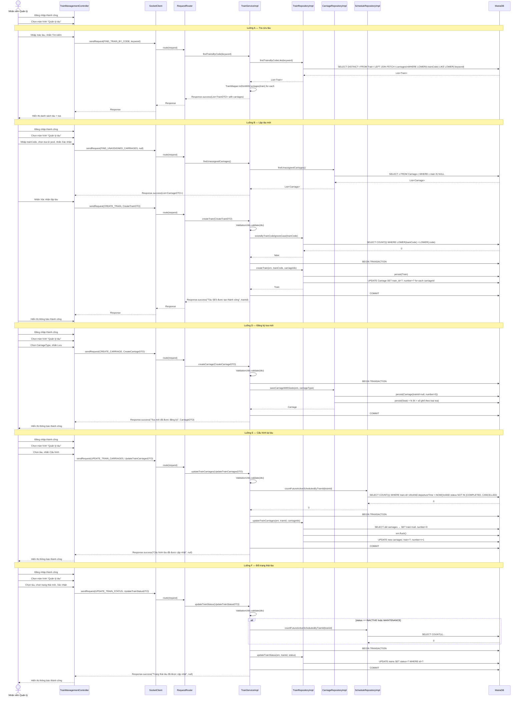
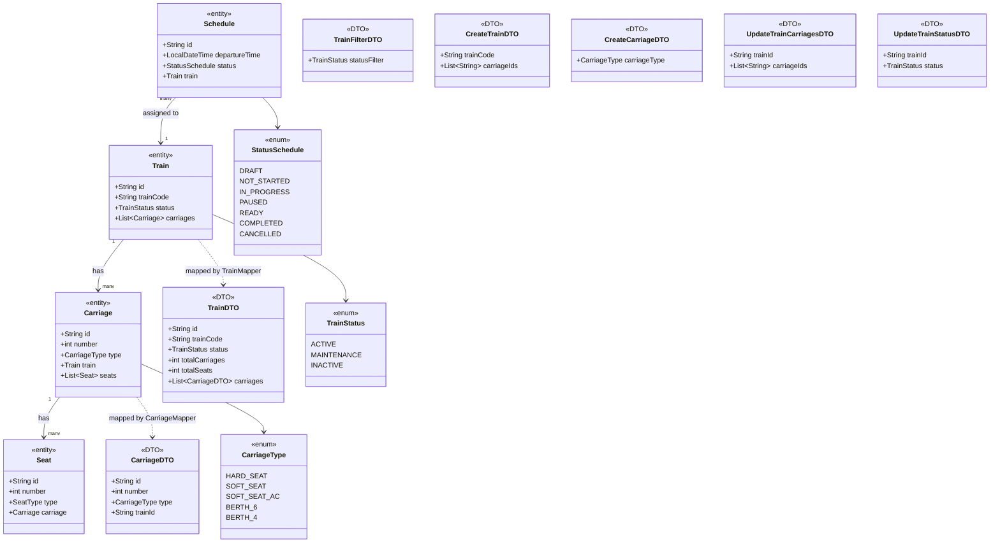

# UC015 — Quản lý tàu

## 1. System Architecture

```mermaid
graph TB
    subgraph CLIENT["Client (JavaFX)"]
        UI["TrainManagementController"]
        SC["SocketClient"]
    end

    subgraph COMMON["Common (Shared)"]
        REQ["Request\n{ ActionType, Object data }"]
        RES["Response\n{ boolean, String, Object }"]
        AT["ActionType\nFIND_ALL_TRAINS\nFIND_TRAIN_BY_CODE\nFIND_UNASSIGNED_CARRIAGES\nCREATE_TRAIN\nCREATE_CARRIAGE\nUPDATE_TRAIN_CARRIAGES\nUPDATE_TRAIN_STATUS"]
    end

    subgraph SERVER["Server"]
        RR["RequestRouter"]
        TS["TrainServiceImpl"]
        SR["ScheduleRepositoryImpl"]
        TR["TrainRepositoryImpl"]
        CR["CarriageRepositoryImpl"]
        TM["TrainMapper"]
        CM["CarriageMapper"]
    end

    subgraph DB["MariaDB (localhost:3307)"]
        T[("trains")]
        C[("carriages")]
        S[("seats")]
        SCH[("schedules")]
    end

    UI -- "new Request(ActionType, DTO)" --> SC
    SC -- "ObjectOutputStream.writeObject(request)" --> RR
    RR -- "Response" --> SC
    SC -- "ObjectInputStream.readObject()" --> UI

    RR -- "route(request)" --> TS
    TS --> SR
    TS --> TR
    TS --> CR
    TS --> TM
    TS --> CM
    TR -- "JPA/JPQL" --> T
    TR -- "JPA/JPQL" --> C
    CR -- "JPA/JPQL" --> C
    CR -- "JPA/JPQL" --> S
    SR -- "JPA/JPQL" --> SCH
```

---

## 2. Sequence Diagram

```mermaid
sequenceDiagram
    actor User as Nhân viên Quản lý
    participant UI as TrainManagementController
    participant SC as SocketClient
    participant RR as RequestRouter
    participant TS as TrainServiceImpl
    participant TR as TrainRepositoryImpl
    participant CR as CarriageRepositoryImpl
    participant SR as ScheduleRepositoryImpl
    participant DB as MariaDB

    User->>UI: Đăng nhập thành công
    User->>UI: Chọn màn hình "Quản lý tàu"
    Note over User,DB: Luồng A — Tra cứu tàu
    User->>UI: Nhập mác tàu, nhấn Tìm kiếm
    UI->>SC: sendRequest(FIND_TRAIN_BY_CODE, keyword)
    SC->>RR: route(request)
    RR->>TS: findTrainsByCode(keyword)
    TS->>TR: findTrainsByCodeLike(keyword)
    TR->>DB: SELECT DISTINCT t FROM Train t LEFT JOIN FETCH t.carriages\nWHERE LOWER(t.trainCode) LIKE LOWER(:keyword)
    DB-->>TR: List<Train>
    TR-->>TS: List<Train>
    TS->>TS: TrainMapper.toDtoWithCarriages(train) for each
    TS-->>RR: Response.success(List<TrainDTO> with carriages)
    RR-->>SC: Response
    SC-->>UI: Response
    UI-->>User: Hiển thị danh sách tàu + toa

    Note over User,DB: Luồng B — Lập tàu mới
    User->>UI: Đăng nhập thành công
    User->>UI: Chọn màn hình "Quản lý tàu"
    User->>UI: Nhập trainCode, chọn toa từ pool, nhấn Xác nhận
    UI->>SC: sendRequest(FIND_UNASSIGNED_CARRIAGES, null)
    SC->>RR: route(request)
    RR->>TS: findUnassignedCarriages()
    TS->>CR: findUnassignedCarriages()
    CR->>DB: SELECT c FROM Carriage c WHERE c.train IS NULL
    DB-->>CR: List<Carriage>
    CR-->>TS: List<Carriage>
    TS-->>UI: Response.success(List<CarriageDTO>)

    User->>UI: Nhấn Xác nhận lập tàu
    UI->>SC: sendRequest(CREATE_TRAIN, CreateTrainDTO)
    SC->>RR: route(request)
    RR->>TS: createTrain(CreateTrainDTO)
    TS->>TS: ValidationUtils.validate(dto)
    TS->>TR: existsByTrainCodeIgnoreCase(trainCode)
    TR->>DB: SELECT COUNT(t) WHERE LOWER(trainCode) = LOWER(:code)
    DB-->>TR: 0
    TR-->>TS: false
    TS->>DB: BEGIN TRANSACTION
    TS->>TR: createTrain(em, trainCode, carriageIds)
    TR->>DB: persist(Train)
    TR->>DB: UPDATE Carriage SET train_id=?, number=? for each carriageId
    TR-->>TS: Train
    TS->>DB: COMMIT
    TS-->>RR: Response.success("Tàu SE5 được tạo thành công", trainId)
    RR-->>SC: Response
    SC-->>UI: Response
    User->>UI: Hiển thị thông báo thành công

    Note over User,DB: Luồng D — Đăng ký toa mới
    User->>UI: Đăng nhập thành công
    User->>UI: Chọn màn hình "Quản lý tàu"
    User->>UI: Chọn CarriageType, nhấn Lưu
    UI->>SC: sendRequest(CREATE_CARRIAGE, CreateCarriageDTO)
    SC->>RR: route(request)
    RR->>TS: createCarriage(CreateCarriageDTO)
    TS->>TS: ValidationUtils.validate(dto)
    TS->>DB: BEGIN TRANSACTION
    TS->>CR: saveCarriageWithSeats(em, carriageType)
    CR->>DB: persist(Carriage{trainId=null, number=0})
    CR->>DB: persist(Seat) × N (N = số ghế theo loại toa)
    CR-->>TS: Carriage
    TS->>DB: COMMIT
    TS-->>UI: Response.success("Toa mới đã được đăng ký", CarriageDTO)
    UI-->>User: Hiển thị thông báo thành công

    Note over User,DB: Luồng E — Cấu hình lại tàu
    User->>UI: Đăng nhập thành công
    User->>UI: Chọn màn hình "Quản lý tàu"
    User->>UI: Chọn tàu, nhấn Cấu hình
    UI->>SC: sendRequest(UPDATE_TRAIN_CARRIAGES, UpdateTrainCarriagesDTO)
    SC->>RR: route(request)
    RR->>TS: updateTrainCarriages(UpdateTrainCarriagesDTO)
    TS->>TS: ValidationUtils.validate(dto)
    TS->>SR: countFutureActiveSchedulesByTrainId(trainId)
    SR->>DB: SELECT COUNT(s) WHERE train.id=:id\nAND departureTime > NOW()\nAND status NOT IN (COMPLETED, CANCELLED)
    DB-->>SR: 0
    SR-->>TS: 0
    TS->>DB: BEGIN TRANSACTION
    TS->>TR: updateTrainCarriages(em, trainId, carriageIds)
    TR->>DB: SELECT old carriages → SET train=null, number=0
    TR->>DB: em.flush()
    TR->>DB: UPDATE new carriages: train=?, number=i+1
    TS->>DB: COMMIT
    TS-->>UI: Response.success("Cấu hình tàu đã được cập nhật", null)
    UI-->>User: Hiển thị thông báo thành công

    Note over User,DB: Luồng F — Đổi trạng thái tàu
    User->>UI: Đăng nhập thành công
    User->>UI: Chọn màn hình "Quản lý tàu"
    User->>UI: Chọn tàu, chọn trạng thái mới, Xác nhận
    UI->>SC: sendRequest(UPDATE_TRAIN_STATUS, UpdateTrainStatusDTO)
    SC->>RR: route(request)
    RR->>TS: updateTrainStatus(UpdateTrainStatusDTO)
    TS->>TS: ValidationUtils.validate(dto)
    alt status == INACTIVE hoặc MAINTENANCE
        TS->>SR: countFutureActiveSchedulesByTrainId(trainId)
        SR->>DB: SELECT COUNT(s)...
        DB-->>SR: 0
    end
    TS->>DB: BEGIN TRANSACTION
    TS->>TR: updateTrainStatus(em, trainId, status)
    TR->>DB: UPDATE trains SET status=? WHERE id=?
    TS->>DB: COMMIT
    TS-->>UI: Response.success("Trạng thái tàu đã được cập nhật", null)
    UI-->>User: Hiển thị thông báo thành công
```

---

## 3. Class Diagram

```mermaid
classDiagram
    direction TB

    class Train {
        <<entity>>
        +String id
        +String trainCode
        +TrainStatus status
        +List~Carriage~ carriages
    }

    class Carriage {
        <<entity>>
        +String id
        +int number
        +CarriageType type
        +Train train
        +List~Seat~ seats
    }

    class Seat {
        <<entity>>
        +String id
        +int number
        +SeatType type
        +Carriage carriage
    }

    class Schedule {
        <<entity>>
        +String id
        +LocalDateTime departureTime
        +StatusSchedule status
        +Train train
    }

    class TrainDTO {
        <<DTO>>
        +String id
        +String trainCode
        +TrainStatus status
        +int totalCarriages
        +int totalSeats
        +List~CarriageDTO~ carriages
    }

    class CarriageDTO {
        <<DTO>>
        +String id
        +int number
        +CarriageType type
        +String trainId
    }

    class TrainFilterDTO {
        <<DTO>>
        +TrainStatus statusFilter
    }

    class CreateTrainDTO {
        <<DTO>>
        +String trainCode
        +List~String~ carriageIds
    }

    class CreateCarriageDTO {
        <<DTO>>
        +CarriageType carriageType
    }

    class UpdateTrainCarriagesDTO {
        <<DTO>>
        +String trainId
        +List~String~ carriageIds
    }

    class UpdateTrainStatusDTO {
        <<DTO>>
        +String trainId
        +TrainStatus status
    }

    class TrainStatus {
        <<enum>>
        ACTIVE
        MAINTENANCE
        INACTIVE
    }

    class CarriageType {
        <<enum>>
        HARD_SEAT
        SOFT_SEAT
        SOFT_SEAT_AC
        BERTH_6
        BERTH_4
    }

    class StatusSchedule {
        <<enum>>
        DRAFT
        NOT_STARTED
        IN_PROGRESS
        PAUSED
        READY
        COMPLETED
        CANCELLED
    }

    Train "1" --> "many" Carriage : has
    Carriage "1" --> "many" Seat : has
    Schedule "many" --> "1" Train : assigned to
    Train ..> TrainDTO : mapped by TrainMapper
    Carriage ..> CarriageDTO : mapped by CarriageMapper
    Train --> TrainStatus
    Carriage --> CarriageType
    Schedule --> StatusSchedule
```
