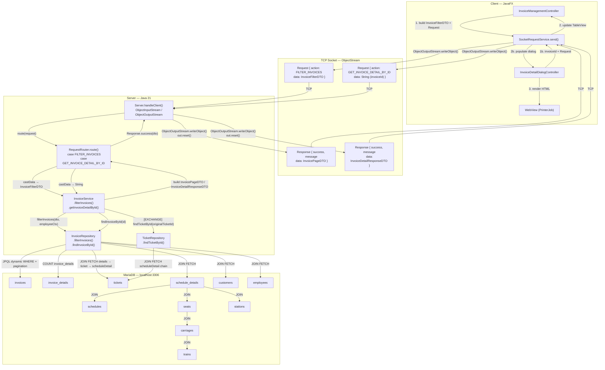
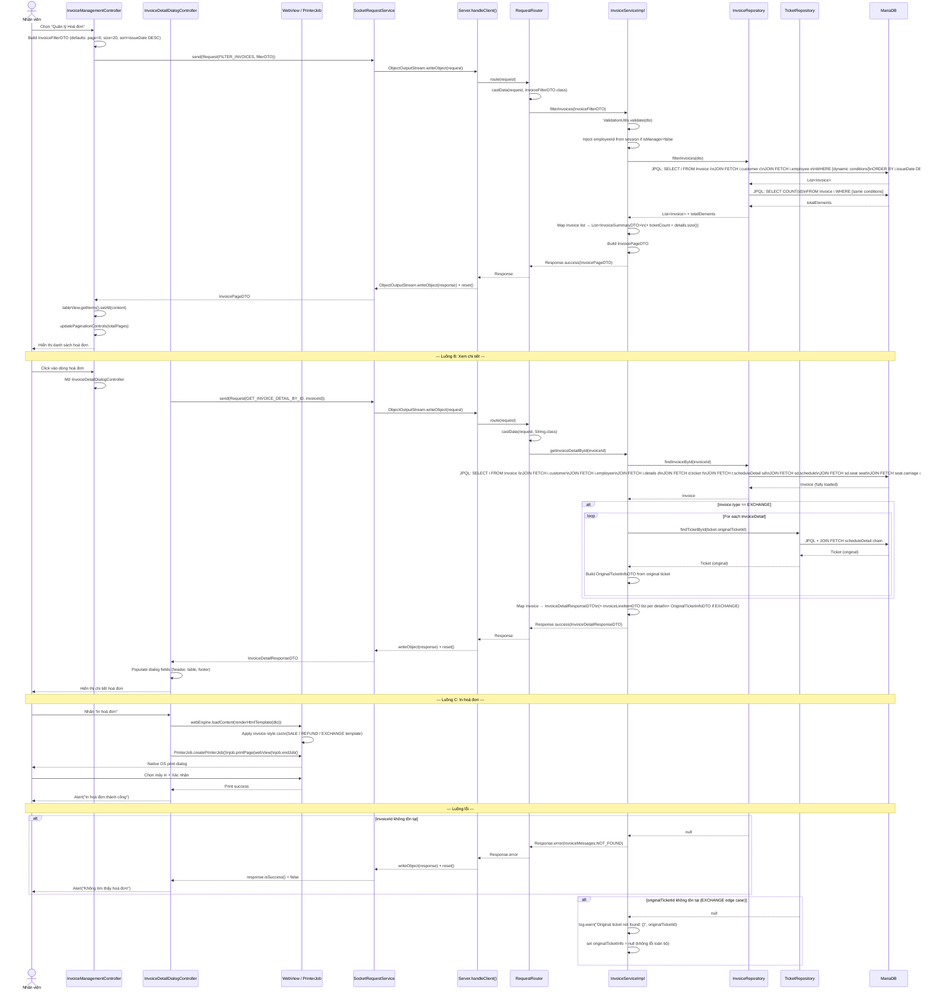
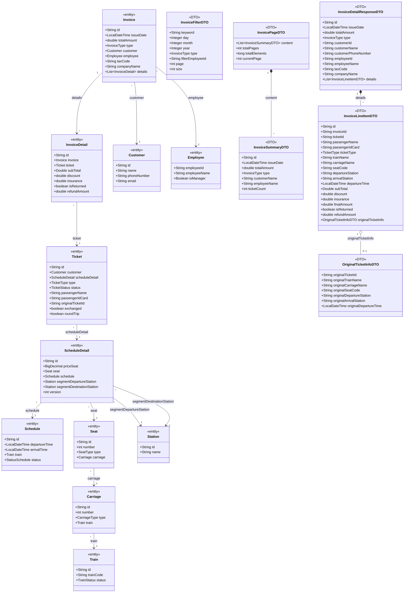

# UC016 — Quản lý hoá đơn

## 1. System Architecture

```mermaid
graph TB
    subgraph CLIENT ["Client — JavaFX"]
        UI["InvoiceManagementController"]
        DLG["InvoiceDetailDialogController"]
        WV["WebView (PrinterJob)"]
        SRS["SocketRequestService.send()"]
    end

    subgraph TRANSPORT ["TCP Socket — ObjectStream"]
        REQ_F["Request { action: FILTER_INVOICES\n data: InvoiceFilterDTO }"]
        REQ_D["Request { action: GET_INVOICE_DETAIL_BY_ID\n data: String (invoiceId) }"]
        RES_F["Response { success, message\n data: InvoicePageDTO }"]
        RES_D["Response { success, message\n data: InvoiceDetailResponseDTO }"]
    end

    subgraph SERVER ["Server — Java 21"]
        SV["Server.handleClient()\n ObjectInputStream / ObjectOutputStream"]
        RR["RequestRouter.route()\n case FILTER_INVOICES\n case GET_INVOICE_DETAIL_BY_ID"]
        IS["InvoiceService\n .filterInvoices()\n .getInvoiceDetailById()"]
        IR["InvoiceRepository\n .filterInvoices()\n .findInvoiceById()"]
        TR["TicketRepository\n .findTicketById()"]
    end

    subgraph DB ["MariaDB — localhost:3306"]
        INV["invoices"]
        INVD["invoice_details"]
        TK["tickets"]
        SD["schedule_details"]
        SCH["schedules"]
        ST["seats"]
        CAR["carriages"]
        TRN["trains"]
        STA["stations"]
        CUS["customers"]
        EMP["employees"]
    end

    UI -->|"1. build InvoiceFilterDTO + Request"| SRS
    DLG -->|"1b. invoiceId + Request"| SRS
    SRS -->|"ObjectOutputStream.writeObject()"| REQ_F
    SRS -->|"ObjectOutputStream.writeObject()"| REQ_D
    REQ_F -->|"TCP"| SV
    REQ_D -->|"TCP"| SV
    SV -->|"route(request)"| RR
    RR -->|"castData → InvoiceFilterDTO"| IS
    RR -->|"castData → String"| IS
    IS -->|"filterInvoices(dto, employeeCtx)"| IR
    IR -->|"JPQL dynamic WHERE + pagination"| INV
    IR -->|"JOIN FETCH"| CUS
    IR -->|"JOIN FETCH"| EMP
    IR -->|"COUNT invoice_details"| INVD
    IS -->|"findInvoiceById(id)"| IR
    IR -->|"JOIN FETCH details → ticket → scheduleDetail"| TK
    IR -->|"JOIN FETCH"| SD
    SD -->|"JOIN"| SCH
    SD -->|"JOIN"| ST
    ST -->|"JOIN"| CAR
    CAR -->|"JOIN"| TRN
    SD -->|"JOIN"| STA
    IS -->|"[EXCHANGE] findTicketById(originalTicketId)"| TR
    TR -->|"JOIN FETCH scheduleDetail chain"| TK
    IS -->|"build InvoicePageDTO / InvoiceDetailResponseDTO"| RR
    RR -->|"Response.success(dto)"| SV
    SV -->|"ObjectOutputStream.writeObject()\nout.reset()"| RES_F
    SV -->|"ObjectOutputStream.writeObject()\nout.reset()"| RES_D
    RES_F -->|"TCP"| SRS
    RES_D -->|"TCP"| SRS
    SRS -->|"2. update TableView"| UI
    SRS -->|"2b. populate dialog"| DLG
    DLG -->|"3. render HTML"| WV
```

---

## 2. Sequence Diagram

```mermaid
sequenceDiagram
    actor NV as Nhân viên
    participant UI as InvoiceManagementController
    participant DLG as InvoiceDetailDialogController
    participant WV as WebView / PrinterJob
    participant SRS as SocketRequestService
    participant SV as Server.handleClient()
    participant RR as RequestRouter
    participant IS as InvoiceServiceImpl
    participant IR as InvoiceRepository
    participant TR as TicketRepository
    participant DB as MariaDB

    NV->>UI: Chọn "Quản lý Hoá đơn"
    UI->>UI: Build InvoiceFilterDTO (defaults: page=0, size=20, sort=issueDate DESC)
    UI->>SRS: send(Request(FILTER_INVOICES, filterDTO))
    SRS->>SV: ObjectOutputStream.writeObject(request)

    SV->>RR: route(request)
    RR->>RR: castData(request, InvoiceFilterDTO.class)
    RR->>IS: filterInvoices(InvoiceFilterDTO)

    IS->>IS: ValidationUtils.validate(dto)
    IS->>IS: Inject employeeId from session if isManager=false

    IS->>IR: filterInvoices(dto)
    IR->>DB: JPQL: SELECT i FROM Invoice i\nJOIN FETCH i.customer c\nJOIN FETCH i.employee e\nWHERE [dynamic conditions]\nORDER BY i.issueDate DESC\nOFFSET page*size LIMIT size
    DB-->>IR: List<Invoice>
    IR->>DB: JPQL: SELECT COUNT(id)\nFROM Invoice i WHERE [same conditions]
    DB-->>IR: totalElements
    IR-->>IS: List<Invoice> + totalElements

    IS->>IS: Map Invoice list → List<InvoiceSummaryDTO>\n(+ ticketCount = details.size())
    IS->>IS: Build InvoicePageDTO
    IS-->>RR: Response.success(InvoicePageDTO)
    RR-->>SV: Response
    SV-->>SRS: ObjectOutputStream.writeObject(response) + reset()
    SRS-->>UI: InvoicePageDTO

    UI->>UI: tableView.getItems().setAll(content)
    UI->>UI: updatePaginationControls(totalPages)
    UI-->>NV: Hiển thị danh sách hoá đơn

    Note over NV,DB: --- Luồng B: Xem chi tiết ---

    NV->>UI: Click vào dòng hoá đơn
    UI->>UI: Mở InvoiceDetailDialogController
    DLG->>SRS: send(Request(GET_INVOICE_DETAIL_BY_ID, invoiceId))
    SRS->>SV: ObjectOutputStream.writeObject(request)

    SV->>RR: route(request)
    RR->>RR: castData(request, String.class)
    RR->>IS: getInvoiceDetailById(invoiceId)

    IS->>IR: findInvoiceById(invoiceId)
    IR->>DB: JPQL: SELECT i FROM Invoice i\nJOIN FETCH i.customer\nJOIN FETCH i.employee\nJOIN FETCH i.details d\nJOIN FETCH d.ticket t\nJOIN FETCH t.scheduleDetail sd\nJOIN FETCH sd.schedule\nJOIN FETCH sd.seat seat\nJOIN FETCH seat.carriage car\nJOIN FETCH car.train\nJOIN FETCH sd.segmentDepartureStation\nJOIN FETCH sd.segmentDestinationStation\nWHERE i.id = :invoiceId
    DB-->>IR: Invoice (fully loaded)
    IR-->>IS: Invoice

    alt invoice.type == EXCHANGE
        loop For each InvoiceDetail
            IS->>TR: findTicketById(ticket.originalTicketId)
            TR->>DB: JPQL + JOIN FETCH scheduleDetail chain
            DB-->>TR: Ticket (original)
            TR-->>IS: Ticket (original)
            IS->>IS: Build OriginalTicketInfoDTO from original ticket
        end
    end

    IS->>IS: Map Invoice → InvoiceDetailResponseDTO\n(+ InvoiceLineItemDTO list per detail\n+ OriginalTicketInfoDTO if EXCHANGE)
    IS-->>RR: Response.success(InvoiceDetailResponseDTO)
    RR-->>SV: Response
    SV-->>SRS: writeObject(response) + reset()
    SRS-->>DLG: InvoiceDetailResponseDTO

    DLG->>DLG: Populate dialog fields (header, table, footer)
    DLG-->>NV: Hiển thị chi tiết hoá đơn

    Note over NV,DB: --- Luồng C: In hoá đơn ---

    NV->>DLG: Nhấn "In hoá đơn"
    DLG->>WV: webEngine.loadContent(renderHtmlTemplate(dto))
    WV->>WV: Apply invoice-style.css\n(SALE / REFUND / EXCHANGE template)
    DLG->>WV: PrinterJob.createPrinterJob()\njob.printPage(webView)\njob.endJob()
    WV-->>NV: Native OS print dialog
    NV->>WV: Chọn máy in + Xác nhận
    WV-->>DLG: Print success
    DLG-->>NV: Alert("In hoá đơn thành công")

    Note over NV,DB: --- Luồng lỗi ---

    alt invoiceId không tồn tại
        IR-->>IS: null
        IS-->>RR: Response.error(InvoiceMessages.NOT_FOUND)
        RR-->>SV: Response.error
        SV-->>SRS: writeObject(response) + reset()
        SRS-->>DLG: response.isSuccess() = false
        DLG-->>NV: Alert("Không tìm thấy hoá đơn")
    end

    alt originalTicketId không tồn tại (EXCHANGE edge case)
        TR-->>IS: null
        IS->>IS: log.warn("Original ticket not found: {}", originalTicketId)
        IS->>IS: set originalTicketInfo = null (không lỗi toàn bộ)
    end
```

---

## 3. Class Diagram

```mermaid
classDiagram
    class Invoice {
        <<entity>>
        +String id
        +LocalDateTime issueDate
        +double totalAmount
        +InvoiceType type
        +Customer customer
        +Employee employee
        +String taxCode
        +String companyName
        +List~InvoiceDetail~ details
    }

    class InvoiceDetail {
        <<entity>>
        +String id
        +Invoice invoice
        +Ticket ticket
        +Double subTotal
        +double discount
        +double insurance
        +boolean isReturned
        +double refundAmount
    }

    class Ticket {
        <<entity>>
        +String id
        +Customer customer
        +ScheduleDetail scheduleDetail
        +TicketType type
        +TicketStatus status
        +String passengerName
        +String passengerIdCard
        +String originalTicketId
        +boolean exchanged
        +boolean roundTrip
    }

    class ScheduleDetail {
        <<entity>>
        +String id
        +BigDecimal priceSeat
        +Seat seat
        +Schedule schedule
        +Station segmentDepartureStation
        +Station segmentDestinationStation
        +int version
    }

    class Schedule {
        <<entity>>
        +String id
        +LocalDateTime departureTime
        +LocalDateTime arrivalTime
        +Train train
        +StatusSchedule status
    }

    class Seat {
        <<entity>>
        +String id
        +int number
        +SeatType type
        +Carriage carriage
    }

    class Carriage {
        <<entity>>
        +String id
        +int number
        +CarriageType type
        +Train train
    }

    class Train {
        <<entity>>
        +String id
        +String trainCode
        +TrainStatus status
    }

    class Station {
        <<entity>>
        +String id
        +String name
    }

    class Customer {
        <<entity>>
        +String id
        +String name
        +String phoneNumber
        +String email
    }

    class Employee {
        <<entity>>
        +String employeeId
        +String employeeName
        +Boolean isManager
    }

    class InvoiceFilterDTO {
        <<DTO>>
        +String keyword
        +Integer day
        +Integer month
        +Integer year
        +InvoiceType type
        +String filterEmployeeId
        +int page
        +int size
    }

    class InvoicePageDTO {
        <<DTO>>
        +List~InvoiceSummaryDTO~ content
        +int totalPages
        +long totalElements
        +int currentPage
    }

    class InvoiceSummaryDTO {
        <<DTO>>
        +String id
        +LocalDateTime issueDate
        +double totalAmount
        +InvoiceType type
        +String customerName
        +String employeeName
        +int ticketCount
    }

    class InvoiceDetailResponseDTO {
        <<DTO>>
        +String id
        +LocalDateTime issueDate
        +double totalAmount
        +InvoiceType type
        +String customerId
        +String customerName
        +String customerPhoneNumber
        +String employeeId
        +String employeeName
        +String taxCode
        +String companyName
        +List~InvoiceLineItemDTO~ details
    }

    class InvoiceLineItemDTO {
        <<DTO>>
        +String id
        +String invoiceId
        +String ticketId
        +String passengerName
        +String passengerIdCard
        +TicketType ticketType
        +String trainName
        +String carriageName
        +String seatCode
        +String departureStation
        +String arrivalStation
        +LocalDateTime departureTime
        +Double subTotal
        +double discount
        +double insurance
        +double finalAmount
        +boolean isReturned
        +double refundAmount
        +OriginalTicketInfoDTO originalTicketInfo
    }

    class OriginalTicketInfoDTO {
        <<DTO>>
        +String originalTicketId
        +String originalTrainName
        +String originalCarriageName
        +String originalSeatCode
        +String originalDepartureStation
        +String originalArrivalStation
        +LocalDateTime originalDepartureTime
    }

    Invoice "1" --> "*" InvoiceDetail : details
    Invoice "*" --> "1" Customer : customer
    Invoice "*" --> "1" Employee : employee
    InvoiceDetail "*" --> "1" Ticket : ticket
    Ticket "*" --> "1" ScheduleDetail : scheduleDetail
    ScheduleDetail "*" --> "1" Seat : seat
    ScheduleDetail "*" --> "1" Schedule : schedule
    ScheduleDetail "*" --> "1" Station : segmentDepartureStation
    ScheduleDetail "*" --> "1" Station : segmentDestinationStation
    Seat "*" --> "1" Carriage : carriage
    Carriage "*" --> "1" Train : train

    InvoicePageDTO "1" *-- "*" InvoiceSummaryDTO : content
    InvoiceDetailResponseDTO "1" *-- "*" InvoiceLineItemDTO : details
    InvoiceLineItemDTO "1" o-- "0..1" OriginalTicketInfoDTO : originalTicketInfo
```