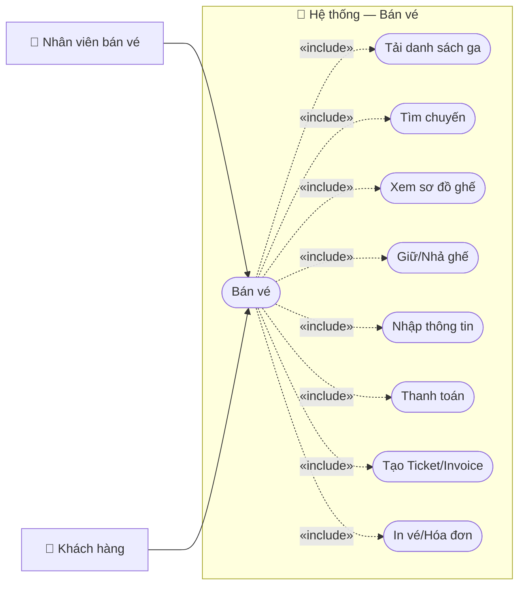

# Usecase: Bán vé

## Actor
- **Primary:** Nhân viên bán vé (`Employee`)
- **Secondary:** Khách hàng/Người mua vé (`Customer`), Hành khách (lưu trên `Ticket.passengerName/passengerIdCard`)
- **System:** JavaFX Client → TCP Socket Server (`RequestRouter`) → MariaDB

## Mô tả
Nhân viên bán vé tra cứu chuyến theo ga đi/ga đến/ngày đi (và ngày về nếu khứ hồi), chọn ghế theo sơ đồ toa, giữ chỗ để chống bán trùng, nhập thông tin hành khách + người mua, thanh toán và phát hành vé/hóa đơn.

## Tiền điều kiện
- Nhân viên đã đăng nhập và Client có `employeeId` hợp lệ (ví dụ `SessionManager.getInstance().getEmployeeId()` hoặc `ClientSessionContext.getInstance().getEmployeeId()`).
- Lịch trình bán vé tồn tại và được Server lọc theo `StatusSchedule.NOT_STARTED` trong `SaleServiceImpl.findSaleCardsByDate(...)`.
- Giá ghế `ScheduleDetail.priceSeat` đã được cấu hình trước khi bán (nếu chưa, Server có thể từ chối với `SaleMessages.PRICE_NOT_CONFIGURED`).

## Hậu điều kiện
- Tạo `Ticket` trạng thái `TicketStatus.PAID`, gắn với `ScheduleDetail` tương ứng.
- Tạo `Invoice` loại `InvoiceType.SALE` và các `InvoiceDetail` cho từng vé.
- Cập nhật `Customer.rewardPoints` (tích điểm và/hoặc trừ điểm nếu đổi điểm).
- Nhả ghế đã giữ theo `clientSessionId` sau khi bán vé thành công (`SaleServiceImpl.createSaleTransaction(...)` gọi `releaseHeldSeatsForSale(...)`).

## Luồng chính
1. Nhân viên mở chức năng bán vé:
   - Flow dạng step: `BanVeController` (load `step-1.fxml`, `step-2.fxml`, `step-3.fxml`, `step-4.fxml`) hoặc flow wizard: `SellTicketWizardController` (`sell-ticket-wizard.fxml`).
2. Client tải danh sách ga:
   - Gửi `Request(ActionType.FIND_ALL_STATIONS, "ALL")` qua `SaleClientService.findAllStations()`.
   - Server route tới `SaleServiceImpl.findAllStations()` và trả danh sách `StationDTO`.
3. Nhân viên chọn ga đi/ga đến, ngày đi, loại vé (`TicketCategory.ONE_WAY/ROUND_TRIP`), ngày về (nếu khứ hồi) và tìm chuyến:
   - Client gửi `ActionType.SEARCH_SCHEDULES_FOR_SALE` với `SaleScheduleSearchDTO`.
   - Server `SaleServiceImpl.searchSchedulesForSale(...)` trả `SaleScheduleSearchResultDTO` gồm `ScheduleSaleCardDTO` cho chiều đi (và chiều về nếu khứ hồi).
4. Nhân viên chọn chuyến và tải sơ đồ ghế:
   - Client gửi `ActionType.GET_SEATMAP_FOR_SCHEDULE` với `SeatMapRequestDTO { scheduleId, clientSessionId }`.
   - Server `SaleServiceImpl.getSeatMapForSchedule(...)` trả `SeatMapResponseDTO` (toa `CarriageSeatMapDTO`, ghế `SeatMapSeatDTO` có trạng thái `SeatAvailabilityStatus.AVAILABLE/HELD/SOLD`).
5. Nhân viên chọn ghế và giữ chỗ:
   - Client giữ ghế bằng `ActionType.HOLD_SEATS_FOR_SALE` với `SeatHoldRequestDTO { scheduleId, scheduleDetailIds, clientSessionId }`.
   - Server giữ chỗ TTL 10 phút (`SeatHoldStore.HOLD_TTL_MILLIS`) và trả `SeatHoldResponseDTO`.
   - Client có thể gia hạn giữ chỗ định kỳ (ví dụ `Step2SeatSelectionController.startHoldKeepAlive()`).
6. Nhân viên nhập thông tin hành khách và người mua:
   - Hành khách theo ghế: `SalePassengerDTO { passengerName, documentType, documentNumber, ticketType, dateOfBirth, studentCardVerified }`.
   - Người mua: `SaleBuyerDTO { buyerName, documentType, documentNumber, buyerEmail, buyerPhone, hasAccount, customerId }`.
   - Trẻ em dưới 6 tuổi (miễn vé ngồi chung): `SaleChildUnder6DTO { childName, dateOfBirth, accompanyDirection, accompanyPassengerIndex }` (nếu có).
7. (Tuỳ chọn) Client tra cứu khách hàng theo giấy tờ người mua để lấy `customerId` và `rewardPoints` trước khi thanh toán:
   - Gửi `ActionType.SEARCH_CUSTOMERS` với `CustomerSearchDTO`.
8. Nhân viên chọn thanh toán:
   - **Tiền mặt:** nhập `amountPaid`.
   - **Online (có trong flow `SellTicketWizardController`):** tạo đơn bằng `ActionType.CREATE_PAYMENT_ORDER` và xác nhận bằng `ActionType.CONFIRM_INTERNAL_PAYMENT` để nhận/chuẩn bị `paymentOrderId`.
9. Client gửi xác nhận bán vé:
   - Gửi `ActionType.CREATE_SALE_TRANSACTION` với `SaleCreateRequestDTO` (bao gồm `clientSessionId`, lịch trình/ghế, hành khách, người mua, `childrenUnder6`, `redeemPoints`, thanh toán, `employeeId`…).
10. Server xử lý trong `SaleServiceImpl.createSaleTransaction(...)`/`doCreateSale(...)`:
    - Validate ghế đang hold đúng session; giới hạn số vé; ràng buộc khứ hồi; ràng buộc trẻ em/tuổi; chống trùng giấy tờ theo chiều; đổi điểm…
    - Tính giá: bảo hiểm 2.000đ/vé; giảm giá theo `TicketType` (CHILD 25%, SENIOR 15%, STUDENT 10%); vé chiều về giảm thêm 10%; làm tròn lên bội 1.000đ (`applyPassengerPricing(...)`).
    - Tạo `Ticket`, `Invoice (SALE)`, `InvoiceDetail`, cập nhật `Customer.rewardPoints`.
    - Trả `SaleCreateResponseDTO` gồm `tickets` và `childVouchers` (đều là `IssuedTicketDTO`).
11. Client hiển thị kết quả và in:
    - In vé: `PrintListController` + `TicketRenderer`.
    - Xem/in hóa đơn: `InvoiceRenderer`.

## Luồng thay thế
- **[Bán vé khứ hồi]:** Bước 3–5 chọn `TicketCategory.ROUND_TRIP` và chọn số ghế chiều về bằng với chiều đi (`SaleMessages.SEAT_CONSTRAINT_MISMATCH` nếu không khớp).
- **[Đổi điểm tích lũy]:** Nếu người mua có tài khoản (`SaleBuyerDTO.hasAccount=true`) và gửi `SaleRedeemPointsDTO.redeemRequested=true`, Server áp dụng giảm điểm cho các vé đủ điều kiện.
- **[Thanh toán online]:** Thêm bước tạo/xác nhận order (`CREATE_PAYMENT_ORDER` → `CONFIRM_INTERNAL_PAYMENT`) trước khi gửi `CREATE_SALE_TRANSACTION` với `paymentMethod=PaymentMethod.ONLINE`.
- **[Tự động tạo/cập nhật hồ sơ người mua]:** Server có thể auto create/update `Customer` theo giấy tờ người mua trong `SaleServiceImpl.ensureCustomerRecord(...)`.

## Luồng lỗi
- **[Dữ liệu tìm chuyến không hợp lệ]:** `SaleMessages.INVALID_STATIONS`, `SaleMessages.INVALID_DATES`.
- **[Không tìm thấy chuyến]:** `SaleMessages.NOT_FOUND_SCHEDULE`.
- **[Ghế đã bán/giữ bởi phiên khác]:** `SaleMessages.SEAT_ALREADY_SOLD`, `SaleMessages.SEAT_HELD_BY_OTHER`.
- **[Vượt giới hạn số vé]:** `SaleMessages.TOO_MANY_TICKETS_PER_LEG` (`MAX_TICKETS_PER_LEG=10`).
- **[Khứ hồi chọn ghế không khớp]:** `SaleMessages.SEAT_CONSTRAINT_MISMATCH`.
- **[Giá ghế chưa cấu hình]:** `SaleMessages.PRICE_NOT_CONFIGURED`.
- **[Thiếu giấy tờ người mua]:** `SaleMessages.CUSTOMER_DOCUMENT_REQUIRED`.
- **[Thiếu nhân viên xử lý]:** `SaleMessages.EMPLOYEE_REQUIRED`.
- **[Thanh toán online không hợp lệ]:** `SaleMessages.ONLINE_PAYMENT_*`.
- **[Không cho đổi điểm khi có vé ưu đãi]:** `SaleMessages.POINTS_NOT_ALLOWED_WITH_DISCOUNT`.
- **[Lỗi tuổi/đối tượng vé]:** Server có thể trả `IllegalArgumentException` với message nghiệp vụ (ví dụ thiếu `dateOfBirth` cho `TicketType.CHILD/SENIOR`, tuổi không thỏa điều kiện).

## Dữ liệu vào (Client → Server)
| ActionType | DTO | Field | Kiểu | Bắt buộc | Mô tả |
|---|---|---|---|---|---|
| `FIND_ALL_STATIONS` | `String` | `data` | `String` | ✓ | Client gửi `"ALL"`. |
| `SEARCH_SCHEDULES_FOR_SALE` | `SaleScheduleSearchDTO` | `departureStationId` | `String` | ✓ | ID ga đi. |
| `SEARCH_SCHEDULES_FOR_SALE` | `SaleScheduleSearchDTO` | `destinationStationId` | `String` | ✓ | ID ga đến. |
| `SEARCH_SCHEDULES_FOR_SALE` | `SaleScheduleSearchDTO` | `departureDate` | `LocalDate` | ✓ | Ngày đi. |
| `SEARCH_SCHEDULES_FOR_SALE` | `SaleScheduleSearchDTO` | `ticketCategory` | `TicketCategory` | ✓ | `ONE_WAY`/`ROUND_TRIP`. |
| `SEARCH_SCHEDULES_FOR_SALE` | `SaleScheduleSearchDTO` | `returnDate` | `LocalDate` |  | Ngày về (bắt buộc nếu `ROUND_TRIP`). |
| `GET_SEATMAP_FOR_SCHEDULE` | `SeatMapRequestDTO` | `scheduleId` | `String` | ✓ | ID lịch trình. |
| `GET_SEATMAP_FOR_SCHEDULE` | `SeatMapRequestDTO` | `clientSessionId` | `String` |  | Phiên client. |
| `HOLD_SEATS_FOR_SALE` | `SeatHoldRequestDTO` | `scheduleId` | `String` | ✓ | ID lịch trình. |
| `HOLD_SEATS_FOR_SALE` | `SeatHoldRequestDTO` | `scheduleDetailIds` | `List<String>` | ✓ | Danh sách `ScheduleDetail.id` cần giữ. |
| `HOLD_SEATS_FOR_SALE` | `SeatHoldRequestDTO` | `clientSessionId` | `String` | ✓ | Phiên client. |
| `RELEASE_HELD_SEATS_FOR_SALE` | `SeatHoldRequestDTO` | `scheduleDetailIds` | `List<String>` | ✓ | Danh sách `ScheduleDetail.id` cần nhả. |
| `RELEASE_HELD_SEATS_FOR_SALE` | `SeatHoldRequestDTO` | `clientSessionId` | `String` | ✓ | Phiên client. |
| `SEARCH_CUSTOMERS` | `CustomerSearchDTO` | `keyword` | `String` |  | Từ khóa tra cứu khách hàng. |
| `CREATE_PAYMENT_ORDER` | `PaymentCreateRequestDTO` | `clientSessionId` | `String` | ✓ | Phiên client. |
| `CREATE_PAYMENT_ORDER` | `PaymentCreateRequestDTO` | `amount` | `double` | ✓ | Số tiền cần thanh toán. |
| `CONFIRM_INTERNAL_PAYMENT` | `PaymentStatusRequestDTO` | `clientSessionId` | `String` | ✓ | Phiên client (chống mismatch). |
| `CONFIRM_INTERNAL_PAYMENT` | `PaymentStatusRequestDTO` | `paymentOrderId` | `String` | ✓ | Mã đơn online. |
| `CREATE_SALE_TRANSACTION` | `SaleCreateRequestDTO` | `clientSessionId` | `String` | ✓ | Phiên client. |
| `CREATE_SALE_TRANSACTION` | `SaleCreateRequestDTO` | `ticketCategory` | `TicketCategory` | ✓ | `ONE_WAY`/`ROUND_TRIP`. |
| `CREATE_SALE_TRANSACTION` | `SaleCreateRequestDTO` | `outboundScheduleId` | `String` | ✓ | Lịch trình chiều đi. |
| `CREATE_SALE_TRANSACTION` | `SaleCreateRequestDTO` | `returnScheduleId` | `String` |  | Lịch trình chiều về (nếu khứ hồi). |
| `CREATE_SALE_TRANSACTION` | `SaleCreateRequestDTO` | `outboundScheduleDetailIds` | `List<String>` | ✓ | Ghế chiều đi (`ScheduleDetail.id`). |
| `CREATE_SALE_TRANSACTION` | `SaleCreateRequestDTO` | `returnScheduleDetailIds` | `List<String>` |  | Ghế chiều về (nếu khứ hồi). |
| `CREATE_SALE_TRANSACTION` | `SaleCreateRequestDTO` | `outboundPassengers` | `List<SalePassengerDTO>` | ✓ | Hành khách chiều đi (1-1 theo ghế). |
| `CREATE_SALE_TRANSACTION` | `SaleCreateRequestDTO` | `returnPassengers` | `List<SalePassengerDTO>` |  | Hành khách chiều về (nếu khứ hồi). |
| `CREATE_SALE_TRANSACTION` | `SaleCreateRequestDTO` | `childrenUnder6` | `List<SaleChildUnder6DTO>` |  | Trẻ <6 đi kèm (nếu có). |
| `CREATE_SALE_TRANSACTION` | `SaleCreateRequestDTO` | `buyer` | `SaleBuyerDTO` | ✓ | Người mua. |
| `CREATE_SALE_TRANSACTION` | `SaleCreateRequestDTO` | `redeemPoints` | `SaleRedeemPointsDTO` |  | Yêu cầu đổi điểm (nếu có). |
| `CREATE_SALE_TRANSACTION` | `SaleCreateRequestDTO` | `paymentMethod` | `PaymentMethod` | ✓ | `CASH`/`ONLINE`. |
| `CREATE_SALE_TRANSACTION` | `SaleCreateRequestDTO` | `amountPaid` | `Double` |  | Bắt buộc với `CASH`. |
| `CREATE_SALE_TRANSACTION` | `SaleCreateRequestDTO` | `paymentOrderId` | `String` |  | Bắt buộc với `ONLINE`. |
| `CREATE_SALE_TRANSACTION` | `SaleCreateRequestDTO` | `employeeId` | `String` | ✓ | Nhân viên xử lý. |

## Dữ liệu ra (Server → Client)
| Response.data | Kiểu | Mô tả |
|---|---|---|
| (FIND_ALL_STATIONS) | `List<StationDTO>` | Danh sách ga. |
| (SEARCH_SCHEDULES_FOR_SALE) | `SaleScheduleSearchResultDTO` | Danh sách chuyến (`ScheduleSaleCardDTO`). |
| (GET_SEATMAP_FOR_SCHEDULE) | `SeatMapResponseDTO` | Sơ đồ ghế theo toa/ghế. |
| (HOLD/RELEASE) | `SeatHoldResponseDTO` | Danh sách giữ/nhả thành công-thất bại + thời điểm hết hạn. |
| (CREATE_PAYMENT_ORDER) | `PaymentCreateResponseDTO` | Mã đơn + QR + thời hạn. |
| (CONFIRM_INTERNAL_PAYMENT/GET_PAYMENT_ORDER_STATUS) | `PaymentStatusDTO` | Trạng thái đơn online. |
| (CREATE_SALE_TRANSACTION) | `SaleCreateResponseDTO` | Kết quả bán vé: `invoiceId`, tổng tiền, tiền thối, điểm, danh sách `IssuedTicketDTO`. |

## Business Rules
- **Giữ chỗ chống bán trùng:** Ghế được giữ theo `clientSessionId` trong `SeatHoldStore` TTL 10 phút; khi tạo giao dịch, Server yêu cầu ghế vẫn hold đúng session (`SaleMessages.SEAT_HELD_BY_OTHER` nếu sai).
- **Giới hạn số vé:** Tối đa 10 vé cho mỗi chiều (`MAX_TICKETS_PER_LEG=10`).
- **Khứ hồi:** Số ghế chiều đi = chiều về; và thời gian khởi hành chiều về phải sau thời gian đến của chiều đi (Server validate trong `doCreateSale(...)`).
- **Không trùng giấy tờ theo chiều:** Một số giấy tờ hành khách không được mua >1 ghế trên cùng một chiều (Server trả lỗi message nghiệp vụ).
- **Vé trẻ em & tuổi:** CHILD hợp lệ từ 6 đến dưới 10; SENIOR từ 60 trở lên; nếu chọn CHILD/SENIOR thì bắt buộc có `dateOfBirth` (`applyPassengerPricing(...)`).
- **Trẻ em dưới 6 tuổi:** 1 người lớn tối đa kèm 2 trẻ <6 (`SaleChildUnder6DTO`).
- **Giảm giá & bảo hiểm:** Bảo hiểm 2.000đ/vé; giảm giá theo loại vé; vé chiều về giảm thêm 10%; làm tròn lên bội 1.000đ.
- **Đổi điểm:** 1 điểm = 1.000đ (`POINT_REDEEM_VALUE=1000`); tích điểm = `floor(totalAmount/10000)`; không cho đổi điểm khi có vé ưu đãi đối tượng (`SaleMessages.POINTS_NOT_ALLOWED_WITH_DISCOUNT`).

---

## Sơ đồ Use Case

