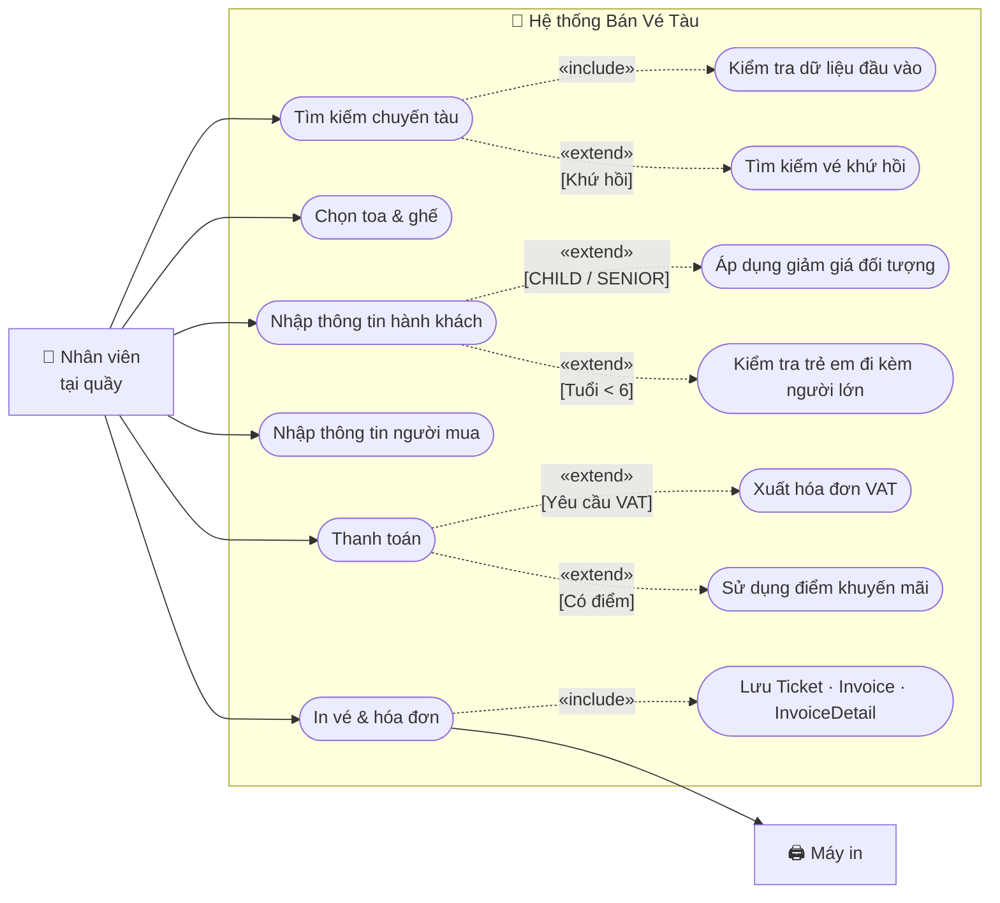

# Usecase - 001: Bán vé tàu

## Actor
- **Primary:** Nhân viên tại quầy
- **System:** Server, Database, Máy in

## Tiền điều kiện
- Nhân viên đã đăng nhập vào hệ thống và chọn chức năng **Bán vé**.
- Khách hàng đã cung cấp thông tin hành trình (ga đi, ga đến, ngày khởi hành, loại vé).

## Hậu điều kiện
- Bản ghi `Ticket` được tạo với `status = "SOLD"` và `type` tương ứng với đối tượng hành khách.
- `ScheduleDetail` liên kết với vé đó được cập nhật (ghế không còn trống).
- Bản ghi `Customer` (người mua đại diện) được tạo hoặc tra cứu theo số giấy tờ.
- Bản ghi `Invoice` (type = `SALE`) và danh sách `InvoiceDetail` được lưu.
- Vé giấy và hóa đơn được in ra cho khách.

## Mô tả
Nhân viên tại quầy tiếp nhận yêu cầu mua vé từ khách hàng, tìm kiếm chuyến tàu phù hợp, chọn ghế, nhập thông tin hành khách, thu tiền và phát hành vé giấy cùng hóa đơn. Hỗ trợ cả vé một chiều và khứ hồi.

---

## Luồng chính (Vé một chiều)

1. Nhân viên nhập thông tin tìm kiếm: **Ga đi**, **Ga đến**, **Ngày khởi hành**; chọn loại vé **Một chiều**.
2. Nhân viên ấn nút **"Tìm kiếm"**.
3. Hệ thống kiểm tra dữ liệu đầu vào:
   - Ga đi ≠ Ga đến.
   - Ngày khởi hành ≥ ngày hiện tại.
4. Hệ thống truy vấn danh sách `Schedule` phù hợp, hiển thị kèm số chỗ trống / đã đặt trên mỗi chuyến.
5. Nhân viên chọn một chuyến tàu, ấn **"Tiếp theo"**.
6. Hệ thống hiển thị danh sách Toa (`Carriage`) và sơ đồ ghế (`Seat`):
   - **Trắng**: `ScheduleDetail` chưa có `Ticket` → ghế trống.
   - **Đỏ**: đã có `Ticket` liên kết → ghế đã bán.
7. Nhân viên chọn Toa, click chọn các ghế trắng theo yêu cầu khách.
8. Hệ thống đổi màu ghế sang **Xanh lá** (đang chọn), đưa `scheduleDetailId` vào giỏ tạm, tính tổng tiền tạm tính từ `ScheduleDetail.seatPrice`.
9. Nhân viên ấn **"Tiếp theo"**.
10. Hệ thống hiển thị form nhập thông tin hành khách — một form tương ứng với mỗi ghế đã chọn.
11. Nhân viên nhập thông tin từng hành khách: **Họ tên**, **Số giấy tờ** (CMND / Hộ chiếu), **Đối tượng** (`TicketType`: `NORMAL`, `CHILD`, `SENIOR`, `STUDENT`).
12. Nhân viên nhập thông tin **Người mua vé (đại diện)**: Họ tên, Số giấy tờ, Email, Số điện thoại.
13. Nhân viên ấn **"Tiếp theo"**.
14. Hệ thống kiểm tra định dạng toàn bộ thông tin vừa nhập (tên không rỗng, số giấy tờ đúng độ dài, email hợp lệ, SĐT hợp lệ).
15. Nếu hợp lệ, hệ thống chuyển sang giao diện **Thanh toán**.
16. Hệ thống tính chi tiết giá vé cho từng hành khách (áp dụng giảm giá theo `TicketType`), hiển thị tổng tiền cần thanh toán.
17. Nhân viên thông báo tổng tiền cho khách, nhập **số tiền khách đưa** vào ô "Tiền khách đưa".
18. Hệ thống tính và hiển thị **tiền thừa trả lại** = Tiền khách đưa − Tổng tiền. Kích hoạt nút **"Thanh toán & In vé"** nếu tiền khách đưa ≥ tổng tiền.
19. Nhân viên ấn **"Thanh toán & In vé"**.
20. Hệ thống thực hiện trong một transaction:
    - Tạo / tra cứu `Customer` theo số giấy tờ người mua.
    - Tạo `Ticket` cho từng hành khách (liên kết `scheduleDetailId`, `customerId`, `ticketType`, `status = SOLD`).
    - Tạo `Invoice` (`type = SALE`, `totalAmount`, `issueDate = now`, liên kết `customerId`, `employeeId`).
    - Tạo `InvoiceDetail` cho từng `Ticket`.
21. Hệ thống hiển thị thông báo **"Thanh toán thành công"** và hộp thoại xem trước danh sách vé.
22. Nhân viên ấn **"In vé"** trên hộp thoại.
23. Hệ thống gửi lệnh in đến máy in, xuất vé giấy và hóa đơn cho khách.

---

## Luồng thay thế

### [AF-1] Vé khứ hồi
- **1.1** Nhân viên chọn loại vé **"Khứ hồi"** → hệ thống kích hoạt ô chọn **Ngày về**.
- **3.1** Nhân viên nhập Ngày đi và Ngày về, ấn "Tìm kiếm" → hệ thống hiển thị 2 danh sách chuyến: chiều đi và chiều về.
- **5.1** Nhân viên chọn chuyến chiều đi và chuyến chiều về → hệ thống hiển thị 2 sơ đồ ghế song song.
- **7.1** Nhân viên chọn ghế cho cả 2 chiều → hệ thống cập nhật giỏ tạm cho cả 2 chiều, tính tổng tiền tạm tính gộp.
- **9.1** Nhân viên ấn "Tiếp theo" → hệ thống kiểm tra số lượng ghế chiều đi = chiều về; nếu không bằng nhau hiển thị lỗi và yêu cầu chọn lại (quay về bước 7).
- Các bước tiếp theo (10–23) như luồng chính; mỗi hành khách sẽ có 2 `Ticket` (chiều đi + chiều về), cả 2 đều có `roundTrip = true`.

### [AF-2] Hành khách là trẻ em hoặc người cao tuổi
- **11.2** Nhân viên chọn Đối tượng = `CHILD` hoặc `SENIOR` → hệ thống hiển thị thêm ô **Ngày sinh**.
- **13.2** Nhân viên nhập hoặc chọn Ngày sinh.
- **14.2** Hệ thống tính tuổi từ ngày sinh so với ngày khởi hành:
  - `CHILD`: tuổi ≥ 6 và < 15 → áp dụng giảm giá trẻ em.
  - `SENIOR`: tuổi ≥ 60 → áp dụng giảm giá người cao tuổi.
  - Nếu không thỏa điều kiện tuổi → mặc định về `NORMAL`, hiển thị cảnh báo.
- Quay về bước 11 để nhập hành khách tiếp theo.

### [AF-3] Xuất hóa đơn VAT
- **17.3** Tại màn hình Thanh toán, nhân viên nhấn **"Xuất hóa đơn VAT"** → hệ thống hiển thị form nhập thông tin doanh nghiệp: Tên công ty, Mã số thuế, Địa chỉ.
- **19.3** Nhân viên nhập và nhấn Lưu → thông tin được đính kèm vào `Invoice` khi lưu ở bước 20.

### [AF-4] Sử dụng điểm khuyến mãi
- **20.3** Tại màn hình Thanh toán, nhân viên nhấn **"Tích điểm"** hoặc **"Đổi điểm"**:
  - *Tích điểm*: Sau khi thanh toán thành công, hệ thống cộng điểm vào tài khoản khách hàng theo giá trị hóa đơn.
  - *Đổi điểm*: Hệ thống tính số tiền giảm tương ứng với điểm quy đổi, cập nhật lại tổng tiền cần thanh toán.
- Quay về bước 17 với tổng tiền đã cập nhật.

---

## Luồng lỗi

- **[Không tìm thấy chuyến tàu]:** Không có `Schedule` nào khớp điều kiện tìm kiếm → hệ thống hiển thị thông báo *"Không tìm thấy chuyến tàu phù hợp"*; nhân viên có thể thay đổi điều kiện và tìm lại.
- **[Vượt giới hạn 10 vé]:** Nhân viên chọn hơn 10 ghế trong một lượt → hệ thống hiển thị cảnh báo *"Mỗi lượt chỉ được mua tối đa 10 vé"*, ngăn không cho chọn thêm.
- **[Thông tin không đúng định dạng]:** Một hoặc nhiều trường ở bước 14 không hợp lệ → hệ thống highlight các trường lỗi, hiển thị thông báo *"Thông tin không đúng định dạng"*; không cho phép tiếp tục cho đến khi sửa đúng.
- **[Tiền khách đưa không đủ]:** Số tiền nhập vào < tổng tiền → hệ thống hiển thị trạng thái *"Chưa đủ"* tại ô Tiền thừa và vô hiệu hóa nút *"Thanh toán & In vé"*.
- **[Trẻ em dưới 6 tuổi không có người lớn đi kèm]:** Nếu hành khách < 6 tuổi, hệ thống yêu cầu nhập **mã vé người lớn đi chung** cùng chuyến. Nếu không tìm thấy vé người lớn hợp lệ → hệ thống từ chối bán vé cho hành khách này với thông báo *"Trẻ em dưới 6 tuổi phải có người lớn đi cùng"*.
- **[Ghế bị mua đồng thời]:** Giữa lúc nhân viên chọn ghế và lúc xác nhận thanh toán, ghế đó đã được bán bởi giao dịch khác (`OptimisticLockException`) → hệ thống thông báo *"Ghế đã được bán bởi giao dịch khác, vui lòng chọn lại"*, yêu cầu quay về bước 6.
- **[Lỗi máy in]:** Kết nối máy in thất bại ở bước 23 → giao dịch đã được lưu thành công; hệ thống thông báo lỗi in và cho phép nhân viên thử in lại hoặc xuất file PDF.

---

## Dữ liệu vào (Client → Server)

### Tìm kiếm chuyến tàu
| Field | Kiểu | Bắt buộc | Mô tả |
|---|---|---|---|
| `departureStation` | `String` | ✓ | Tên hoặc mã ga đi |
| `arrivalStation` | `String` | ✓ | Tên hoặc mã ga đến |
| `departureDate` | `LocalDate` | ✓ | Ngày khởi hành (≥ ngày hiện tại) |
| `ticketCategory` | `String` (`ONE_WAY` / `ROUND_TRIP`) | ✓ | Loại vé |
| `returnDate` | `LocalDate` | ✗ | Ngày về (chỉ khi `ROUND_TRIP`) |

### Chọn ghế
| Field | Kiểu | Bắt buộc | Mô tả |
|---|---|---|---|
| `outboundScheduleId` | `String` | ✓ | ID chuyến chiều đi |
| `returnScheduleId` | `String` | ✗ | ID chuyến chiều về (chỉ khi `ROUND_TRIP`) |
| `selectedScheduleDetailIds` | `List<String>` | ✓ | Danh sách `scheduleDetailId` ghế đã chọn |

### Thông tin hành khách (mỗi phần tử tương ứng 1 ghế)
| Field | Kiểu | Bắt buộc | Mô tả |
|---|---|---|---|
| `passengerName` | `String` | ✓ | Họ tên hành khách |
| `idCard` | `String` | ✗ | Số CMND / CCCD |
| `passport` | `String` | ✗ | Số hộ chiếu (nếu dùng thay idCard) |
| `ticketType` | `TicketType` | ✓ | `NORMAL`, `CHILD`, `SENIOR`, `STUDENT` |
| `dateOfBirth` | `LocalDate` | ✗ | Ngày sinh (bắt buộc khi `CHILD` hoặc `SENIOR`) |
| `companionAdultTicketId` | `String` | ✗ | Mã vé người lớn đi kèm (bắt buộc khi trẻ em < 6 tuổi) |

### Thông tin người mua đại diện
| Field | Kiểu | Bắt buộc | Mô tả |
|---|---|---|---|
| `buyerName` | `String` | ✓ | Họ tên người mua |
| `buyerIdCard` | `String` | ✓ | Số CMND / CCCD người mua |
| `buyerEmail` | `String` | ✓ | Email người mua |
| `buyerPhone` | `String` | ✓ | Số điện thoại người mua |

### Thanh toán
| Field | Kiểu | Bắt buộc | Mô tả |
|---|---|---|---|
| `amountPaid` | `double` | ✓ | Số tiền khách đưa |
| `usePoints` | `boolean` | ✗ | Có đổi điểm khuyến mãi không |
| `pointsToRedeem` | `int` | ✗ | Số điểm muốn đổi |
| `companyName` | `String` | ✗ | Tên công ty (cho hóa đơn VAT) |
| `taxCode` | `String` | ✗ | Mã số thuế (cho hóa đơn VAT) |
| `companyAddress` | `String` | ✗ | Địa chỉ công ty (cho hóa đơn VAT) |

---

## Dữ liệu ra (Server → Client)

### Kết quả tìm kiếm chuyến tàu
| Field | Kiểu | Mô tả |
|---|---|---|
| `scheduleId` | `String` | ID chuyến tàu |
| `trainName` | `String` | Tên / số hiệu tàu |
| `departureStation` | `String` | Ga đi |
| `arrivalStation` | `String` | Ga đến |
| `departureTime` | `LocalDateTime` | Giờ khởi hành |
| `arrivalTime` | `LocalDateTime` | Giờ đến dự kiến |
| `availableSeats` | `int` | Số ghế còn trống |
| `totalSeats` | `int` | Tổng số ghế |

### Kết quả thanh toán thành công
| Field | Kiểu | Mô tả |
|---|---|---|
| `invoiceId` | `String` | ID hóa đơn |
| `invoiceDate` | `LocalDateTime` | Ngày giờ phát hành hóa đơn |
| `totalAmount` | `double` | Tổng tiền |
| `amountPaid` | `double` | Tiền khách đưa |
| `changeAmount` | `double` | Tiền thừa trả lại |
| `tickets` | `List<TicketDTO>` | Danh sách vé đã phát hành |

### TicketDTO
| Field | Kiểu | Mô tả |
|---|---|---|
| `ticketId` | `String` | Mã vé |
| `passengerName` | `String` | Tên hành khách |
| `seatNumber` | `String` | Số ghế |
| `carriageName` | `String` | Tên toa |
| `trainName` | `String` | Tên tàu |
| `departureStation` | `String` | Ga đi |
| `arrivalStation` | `String` | Ga đến |
| `departureTime` | `LocalDateTime` | Giờ khởi hành |
| `seatType` | `SeatType` | Loại ghế (`HARD_SEAT`, `SOFT_SEAT`, …) |
| `ticketType` | `TicketType` | Đối tượng hành khách |
| `price` | `double` | Giá vé (sau giảm giá) |
| `status` | `String` | Trạng thái vé (`SOLD`) |
| `qrCode` | `String` | Mã QR để soát vé |

---

## Business Rules

- Tối đa **10 vé** trong một lượt giao dịch.
- Ngày khởi hành phải **≥ ngày hiện tại**; ga đi phải **khác** ga đến.
- Vé khứ hồi: số ghế chọn **chiều đi phải bằng** số ghế chọn chiều về.
- `TicketType.CHILD` áp dụng cho hành khách **6 ≤ tuổi < 15** (tính theo ngày khởi hành); `SENIOR` cho **tuổi ≥ 60**.
- Trẻ em **dưới 6 tuổi** phải có vé người lớn đi cùng trên cùng chuyến tàu — không bán nếu không có.
- Giảm giá theo `TicketType` được áp dụng dựa trên `ScheduleDetail.seatPrice` làm giá gốc.
- Nút **"Thanh toán & In vé"** chỉ được kích hoạt khi `amountPaid ≥ totalAmount`.
- Toàn bộ thao tác lưu (Ticket, Invoice, InvoiceDetail) phải nằm trong **một transaction duy nhất** — rollback toàn bộ nếu bất kỳ bước nào thất bại.
- `Invoice.type` luôn là `SALE` cho usecase này.
- Nếu in vé thất bại, **không rollback** giao dịch — giao dịch đã hoàn tất; cho phép in lại.
- Mỗi `ScheduleDetail` chỉ liên kết được với **một `Ticket` duy nhất** (quan hệ `@OneToOne`) — cần kiểm tra race condition bằng optimistic lock hoặc select-for-update trước khi tạo vé.

---

## Sơ đồ Use Case

