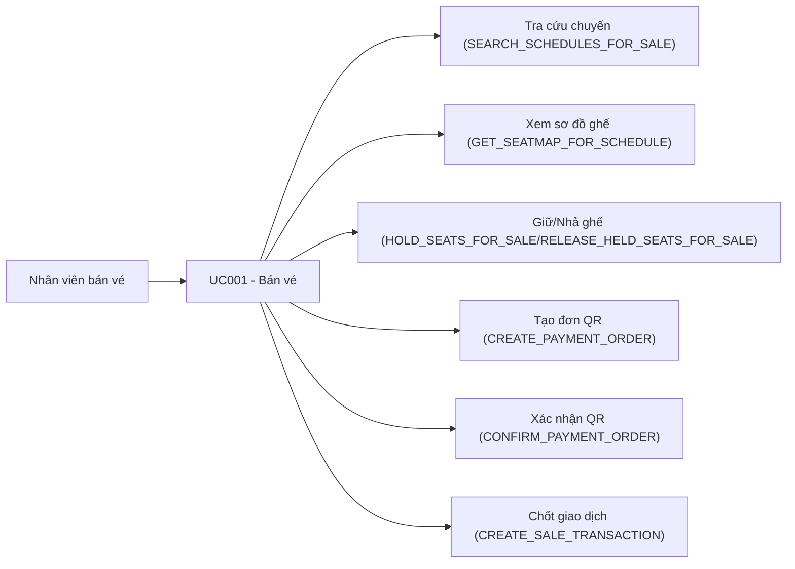

# Use case UC001: Bán vé

## Actor
- **Primary:** Nhân viên bán vé (quầy)
- **System:** JavaFX Client → TCP Socket Server → MariaDB (và mô-đun thanh toán nội bộ qua QR)

## Tiền điều kiện
- Nhân viên đã đăng nhập trên client.
- Lịch trình (`Schedule`) và giá ghế (`ScheduleDetail.priceSeat`) đã được cấu hình để bán.

## Hậu điều kiện (khi thành công)
- Tạo `Invoice` type `SALE` + `InvoiceDetail` tương ứng.
- Tạo `Ticket` trạng thái `TicketStatus.PAID` cho từng ghế (`ScheduleDetail`) đã chọn.
- Cập nhật điểm thưởng của người mua (`Customer.rewardPoints`):
  - Có thể trừ điểm nếu có yêu cầu đổi điểm (`SaleRedeemPointsDTO`).
  - Luôn cộng điểm theo tổng tiền thanh toán (rule trong `SaleServiceImpl`).
- Nếu thanh toán online: `paymentOrderId` bị “consume” và gắn với `invoiceId` (qua `InternalPaymentOrderStore.consumeOrder(...)`).

---

## Mô tả
Nhân viên tìm chuyến theo ga đi/ga đến/ngày đi (và ngày về nếu khứ hồi), xem sơ đồ ghế, giữ ghế theo phiên (`clientSessionId`), nhập thông tin hành khách/người mua, chọn phương thức thanh toán (tiền mặt hoặc online qua QR), xác nhận thanh toán và chốt giao dịch để phát hành vé + hóa đơn.

---

## Luồng chính (theo ActionType)

### 1) Tìm ga (phục vụ UI)
1. Client gửi `Request(ActionType.FIND_ALL_STATIONS, null)`.
2. Server trả `List<StationDTO>` (từ `SaleServiceImpl.findAllStations()`).

### 2) Tra cứu chuyến bán vé
1. Client gửi `Request(ActionType.SEARCH_SCHEDULES_FOR_SALE, SaleScheduleSearchDTO)`.
2. Server validate dữ liệu (tham chiếu `SaleMessages.INVALID_REQUEST/INVALID_STATIONS/INVALID_DATES`).
3. Server trả `SaleScheduleSearchResultDTO` (danh sách chuyến outbound/return dạng `ScheduleSaleCardDTO`).

### 3) Xem sơ đồ ghế
1. Client gửi `Request(ActionType.GET_SEATMAP_FOR_SCHEDULE, SeatMapRequestDTO)`.
2. Server trả `SeatMapResponseDTO` (toa/ghế + trạng thái ghế: `SOLD/HELD/AVAILABLE`).

### 4) Giữ ghế / nhả ghế theo phiên
1. Client gửi:
   - Hold: `Request(ActionType.HOLD_SEATS_FOR_SALE, SeatHoldRequestDTO)`
   - Release: `Request(ActionType.RELEASE_HELD_SEATS_FOR_SALE, SeatHoldRequestDTO)`
2. Server trả `SeatHoldResponseDTO` gồm `successIds/failedIds/expiresAtEpochMillis`.

### 5) Thanh toán online (nếu chọn ONLINE)
1. Tạo đơn thanh toán (QR):
   - Client gửi `Request(ActionType.CREATE_PAYMENT_ORDER, PaymentCreateRequestDTO)`
   - Server tạo đơn trong `InternalPaymentOrderStore` và trả `PaymentCreateResponseDTO` (kèm QR payload/PNG).
2. Theo dõi trạng thái:
   - Client gửi `Request(ActionType.GET_PAYMENT_ORDER_STATUS, PaymentStatusRequestDTO)`
   - Server trả `PaymentStatusDTO` (PENDING/SUCCESS/EXPIRED...).
3. Xác nhận thanh toán:
   - Client gửi `Request(ActionType.CONFIRM_PAYMENT_ORDER, PaymentStatusRequestDTO)` (hoặc `CONFIRM_INTERNAL_PAYMENT`)
   - Server xác nhận và trả `PaymentStatusDTO` trạng thái `SUCCESS`.

### 6) Chốt giao dịch bán vé
1. Client gửi `Request(ActionType.CREATE_SALE_TRANSACTION, SaleCreateRequestDTO)`.
2. `SaleServiceImpl.createSaleTransaction()`:
   - Kiểm tra `paymentMethod`:
     - CASH: cần `amountPaid >= 0` và đủ tiền (`amountPaid >= totalAmount`).
     - ONLINE: cần `paymentOrderId` và trạng thái đơn hợp lệ (session khớp, số tiền khớp, đã confirm).
   - Kiểm tra ràng buộc nghiệp vụ:
     - Vé khứ hồi: số ghế chiều đi = chiều về (`SaleMessages.SEAT_CONSTRAINT_MISMATCH`).
     - Mỗi chiều tối đa 10 vé (`SaleMessages.TOO_MANY_TICKETS_PER_LEG`).
     - Trẻ < 6 tuổi phải có người lớn đi kèm (`SaleMessages.CHILD_REQUIRES_ADULT`).
     - Không cho đổi điểm nếu có vé ưu đãi theo đối tượng (`SaleMessages.POINTS_NOT_ALLOWED_WITH_DISCOUNT`).
     - Ghế phải đang được hold bởi đúng `clientSessionId`, không bị giao dịch khác giữ/bán.
   - Ghi DB trong 1 transaction: tạo `Invoice`, `InvoiceMetadata`, `Ticket`, `InvoiceDetail`, cập nhật `Customer.rewardPoints`.
3. Server trả `SaleCreateResponseDTO` (invoiceId, tổng tiền, tiền thừa, danh sách vé phát hành...).

---

## Luồng lỗi tiêu biểu (tham chiếu đúng constant trong code)
- `SaleMessages.INVALID_REQUEST`: thiếu/sai DTO, thiếu `clientSessionId`, mismatch số lượng passenger vs scheduleDetailIds.
- `SaleMessages.SEAT_ALREADY_SOLD`: ghế vừa bị bán bởi giao dịch khác (optimistic lock/constraint).
- `SaleMessages.SEAT_HELD_BY_OTHER`: ghế đang bị phiên khác giữ.
- `SaleMessages.ONLINE_PAYMENT_ORDER_REQUIRED`: chọn ONLINE nhưng thiếu `paymentOrderId`.
- `SaleMessages.ONLINE_PAYMENT_NOT_CONFIRMED`: đơn online chưa được xác nhận.
- `SaleMessages.ONLINE_PAYMENT_AMOUNT_MISMATCH`: tiền đơn online không khớp tổng tiền.
- `SaleMessages.PAYMENT_NOT_READY`: tiền mặt chưa đủ điều kiện (thiếu/âm/không đủ tiền).

---

## Dữ liệu vào/ra (I/O)

### Client → Server (Request.data)
| ActionType | DTO | Trường chính |
|---|---|---|
| `FIND_ALL_STATIONS` | `null` | - |
| `SEARCH_SCHEDULES_FOR_SALE` | `SaleScheduleSearchDTO` | `departureStationId`, `destinationStationId`, `departureDate`, `ticketCategory`, `returnDate`, `page`, `size` |
| `GET_SEATMAP_FOR_SCHEDULE` | `SeatMapRequestDTO` | `scheduleId`, `clientSessionId` |
| `HOLD_SEATS_FOR_SALE` / `RELEASE_HELD_SEATS_FOR_SALE` | `SeatHoldRequestDTO` | `scheduleId`, `scheduleDetailIds`, `clientSessionId` |
| `CREATE_PAYMENT_ORDER` | `PaymentCreateRequestDTO` | `clientSessionId`, `amount`, `description` |
| `GET_PAYMENT_ORDER_STATUS` / `CONFIRM_PAYMENT_ORDER` / `CONFIRM_INTERNAL_PAYMENT` | `PaymentStatusRequestDTO` | `clientSessionId`, `paymentOrderId` |
| `CREATE_SALE_TRANSACTION` | `SaleCreateRequestDTO` | `clientSessionId`, `ticketCategory`, `outboundScheduleId`, `returnScheduleId`, `outboundScheduleDetailIds`, `returnScheduleDetailIds`, `outboundPassengers`, `returnPassengers`, `childrenUnder6`, `buyer`, `vat`, `redeemPoints`, `paymentMethod`, `amountPaid`, `paymentOrderId`, `employeeId` |

### Server → Client (Response.data)
| Luồng | Response.data |
|---|---|
| Danh sách ga | `List<StationDTO>` |
| Danh sách chuyến bán vé | `SaleScheduleSearchResultDTO` |
| Sơ đồ ghế | `SeatMapResponseDTO` |
| Hold/Release ghế | `SeatHoldResponseDTO` |
| Tạo đơn thanh toán | `PaymentCreateResponseDTO` |
| Trạng thái/xác nhận thanh toán | `PaymentStatusDTO` |
| Bán vé | `SaleCreateResponseDTO` |

---

## Use Case Diagram (Mermaid)

