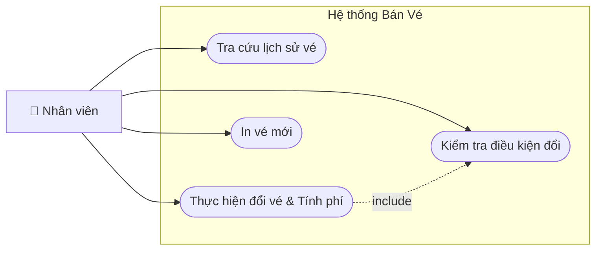

# Usecase - 002: Đổi vé tàu

## Actor

- **Primary:** Nhân viên tại quầy
- **System:** Server, Database, Máy in

## Tiền điều kiện

- Nhân viên đã đăng nhập vào hệ thống và chọn chức năng **Đổi vé**.
- Khách hàng (người đi tàu hoặc người mua đại diện) đã mua vé trước đó và vé đang ở trạng thái hợp lệ (`status = "SOLD"`).

## Hậu điều kiện

- Bản ghi `Ticket` cũ được cập nhật `status = "EXCHANGED"`.
- `ScheduleDetail` của vé cũ được giải phóng (trạng thái ghế trống).
- Bản ghi `Ticket` mới được tạo với `status = "SOLD"` và lưu giữ liên kết với vé cũ thông qua `originalTicketId`.
- Bản ghi `Invoice` (type = `EXCHANGE`) và danh sách `InvoiceDetail` được lưu để đối soát phí.
- Vé giấy mới và biên lai đổi vé được in ra cho khách.

## Mô tả

Nhân viên tại quầy tiếp nhận yêu cầu đổi vé từ khách hàng. Hệ thống thực hiện kiểm tra các ràng buộc về thời gian khởi hành và số lần đổi. Nếu thỏa mãn, nhân viên tiến hành chọn hành trình hoặc chỗ ngồi mới. Hệ thống tự động tính toán phí đổi vé cố định và phần chênh lệch giá giữa vé mới và vé cũ để thực hiện thu thêm hoặc hoàn tiền cho khách.

---

## Luồng chính

1. Nhân viên nhập thông tin tra cứu: **Số CMND / Hộ chiếu** của khách hàng.
2. Hệ thống truy vấn và hiển thị danh sách các vé có thể đổi (trạng thái `SOLD`).
3. Nhân viên chọn các vé khách muốn đổi và ấn **"Yêu cầu Đổi vé"**.
4. Hệ thống kiểm tra điều kiện cho từng vé:
   - Cách giờ tàu chạy ít nhất 24 giờ.
   - Vé chưa từng thực hiện giao dịch đổi trước đó.
5. Hệ thống xác nhận **"Đủ điều kiện đổi vé"** và mở giao diện tìm kiếm chuyến tàu mới.
6. Nhân viên nhập thông tin hành trình mới (Ga đi, Ga đến, Ngày đi) và ấn **"Tìm kiếm"**.
7. Hệ thống hiển thị danh sách các chuyến tàu (`Schedule`) phù hợp.
8. Nhân viên chọn chuyến tàu và sơ đồ ghế mới tương ứng.
9. Hệ thống cập nhật trạng thái ghế mới sang màu **Xanh lá** (đang chọn) và đưa vào giỏ tạm.
10. Nhân viên ấn **"Tính phí & Xác nhận"**.
11. Hệ thống tính toán chi tiết:
    - **Phí đổi vé**: (Số lượng vé \* Mức phí quy định).
    - **Chênh lệch**: (Tổng giá vé mới - Tổng giá vé cũ).
    - **Tổng thanh toán**: Phí đổi vé + Chênh lệch.
12. Hệ thống hiển thị bảng kê chi tiết các khoản phí cho nhân viên và khách hàng đối chiếu.
13. Nhân viên nhận tiền từ khách (nếu tổng > 0) hoặc chuẩn bị tiền hoàn (nếu tổng < 0) và ấn **"Xác nhận thanh toán"**.
14. Hệ thống thực hiện các thao tác sau trong một giao dịch (Transaction):
    - Cập nhật trạng thái vé cũ thành `EXCHANGED` và vô hiệu hóa QR code cũ.
    - Giải phóng ghế cũ trong `ScheduleDetail`.
    - Tạo bản ghi `Ticket` mới gắn với ghế mới và lưu `originalTicketId`.
    - Lưu `Invoice` loại `EXCHANGE` cùng các `InvoiceDetail` tương ứng.
15. Hệ thống báo **"Đổi vé thành công"** và hiển thị bản xem trước vé mới.
16. Nhân viên ấn **"In vé"** để hoàn tất quy trình.

---

## Luồng thay thế

### [AF-1] Vé mới có giá trị thấp hơn vé cũ

- **11.1** Nếu giá vé mới rẻ hơn vé cũ và phần chênh lệch lớn hơn phí đổi vé, Tổng thanh toán sẽ là số âm.
- **12.1** Hệ thống hiển thị số tiền **"Cần hoàn trả khách"**.
- **13.1** Nhân viên xác nhận đã chi trả tiền mặt/chuyển khoản cho khách trước khi ấn hoàn tất.

### [AF-2] Đổi nhiều vé cùng lúc

- **3.1** Nhân viên có thể chọn hàng loạt vé trong danh sách lịch sử để đổi chung một chuyến tàu mới.
- **11.2** Hệ thống gom tất cả vào một hóa đơn `EXCHANGE` duy nhất để dễ quản lý.

---

## Luồng lỗi

- **[Vé không đủ điều kiện]:** Thời gian đổi vé nằm trong khoảng < 24h trước giờ tàu chạy → Hệ thống cảnh báo lỗi và ngăn chặn giao dịch.
- **[Vé đã đổi một lần]:** Hệ thống kiểm tra thấy vé đã có `originalTicketId` → Thông báo _"Vé này đã được đổi trước đó, không thể đổi lần thứ hai"_.
- **[Lỗi chiếm chỗ]:** Trong lúc chọn ghế mới, ghế đó đã bị quầy khác bán mất → Hệ thống báo lỗi xung đột và yêu cầu nhân viên chọn lại ghế khác.

---

## Dữ liệu vào (Client → Server)

### Tra cứu

| Field    | Kiểu     | Mô tả                          |
| -------- | -------- | ------------------------------ |
| `idCard` | `String` | Số giấy tờ định danh của khách |

### Giao dịch đổi

| Field                  | Kiểu            | Mô tả                        |
| ---------------------- | --------------- | ---------------------------- |
| `oldTicketIds`         | `List<String>`  | Danh sách mã vé cũ           |
| `newScheduleDetailIds` | `List<Integer>` | Danh sách ID ghế mới đã chọn |
| `cashReceived`         | `double`        | Số tiền thực nhận từ khách   |

---

## Business Rules

1. **Quy tắc 24h:** Chỉ được đổi vé nếu thời gian hiện tại cách giờ khởi hành trên vé cũ từ 24 tiếng trở lên.
2. **Quy tắc 1 lần:** Mỗi vé chỉ có duy nhất một cơ hội đổi.
3. **Tính phí:** Phí đổi vé là khoản phí dịch vụ cố định, không được hoàn trả ngay cả khi giá vé mới thấp hơn vé cũ.
4. **Tính nhất quán:** Việc hủy vé cũ và tạo vé mới phải xảy ra đồng thời. Nếu một bước lỗi, toàn bộ ghế (cả cũ và mới) phải giữ nguyên trạng thái ban đầu.

---

## Sơ đồ Use Case

---

## 🛠 Yêu cầu cập nhật Database / Entity (Từ BA Review)

Để hiện thực hóa nghiệp vụ đổi vé, các Entity cần được bổ sung các thuộc tính sau:

1. **Ticket Entity:**
   - Thêm `originalTicketId` (String): Lưu ID của vé cũ. Dùng để kiểm tra điều kiện "chỉ đổi 1 lần". Nếu trường này có giá trị, hệ thống sẽ từ chối đổi tiếp.
   - Thêm `isExchanged` (boolean): Đánh dấu vé đã bị thay thế để không cho phép sử dụng đi tàu hoặc đổi/trả lần nữa.

2. **Invoice Entity:**
   - `InvoiceType`: Bổ sung giá trị `EXCHANGE` vào Enum để phân biệt với hóa đơn bán mới (`SALE`) hoặc hoàn tiền (`REFUND`).
   - Thêm các trường hỗ trợ hóa đơn VAT nếu khách yêu cầu đổi cho pháp nhân (`taxCode`, `companyName`).

3. **InvoiceDetail Entity:**
   - Đảm bảo trường `subTotal` có thể lưu giá trị âm. Điều này cực kỳ quan trọng để ghi nhận dòng "Thu hồi vé cũ" trong báo cáo tài chính của hóa đơn đổi vé.

4. **ScheduleDetail Entity:**
   - Cần có `@Version` để triển khai **Optimistic Locking**. Điều này ngăn chặn việc hai nhân viên ở hai quầy khác nhau cùng đổi vé vào chung một chỗ ngồi trống tại cùng một thời điểm.
