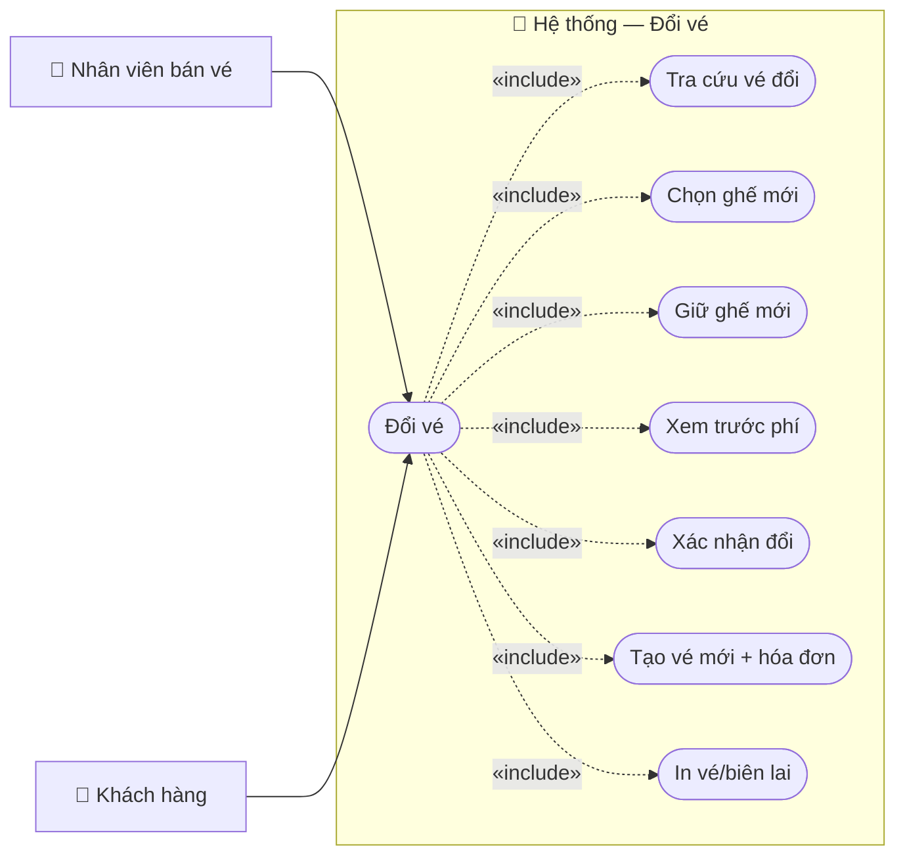

# Usecase: Đổi vé

## Actor
- **Primary:** Nhân viên bán vé (`Employee`)
- **Secondary:** Khách hàng (cung cấp thông tin vé/giấy tờ)
- **System:** JavaFX Client → TCP Socket Server (`RequestRouter`) → MariaDB

## Mô tả
Nhân viên tra cứu vé đủ điều kiện đổi, chọn vé cũ và ghế mới (cùng ga đi/ga đến), xem trước phí đổi và tổng phải thu, xác nhận đổi vé để phát hành vé mới và hóa đơn đổi vé.

## Tiền điều kiện
- Nhân viên đã đăng nhập và có `employeeId` hợp lệ.
- Vé cũ tồn tại và ở trạng thái `TicketStatus.PAID`.
- Vé cũ chưa đổi (`Ticket.originalTicketId` null và `Ticket.isExchanged=false`) và chưa trả (`TicketStatus.RETURNED`).
- Còn ≥ 24h đến giờ khởi hành của vé cũ (Server validate trong `TicketServiceImpl.validateBusinessRulesOrThrow(...)`).
- Ghế mới đã được giữ bởi đúng `clientSessionId` trước khi preview/confirm (`SeatHoldStore.isHeldBy(...)`).

## Hậu điều kiện
- Vé cũ được cập nhật: `TicketStatus.EXCHANGED`, `exchanged=true`, `qrCode="INVALID"`.
- Vé mới được tạo với `Ticket.originalTicketId=<id vé cũ>`.
- Tạo `Invoice` loại `InvoiceType.EXCHANGE` và các `InvoiceDetail`.
- Nhả hold ghế mới sau khi đổi xong (`SeatHoldStore.releaseAll(...)`).

## Luồng chính
1. Nhân viên tra cứu vé cần đổi:
   - Endpoint chuẩn: `ActionType.SEARCH_TICKETS_FOR_EXCHANGE` (`ExchangeTicketClientService.searchTicketsForExchange`) với `ExchangeEligibleTicketSearchDTO { idCard }`.
   - Server `TicketServiceImpl.searchTicketsForExchange(...)` có thể tìm theo ticketId/QR, giấy tờ người mua (`Customer`) hoặc giấy tờ hành khách (`Ticket.passengerIdCard`), và trả `List<ExchangeEligibleTicketDTO>` kèm `eligible/ineligibleReason`.
2. Nhân viên chọn vé cũ cần đổi.
3. Nhân viên chọn chuyến/ghế mới và giữ chỗ:
   - Dùng lại luồng bán vé: `SEARCH_SCHEDULES_FOR_SALE` → `GET_SEATMAP_FOR_SCHEDULE` → `HOLD_SEATS_FOR_SALE`.
4. Client xem trước phí đổi:
   - Gửi `ActionType.PREVIEW_EXCHANGE_TICKETS` với `ExchangeTicketPreviewRequestDTO { oldTicketIds, newScheduleDetailIds, clientSessionId }`.
   - Server `TicketServiceImpl.previewExchangeTickets(...)`:
     - Validate số lượng vé cũ = số ghế mới (`TicketMessages.COUNT_MISMATCH`).
     - Validate điều kiện đổi + check hold.
     - Tính `totalOldPrice` theo **actual paid** từ `InvoiceDetail` SALE (`resolveActualPaidAmount(...)`), fallback `ScheduleDetail.priceSeat`.
     - Tính `totalNewPrice` theo `ScheduleDetail.priceSeat`.
     - Phí đổi cố định `EXCHANGE_FEE = 20_000`/vé.
     - Nếu vé mới rẻ hơn vé cũ thì **không hoàn chênh lệch âm**, chỉ thu phí đổi.
     - Trả `ExchangeTicketPreviewDTO`.
5. Nhân viên xác nhận đổi vé:
   - Client gửi `ActionType.EXCHANGE_TICKET` với `ExchangeTicketRequestDTO { oldTicketIds, newScheduleDetailIds, employeeId, clientSessionId, taxCode, companyName }`.
   - Server `TicketServiceImpl.exchangeTickets(...)` chạy transaction:
     - Validate lại điều kiện đổi + check hold.
     - Validate cùng ga đi/ga đến (`validateSameDepartureDestinationOrThrow(...)`).
     - Cập nhật vé cũ sang `EXCHANGED`, tạo vé mới + `Invoice (EXCHANGE)` + `InvoiceDetail`.
     - Trả `ExchangeTicketResponseDTO { invoiceId, totalAmount, newTickets }`.
6. Client hiển thị kết quả và in:
   - In vé mới: `PrintListController`.
   - In biên lai đổi vé (nếu dùng flow wizard): `ExchangeReceiptRenderer` + template `/client/print/bien-lai-doi-ve.xml`.

## Luồng thay thế
- **[UI đổi vé đang reuse màn hình tra cứu trả vé]:** `ReturnTicketController` (mode đổi vé) có validate nhanh 24h và cờ `originalTicketId` trước khi chuyển qua bước chọn ghế; Server vẫn là source-of-truth (vẫn validate lại khi preview/confirm).

## Luồng lỗi
- **[Thiếu dữ liệu/không hợp lệ]:** `TicketMessages.OLD_TICKET_IDS_REQUIRED`, `NEW_SCHEDULE_DETAIL_IDS_REQUIRED`, `INVALID_SESSION`, `COUNT_MISMATCH`.
- **[Vé không đủ điều kiện đổi]:** `TicketMessages.TICKET_NOT_PAID`, `TICKET_ALREADY_RETURNED`, `TICKET_ALREADY_EXCHANGED`, `EXCHANGE_TIME_EXPIRED`.
- **[Ghế mới không được hold đúng session]:** `TicketMessages.SEAT_HELD_BY_OTHER`.
- **[Không đổi khác hành trình]:** `TicketMessages.EXCHANGE_ROUTE_DATA_MISSING`, `EXCHANGE_ROUTE_MISMATCH`.
- **[Xung đột dữ liệu ghế]:** `TicketMessages.DATA_CONFLICT` (OptimisticLock).
- **[Lỗi nghiệp vụ khác]:** `TicketMessages.EXCHANGE_FAILED_PREFIX + <message>`.

## Dữ liệu vào (Client → Server)
| ActionType | DTO | Field | Kiểu | Bắt buộc | Mô tả |
|---|---|---|---|---|---|
| `SEARCH_TICKETS_FOR_EXCHANGE` | `ExchangeEligibleTicketSearchDTO` | `idCard` | `String` | ✓ | Từ khóa tra cứu (tên field là `idCard`). |
| `PREVIEW_EXCHANGE_TICKETS` | `ExchangeTicketPreviewRequestDTO` | `oldTicketIds` | `List<String>` | ✓ | Vé cũ. |
| `PREVIEW_EXCHANGE_TICKETS` | `ExchangeTicketPreviewRequestDTO` | `newScheduleDetailIds` | `List<String>` | ✓ | Ghế mới (`ScheduleDetail.id`). |
| `PREVIEW_EXCHANGE_TICKETS` | `ExchangeTicketPreviewRequestDTO` | `clientSessionId` | `String` | ✓ | Phiên client. |
| `EXCHANGE_TICKET` | `ExchangeTicketRequestDTO` | `oldTicketIds` | `List<String>` | ✓ | Vé cũ. |
| `EXCHANGE_TICKET` | `ExchangeTicketRequestDTO` | `newScheduleDetailIds` | `List<String>` | ✓ | Ghế mới. |
| `EXCHANGE_TICKET` | `ExchangeTicketRequestDTO` | `employeeId` | `String` | ✓ | Nhân viên xử lý. |
| `EXCHANGE_TICKET` | `ExchangeTicketRequestDTO` | `clientSessionId` | `String` | ✓ | Phiên client. |
| `EXCHANGE_TICKET` | `ExchangeTicketRequestDTO` | `taxCode` | `String` |  | MST (<=20 ký tự). |
| `EXCHANGE_TICKET` | `ExchangeTicketRequestDTO` | `companyName` | `String` |  | Tên công ty (<=200 ký tự). |

## Dữ liệu ra (Server → Client)
| Response.data | Kiểu | Mô tả |
|---|---|---|
| (SEARCH_TICKETS_FOR_EXCHANGE) | `List<ExchangeEligibleTicketDTO>` | Danh sách vé + cờ đủ điều kiện. |
| (PREVIEW_EXCHANGE_TICKETS) | `ExchangeTicketPreviewDTO` | Tổng tiền vé cũ/mới, phí đổi, chênh lệch, tổng phải thu. |
| (EXCHANGE_TICKET) | `ExchangeTicketResponseDTO` | Mã hóa đơn đổi vé + danh sách `IssuedTicketDTO` vé mới. |

## Business Rules
- **Điều kiện đổi:** Vé `PAID`, chưa đổi, chưa trả và còn ≥24h.
- **Giữ ghế mới:** Ghế mới phải được hold bởi đúng `clientSessionId` trước khi preview/confirm.
- **Cùng hành trình:** Không đổi khác ga đi/ga đến.
- **Phí đổi cố định:** `EXCHANGE_FEE = 20_000`/vé.
- **Không hoàn chênh lệch âm:** Vé mới rẻ hơn → chỉ thu phí đổi.
- **Giá vé cũ theo actual paid:** Ưu tiên lấy từ `InvoiceDetail` SALE, fallback `ScheduleDetail.priceSeat`.
- **Vô hiệu QR vé cũ:** Sau đổi set `"INVALID"`.

---

## Sơ đồ Use Case

