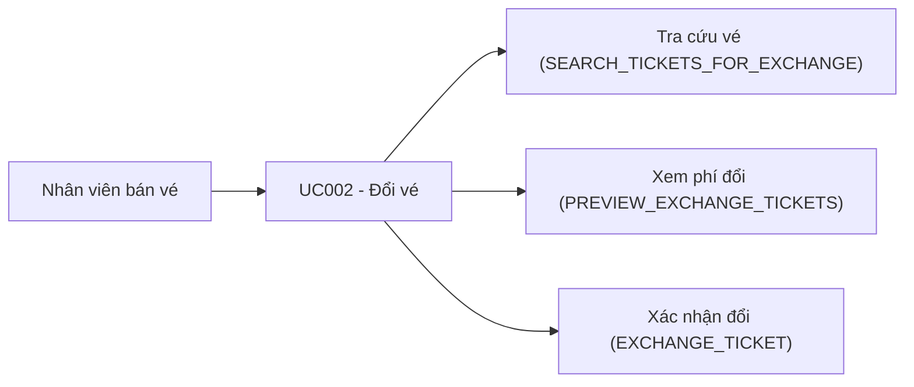

# Use case UC002: Đổi vé

## Actor
- **Primary:** Nhân viên bán vé (quầy)
- **System:** JavaFX Client → TCP Socket Server → MariaDB

## Tiền điều kiện
- Nhân viên đã đăng nhập và cung cấp `employeeId` (có thể là `employee_id` hoặc `employee_code` như `QL001`, được resolve trong `TicketServiceImpl.findEmployeeByIdOrCode(...)`).
- Vé cần đổi tồn tại và đang ở trạng thái `TicketStatus.PAID`.
- Ghế mới đã được giữ (hold) theo đúng `clientSessionId` (qua `SeatHoldStore`).

## Hậu điều kiện (khi thành công)
- Vé cũ:
  - `Ticket.exchanged = true`
  - `Ticket.status = TicketStatus.EXCHANGED`
  - `Ticket.qrCode = "INVALID"`
- Vé mới:
  - `Ticket.status = TicketStatus.PAID`
  - `Ticket.originalTicketId = oldTicketId`
  - `Ticket.exchanged = false`
  - `Ticket.qrCode = ticketId`
- Tạo `Invoice` type `EXCHANGE` + `InvoiceDetail` cho các vé mới.
- Hold ghế mới được giải phóng sau khi đổi xong (`SeatHoldStore.releaseAll(...)`).

---

## Mô tả
Nhân viên tra cứu vé đủ điều kiện đổi theo giấy tờ (CCCD/hộ chiếu), chọn các vé cần đổi, chọn ghế mới (đã hold), xem trước phí đổi, sau đó xác nhận đổi để hệ thống cập nhật trạng thái vé cũ và phát hành vé mới + hóa đơn đổi.

---

## Luồng chính (theo ActionType)

### 1) Tra cứu vé đủ điều kiện đổi
1. Client gửi `Request(ActionType.SEARCH_TICKETS_FOR_EXCHANGE, ExchangeEligibleTicketSearchDTO)`.
2. Server (`TicketServiceImpl.searchTicketsForExchange`) validate `idCard` và tìm vé `PAID` theo giấy tờ khách.
3. Trả về `List<ExchangeEligibleTicketDTO>` (kèm `eligible/ineligibleReason`).

### 2) Xem trước phí đổi
1. Client gửi `Request(ActionType.PREVIEW_EXCHANGE_TICKETS, ExchangeTicketPreviewRequestDTO)` gồm:
   - `oldTicketIds`
   - `newScheduleDetailIds` (1–1 với vé cũ)
   - `clientSessionId`
2. Server (`TicketServiceImpl.previewExchangeTickets`):
   - `oldTicketIds.size == newScheduleDetailIds.size` (`TicketMessages.COUNT_MISMATCH` nếu sai).
   - `clientSessionId` hợp lệ (`TicketMessages.INVALID_SESSION` nếu thiếu/sai).
   - Load vé cũ và kiểm tra nghiệp vụ (`validateBusinessRulesOrThrow`):
     - Vé đã từng đổi hoặc là vé phát sinh từ đổi (`TicketMessages.TICKET_ALREADY_EXCHANGED`)
     - Vé đã trả (`TicketMessages.TICKET_ALREADY_RETURNED`)
     - Vé không còn `PAID`
     - Thời gian đến giờ khởi hành < 24h (`TicketMessages.EXCHANGE_TIME_EXPIRED`)
   - Kiểm tra ghế mới đang được hold bởi đúng phiên (`SeatHoldStore.isHeldBy(...)`), nếu không: `TicketMessages.SEAT_HELD_BY_OTHER`.
   - Tính tiền:
     - Giá vé cũ lấy theo “thực trả” (`resolveActualPaidAmount(...)`), không dùng `priceSeat` mặc định.
     - Phí đổi: `oldTickets.size * 20_000` (`EXCHANGE_FEE`).
     - Nếu vé mới rẻ hơn vé cũ: **không hoàn chênh lệch**, chỉ thu phí đổi.
3. Trả về `ExchangeTicketPreviewDTO`.

### 3) Xác nhận đổi vé
1. Client gửi `Request(ActionType.EXCHANGE_TICKET, ExchangeTicketRequestDTO)`.
2. Server (`TicketServiceImpl.exchangeTickets` → `doExchangeTicketsOrThrow` trong transaction):
   - Resolve nhân viên từ `employeeId/employeeCode` (nếu không thấy: `EmployeeMessages.notFoundById(...)`).
   - Re-check hold ghế mới theo `clientSessionId` (nếu không: `TicketMessages.SEAT_HELD_BY_OTHER`).
   - Update vé cũ: `EXCHANGED`, `exchanged=true`, `qrCode="INVALID"`.
   - Khóa/kiểm tra ghế đã bán theo `scheduleId` với pessimistic lock (`ScheduleDetailRepository.getSoldSeatIdsWithLock(...)`).
   - Tạo vé mới + hóa đơn đổi + chi tiết hóa đơn.
3. Release toàn bộ hold ghế mới và trả `ExchangeTicketResponseDTO` (message theo `TicketMessages.EXCHANGE_SUCCESS`).

---

## Luồng lỗi tiêu biểu (tham chiếu constant)
- `TicketMessages.DATA_INVALID_PREFIX + ...`: DTO không hợp lệ.
- `TicketMessages.COUNT_MISMATCH`: số vé cũ và ghế mới không khớp.
- `TicketMessages.INVALID_SESSION`: `clientSessionId` không hợp lệ.
- `TicketMessages.SOME_TICKETS_INVALID`: vé không tồn tại/không hợp lệ.
- `TicketMessages.SEAT_HELD_BY_OTHER`: ghế mới không thuộc hold của phiên hiện tại.
- `TicketMessages.SEAT_NOT_AVAILABLE`: ghế đã có người đặt.
- `TicketMessages.DATA_CONFLICT`: xung đột dữ liệu (optimistic lock).

---

## Dữ liệu vào/ra (I/O)

### Client → Server (Request.data)
| ActionType | DTO | Trường chính |
|---|---|---|
| `SEARCH_TICKETS_FOR_EXCHANGE` | `ExchangeEligibleTicketSearchDTO` | `idCard` |
| `PREVIEW_EXCHANGE_TICKETS` | `ExchangeTicketPreviewRequestDTO` | `oldTicketIds`, `newScheduleDetailIds`, `clientSessionId` |
| `EXCHANGE_TICKET` | `ExchangeTicketRequestDTO` | `oldTicketIds`, `newScheduleDetailIds`, `employeeId`, `clientSessionId`, `taxCode`, `companyName` |

### Server → Client (Response.data)
| Luồng | Response.data |
|---|---|
| Tra cứu vé đổi | `List<ExchangeEligibleTicketDTO>` |
| Xem trước phí đổi | `ExchangeTicketPreviewDTO` |
| Đổi vé | `ExchangeTicketResponseDTO` |

---

## Use Case Diagram (Mermaid)

