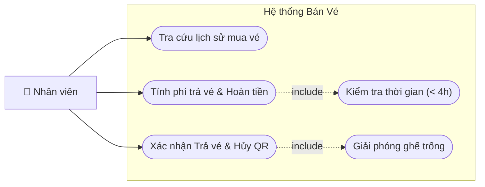

# Usecase - 003: Trả vé tàu

## Actor

- **Primary:** Nhân viên tại quầy
- **System:** Server, Database

## Tiền điều kiện

- Nhân viên đã đăng nhập vào hệ thống và chọn chức năng **Trả vé**.
- Khách hàng có vé tàu hợp lệ (trạng thái `status = "SOLD"`) và chưa qua giờ khởi hành.

## Hậu điều kiện

- Bản ghi `Ticket` được cập nhật `status = "RETURNED"`.
- `ScheduleDetail` liên kết với vé đó được giải phóng (trạng thái ghế trống).
- Mã QR trên vé bị vô hiệu hóa, không thể sử dụng để quét qua cổng soát vé.
- Bản ghi `Invoice` (type = `REFUND`) và danh sách `InvoiceDetail` được lưu.
- Khách hàng nhận lại tiền mặt (sau khi đã trừ phí trả vé theo quy định).

## Mô tả

Nhân viên tại quầy tiếp nhận yêu cầu trả vé từ khách hàng. Hệ thống kiểm tra điều kiện thời gian (phải trước giờ khởi hành ít nhất 4 tiếng). Nếu hợp lệ, hệ thống tính toán phí trả vé (có phân biệt vé mua mới và vé đã từng đổi), hiển thị số tiền hoàn lại. Nhân viên chi tiền cho khách và xác nhận hủy vé trên hệ thống.

---

## Luồng chính

1. Nhân viên nhập thông tin tra cứu: **Số CMND / Hộ chiếu** của người mua hoặc người đi tàu.
2. Hệ thống truy vấn và hiển thị danh sách các vé hợp lệ tương ứng với giấy tờ vừa nhập (chỉ hiện vé trạng thái `SOLD`).
3. Nhân viên chọn một hoặc nhiều vé khách hàng muốn trả trong danh sách lịch sử mua vé.
4. Nhân viên ấn **"Yêu cầu Trả vé"**.
5. Hệ thống kiểm tra điều kiện trả vé cho từng vé được chọn:
   - Vé chưa được sử dụng.
   - Thời gian hiện tại cách giờ khởi hành của chuyến tàu ≥ 4 giờ.
6. Hệ thống xác nhận đủ điều kiện và tiến hành tính phí trả vé:
   - Áp dụng mức phí trả vé tiêu chuẩn (ví dụ: 10% hoặc 20% giá vé quy định tùy thời điểm).
   - Tính **Số tiền hoàn lại** = Giá vé gốc - Phí trả vé.
7. Hệ thống hiển thị bảng kê chi tiết: Thông tin vé, Phí trả vé, và **Tổng số tiền hoàn lại** cho khách hàng.
8. Nhân viên thông báo số tiền hoàn lại cho khách. Nếu khách đồng ý, nhân viên thực hiện chi trả tiền mặt (hoặc chuyển khoản hoàn tiền).
9. Nhân viên ấn **"Xác nhận trả vé"**.
10. Hệ thống thực hiện các thao tác sau trong một giao dịch (Transaction):
    - Cập nhật `Ticket`: `status = "RETURNED"`.
    - Vô hiệu hóa `qrCode` của vé.
    - Cập nhật `ScheduleDetail` (giải phóng ghế, cập nhật `seat_id` trống để mở bán lại).
    - Tạo bản ghi `Invoice` mới: `type = REFUND`, `totalAmount` = Tổng tiền hoàn lại, `issueDate = now`.
    - Lặp qua các vé được trả để tạo `InvoiceDetail` ghi nhận số tiền hoàn (`refundAmount`) và đánh dấu `isReturned = true` cho hóa đơn gốc nếu cần.
11. Hệ thống hiển thị thông báo **"Trả vé thành công"** và in biên lai hoàn tiền (nếu khách yêu cầu).

---

## Luồng thay thế

### [AF-1] Vé đã từng đổi trước đó

- **6.1** Tại bước 6, hệ thống phát hiện vé đang được yêu cầu trả là vé sinh ra từ một giao dịch đổi vé trước đó (kiểm tra trường `originalTicketId` khác null hoặc đánh dấu `isExchanged`).
- **6.2** Hệ thống áp dụng quy định phạt nặng hơn: **Khấu trừ 30% giá vé** làm phí trả vé.
- **7.1** Hệ thống hiển thị mức phí 30% kèm ghi chú "Phí áp dụng cho vé đã đổi", tính toán lại Số tiền hoàn lại. Các bước sau diễn ra như luồng chính.

---

## Luồng lỗi

- **[Không tìm thấy vé]:** Ở bước 2, nếu CMND/Hộ chiếu không khớp với bất kỳ giao dịch nào → Hệ thống thông báo _"Không tìm thấy lịch sử mua vé cho giấy tờ này"_.
- **[Lỗi thời gian trả vé]:** Ở bước 5, nếu thời gian hiện tại đến giờ tàu chạy < 4 giờ → Hệ thống báo lỗi _"Vé không đủ điều kiện trả: Phải thực hiện trả vé trước giờ khởi hành ít nhất 4 giờ"_, từ chối giao dịch.
- **[Vé đã qua sử dụng / Đã trả]:** Ở bước 5, nếu vé có trạng thái khác `SOLD` (ví dụ `CHECKED_IN` hoặc `RETURNED`) → Hệ thống báo lỗi _"Vé đã được sử dụng hoặc đã được hoàn trả trước đó"_.

---

## Dữ liệu vào (Client → Server)

### Tra cứu

| Field    | Kiểu     | Bắt buộc | Mô tả                          |
| -------- | -------- | -------- | ------------------------------ |
| `idCard` | `String` | ✓        | Số giấy tờ định danh của khách |

### Giao dịch trả vé

| Field          | Kiểu           | Bắt buộc | Mô tả                                                |
| -------------- | -------------- | -------- | ---------------------------------------------------- |
| `ticketIds`    | `List<String>` | ✓        | Danh sách mã vé khách muốn trả                       |
| `refundAmount` | `double`       | ✓        | Số tiền thực tế nhân viên xác nhận đã hoàn cho khách |
| `employeeId`   | `String`       | ✓        | ID nhân viên thực hiện giao dịch                     |

---

## Dữ liệu ra (Server → Client)

### Thông tin hoàn tiền (Preview)

| Field              | Kiểu     | Mô tả                                                  |
| ------------------ | -------- | ------------------------------------------------------ |
| `totalTicketPrice` | `double` | Tổng giá trị gốc của các vé                            |
| `refundFee`        | `double` | Tổng phí trả vé hệ thống tính toán (10%, 20% hoặc 30%) |
| `refundAmount`     | `double` | Số tiền cuối cùng cần hoàn lại cho khách               |

---

## Business Rules

1. **Quy tắc 4h:** Giao dịch trả vé phải được thực hiện tối thiểu 4 tiếng trước thời gian khởi hành ghi trên vé. Dưới 4 tiếng, vé mất giá trị hoàn trả.
2. **Khấu trừ vé đã đổi:** Nếu vé khách mang đi trả là vé đã từng được đổi 1 lần (vé có `originalTicketId`), mức phí trả vé bắt buộc là 30% giá trị vé hiện tại.
3. **Giải phóng ghế:** Ngay khi xác nhận trả vé, ghế liên kết với vé đó phải được giải phóng lập tức trên hệ thống để khách hàng khác có thể mua (Optimistic Locking).
4. **Transaction:** Quá trình đổi trạng thái vé, hủy QR, giải phóng ghế và lưu hóa đơn `REFUND` phải đảm bảo tính ACID.

---

## Sơ đồ Use Case

---

## 🛠 Yêu cầu cập nhật Database / Entity (Từ BA Review)

Để hiện thực hóa nghiệp vụ trả vé, code Entity (đã được tạo ở bước trước) đã sẵn sàng, nhưng Tech Lead / Developer cần lưu ý mapping logic sao cho chuẩn:

1. **Ticket Entity:**
   - Trạng thái `status`: Đảm bảo quy ước có trạng thái `RETURNED` (hoặc `REFUNDED`) trong hằng số hệ thống.
   - `qrCode`: Cần có logic xử lý ở tầng Service để ghi đè chuỗi mã hóa thành `null` hoặc chuỗi `INVALID` khi trả vé thành công.

2. **Invoice Entity:**
   - `InvoiceType`: Sử dụng giá trị `REFUND` từ Enum.
   - `totalAmount`: Lưu đúng số tiền đã hoàn lại cho khách (có thể lưu số dương hoặc âm tùy chiến lược kế toán của nhóm, nhưng nên lưu số dương kèm Type là `REFUND`).

3. **InvoiceDetail Entity:**
   - Cập nhật trường `isReturned = true`.
   - Cập nhật trường `refundAmount` tương ứng với số tiền hoàn lại của riêng tờ vé đó (Giá vé - Phí trả vé). Việc chia nhỏ `refundAmount` cho từng `InvoiceDetail` giúp đối soát dễ dàng hơn khi 1 hóa đơn trả nhiều loại vé có mệnh giá và mức phí khác nhau.
