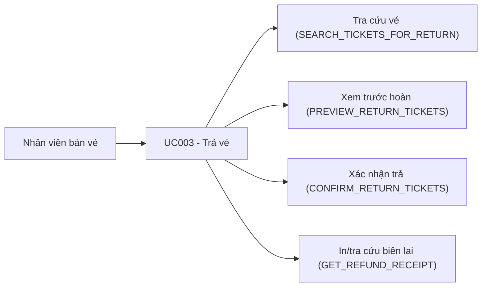

# Use case UC003: Trả vé (Hoàn vé)

## Actor
- **Primary:** Nhân viên bán vé (quầy)
- **System:** JavaFX Client → TCP Socket Server → MariaDB

## Tiền điều kiện
- Nhân viên đã đăng nhập và cung cấp `employeeId` (có thể là `employee_id` hoặc `employee_code` như `QL001`).
- Vé cần trả tồn tại và đang ở trạng thái `TicketStatus.PAID`.

## Hậu điều kiện (khi thành công)
- Tạo `Invoice` type `REFUND` và `InvoiceDetail` tương ứng cho từng vé được hoàn.
- Cập nhật vé:
  - `Ticket.status = TicketStatus.RETURNED`
  - `Ticket.qrCode = "INVALID"`
- Cập nhật `InvoiceDetail` thuộc hóa đơn `SALE` gốc (nếu có): set `isReturned=true` và `refundAmount`.
- Có thể tra cứu biên lai hoàn tiền bằng `refundInvoiceId` (ActionType `GET_REFUND_RECEIPT`) để in/xem lại.

---

## Mô tả
Nhân viên tra cứu vé cần hoàn theo mã vé/QR hoặc giấy tờ khách hàng/hành khách, chọn danh sách vé, hệ thống tính trước phí hoàn và số tiền hoàn. Nhân viên xác nhận hoàn, hệ thống ghi nhận giao dịch hoàn (biên lai) và cập nhật trạng thái vé.

---

## Luồng chính (theo ActionType)

### 1) Tra cứu vé trả
1. Client gửi `Request(ActionType.SEARCH_TICKETS_FOR_RETURN, ReturnTicketSearchDTO)`.
2. Server (`TicketServiceImpl.searchTicketsForReturn`) tìm vé theo `queryType`:
   - `AUTO`: thử theo `ticketId/qrCode` → nếu không có thì tìm theo giấy tờ người mua (`BUYER_DOCUMENT`) và giấy tờ hành khách (`PASSENGER_DOCUMENT`) rồi merge.
   - `TICKET_ID`: tìm theo `ticketId/qrCode`.
   - `BUYER_DOCUMENT`: tìm theo giấy tờ người mua.
   - `PASSENGER_DOCUMENT`: tìm theo giấy tờ hành khách.
   - Nếu `query` rỗng: load mặc định danh sách vé `PAID`.
3. Trả về `List<ReturnTicketTicketDTO>` (chỉ gồm vé `PAID`).

### 2) Xem trước số tiền hoàn
1. Client gửi `Request(ActionType.PREVIEW_RETURN_TICKETS, ReturnTicketPreviewRequestDTO)` gồm `ticketIds`.
2. Server (`TicketServiceImpl.previewReturnTickets` → `doComputeReturn`) kiểm tra:
   - Danh sách `ticketIds` không rỗng (`TicketMessages.TICKET_IDS_REQUIRED`).
   - Không trùng `ticketIds` (`TicketMessages.TICKET_IDS_DUPLICATE`).
   - Vé tồn tại và đủ số lượng (`TicketMessages.SOME_TICKETS_INVALID`).
   - Vé phải `PAID` (`TicketMessages.TICKET_NOT_RETURNABLE`).
   - Vé có lịch trình và `departureTime` (`TicketMessages.SCHEDULE_NOT_FOUND`).
   - Điều kiện thời gian: còn ít nhất **4 giờ** trước giờ khởi hành (`TicketMessages.NOT_ELIGIBLE_BY_TIME`).
   - Tất cả vé trong một lần hoàn phải thuộc **cùng 1 khách hàng** (`TicketMessages.CUSTOMER_MISMATCH`).
   - Tính phí hoàn:
     - Nếu vé “đã đổi” (`originalTicketId != null` hoặc `isExchanged=true`) → 30%.
     - Nếu chưa đổi: < 24h → 20%, ngược lại 10%.
     - Phí tối thiểu mỗi vé: 10.000 (`MIN_RETURN_FEE_PER_TICKET`), làm tròn lên bội 1.000.
     - Giá vé dùng “thực trả” từ invoice detail SALE (fallback về `ScheduleDetail.priceSeat` nếu không tìm thấy).
3. Trả về `ReturnTicketPreviewDTO(totalTicketPrice, refundFee, refundAmount)`.

### 3) Xác nhận trả vé
1. Client gửi `Request(ActionType.CONFIRM_RETURN_TICKETS, ReturnTicketConfirmDTO)` gồm:
   - `ticketIds`
   - `refundAmount`
   - `employeeId`
2. Server (`TicketServiceImpl.confirmReturnTickets` → transactional `doConfirmReturnTickets`) kiểm tra:
   - `refundAmount` phải khớp với preview trong sai số `REFUND_TOLERANCE` (`TicketMessages.REFUND_AMOUNT_MISMATCH`).
   - Nhân viên hợp lệ (resolve `employeeId/employeeCode`) (`EmployeeMessages.notFoundById(...)`).
   - Re-check các điều kiện tính hoàn + cùng khách hàng.
3. Ghi DB:
   - Tạo `Invoice` type `REFUND`.
   - Tạo `InvoiceDetail` cho biên lai hoàn (`insurance=0` vì “insurance non-refundable” theo rule hiện tại).
   - Update invoice detail SALE gốc: `isReturned=true`, `refundAmount`.
   - Update ticket: `RETURNED`, `qrCode="INVALID"`.
4. Trả về `refundInvoiceId` (String) với message theo `TicketMessages.RETURN_SUCCESS`.

### 4) Tra cứu biên lai hoàn tiền
1. Client gửi `Request(ActionType.GET_REFUND_RECEIPT, RefundReceiptRequestDTO)` với `refundInvoiceId`.
2. Server load `Invoice` + join các quan hệ (customer/employee/details/ticket/schedule/route/stations...) và trả `RefundReceiptDTO`.

---

## Luồng lỗi tiêu biểu (tham chiếu constant)
- `TicketMessages.TICKET_IDS_REQUIRED`: thiếu danh sách vé.
- `TicketMessages.TICKET_IDS_DUPLICATE`: danh sách vé trùng.
- `TicketMessages.SOME_TICKETS_INVALID`: vé không tồn tại/không hợp lệ.
- `TicketMessages.TICKET_NOT_RETURNABLE`: vé không ở trạng thái trả được.
- `TicketMessages.NOT_ELIGIBLE_BY_TIME`: không đủ điều kiện thời gian (dưới 4h).
- `TicketMessages.CUSTOMER_MISMATCH`: vé không cùng khách hàng.
- `TicketMessages.REFUND_AMOUNT_MISMATCH`: số tiền hoàn không khớp với hệ thống.
- `TicketMessages.DATA_CONFLICT`: xung đột dữ liệu (optimistic lock).

---

## Dữ liệu vào/ra (I/O)

### Client → Server (Request.data)
| ActionType | DTO | Trường chính |
|---|---|---|
| `SEARCH_TICKETS_FOR_RETURN` | `ReturnTicketSearchDTO` | `query`, `queryType` |
| `PREVIEW_RETURN_TICKETS` | `ReturnTicketPreviewRequestDTO` | `ticketIds` |
| `CONFIRM_RETURN_TICKETS` | `ReturnTicketConfirmDTO` | `ticketIds`, `refundAmount`, `employeeId` |
| `GET_REFUND_RECEIPT` | `RefundReceiptRequestDTO` | `refundInvoiceId` |

### Server → Client (Response.data)
| Luồng | Response.data |
|---|---|
| Tra cứu vé trả | `List<ReturnTicketTicketDTO>` |
| Xem trước hoàn tiền | `ReturnTicketPreviewDTO` |
| Xác nhận hoàn tiền | `refundInvoiceId` (String) |
| Biên lai hoàn tiền | `RefundReceiptDTO` |

---

## Use Case Diagram (Mermaid)

