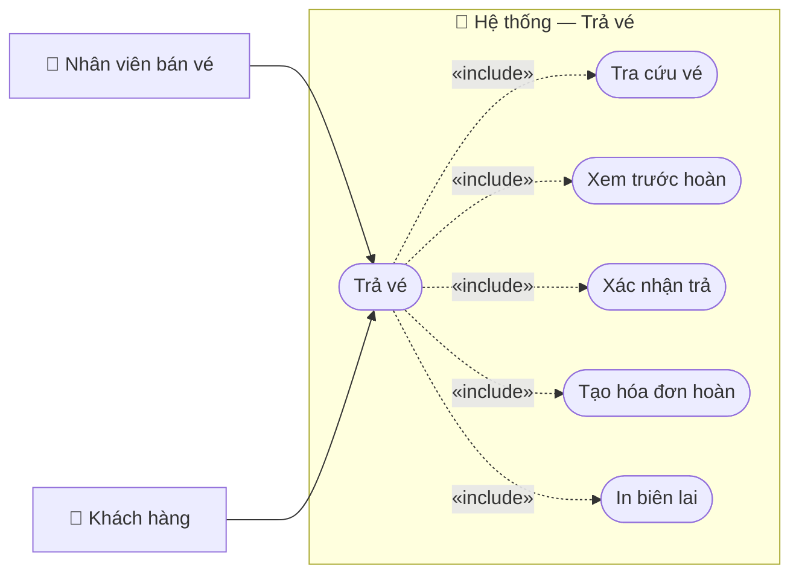

# Usecase: Trả vé

## Actor
- **Primary:** Nhân viên bán vé (`Employee`)
- **Secondary:** Khách hàng (cung cấp thông tin vé/giấy tờ)
- **System:** JavaFX Client → TCP Socket Server (`RequestRouter`) → MariaDB

## Mô tả
Nhân viên tra cứu vé đã thanh toán có thể trả, xem trước phí trả và số tiền hoàn, xác nhận trả vé để tạo hóa đơn hoàn vé và (tuỳ chọn) in biên lai hoàn tiền.

## Tiền điều kiện
- Nhân viên đã đăng nhập và có `employeeId` hợp lệ.
- Vé tồn tại và ở trạng thái `TicketStatus.PAID`.
- Còn **ít nhất 4 giờ** tới giờ khởi hành (Server validate `MINUTES_4H = 4*60`).
- Nếu trả theo lô, tất cả vé phải thuộc **cùng khách hàng** (`TicketMessages.CUSTOMER_MISMATCH`).

## Hậu điều kiện
- Tạo `Invoice` loại `InvoiceType.REFUND` và `InvoiceDetail` refund (`isReturned=true`, `refundAmount`).
- Update `InvoiceDetail` SALE tương ứng: `returned=true`, set `refundAmount`.
- Update `Ticket.status=TicketStatus.RETURNED` và `Ticket.qrCode="INVALID"`.
- Thu hồi reward points earned từ các vé trả (không hoàn lại redeemed points theo comment trong code).

## Luồng chính
1. Nhân viên mở màn hình trả vé:
   - UI: `tra-ve.fxml` + `ReturnTicketController` (mode trả vé khi không set `mainController`).
2. Nhân viên tra cứu vé trả:
   - Client gửi `ActionType.SEARCH_TICKETS_FOR_RETURN` với `ReturnTicketSearchDTO { query, queryType=AUTO }` qua `ReturnTicketClientService.searchTicketsForReturn(query)`.
   - Server `TicketServiceImpl.searchTicketsForReturn(...)` tìm theo ticketId/QR, giấy tờ người mua hoặc hành khách; nếu query rỗng thì load danh sách `PAID`.
   - Trả `List<ReturnTicketTicketDTO>`.
3. Nhân viên chọn vé cần trả.
4. Client xem trước tiền hoàn:
   - Gửi `ActionType.PREVIEW_RETURN_TICKETS` với `ReturnTicketPreviewRequestDTO { ticketIds }`.
   - Server `TicketServiceImpl.previewReturnTickets(...)`:
     - Validate danh sách không rỗng, không trùng (`TicketMessages.TICKET_IDS_DUPLICATE`).
     - Check từng vé phải `PAID`, có schedule hợp lệ, và còn ≥4h (`TicketMessages.NOT_ELIGIBLE_BY_TIME`).
     - Check cùng khách hàng (`TicketMessages.CUSTOMER_MISMATCH`).
     - Tính phí theo `computeReturnFee(...)` và trả `ReturnTicketPreviewDTO`.
5. Nhân viên xác nhận trả vé:
   - Client gửi `ActionType.CONFIRM_RETURN_TICKETS` với `ReturnTicketConfirmDTO { ticketIds, refundAmount, employeeId }`.
   - Server `TicketServiceImpl.confirmReturnTickets(...)`:
     - Recompute và so với `refundAmount` với sai số `REFUND_TOLERANCE=1.0` (`TicketMessages.REFUND_AMOUNT_MISMATCH` nếu lệch).
     - Tạo `Invoice (REFUND)` + `InvoiceDetail` refund cho từng vé.
     - Update `InvoiceDetail` SALE, thu hồi điểm, update `Ticket` sang `RETURNED` và QR `"INVALID"`.
     - Trả `refundInvoiceId`.
6. (Tuỳ chọn) In biên lai hoàn tiền:
   - Client gửi `ActionType.GET_REFUND_RECEIPT` với `RefundReceiptRequestDTO { refundInvoiceId }`.
   - Server `TicketServiceImpl.getRefundReceipt(...)` trả `RefundReceiptDTO` (hỗ trợ multi-ticket qua `items`).
   - Client preview/in bằng template `/client/print/bien-lai-tra-ve.xml`.

## Luồng thay thế
- **[Trả nhiều vé]:** Chọn nhiều vé ở bước 3; Server bắt buộc cùng khách hàng.

## Luồng lỗi
- **[Vé không trả được]:** `TicketMessages.TICKET_NOT_RETURNABLE`, `TicketMessages.SOME_TICKETS_INVALID`.
- **[Không đủ điều kiện thời gian]:** `TicketMessages.NOT_ELIGIBLE_BY_TIME`.
- **[Danh sách vé trùng]:** `TicketMessages.TICKET_IDS_DUPLICATE`.
- **[Không cùng khách hàng]:** `TicketMessages.CUSTOMER_MISMATCH`.
- **[Tiền hoàn không khớp]:** `TicketMessages.REFUND_AMOUNT_MISMATCH`.
- **[Thiếu nhân viên]:** `TicketMessages.EMPLOYEE_ID_REQUIRED` hoặc message từ `EmployeeMessages.notFoundById(...)`.
- **[Lỗi lấy biên lai]:** Server có thể trả message nghiệp vụ (ví dụ “Mã biên lai hoàn tiền không hợp lệ.”).

## Dữ liệu vào (Client → Server)
| ActionType | DTO | Field | Kiểu | Bắt buộc | Mô tả |
|---|---|---|---|---|---|
| `SEARCH_TICKETS_FOR_RETURN` | `ReturnTicketSearchDTO` | `query` | `String` |  | Từ khóa tra cứu. |
| `SEARCH_TICKETS_FOR_RETURN` | `ReturnTicketSearchDTO` | `queryType` | `ReturnTicketSearchType` |  | UI dùng `AUTO`. |
| `PREVIEW_RETURN_TICKETS` | `ReturnTicketPreviewRequestDTO` | `ticketIds` | `List<String>` | ✓ | Danh sách vé. |
| `CONFIRM_RETURN_TICKETS` | `ReturnTicketConfirmDTO` | `ticketIds` | `List<String>` | ✓ | Danh sách vé. |
| `CONFIRM_RETURN_TICKETS` | `ReturnTicketConfirmDTO` | `refundAmount` | `double` | ✓ | Số tiền hoàn theo preview. |
| `CONFIRM_RETURN_TICKETS` | `ReturnTicketConfirmDTO` | `employeeId` | `String` | ✓ | Nhân viên xử lý. |
| `GET_REFUND_RECEIPT` | `RefundReceiptRequestDTO` | `refundInvoiceId` | `String` | ✓ | ID hóa đơn hoàn vé. |

## Dữ liệu ra (Server → Client)
| Response.data | Kiểu | Mô tả |
|---|---|---|
| (SEARCH_TICKETS_FOR_RETURN) | `List<ReturnTicketTicketDTO>` | Danh sách vé trả. |
| (PREVIEW_RETURN_TICKETS) | `ReturnTicketPreviewDTO` | `totalTicketPrice`, `refundFee`, `refundAmount`. |
| (CONFIRM_RETURN_TICKETS) | `String` | `refundInvoiceId`. |
| (GET_REFUND_RECEIPT) | `RefundReceiptDTO` | Dữ liệu biên lai hoàn tiền. |

## Business Rules
- **Cutoff trả vé:** Còn ≥4h tới giờ khởi hành.
- **Phí trả vé (`computeReturnFee(...)`):**
  - Vé đã đổi (`originalTicketId` != null hoặc `isExchanged=true`) → 30%.
  - Vé chưa đổi: <24h → 20%, ≥24h → 10%.
  - Tối thiểu 10.000đ/vé (`MIN_RETURN_FEE_PER_TICKET=10_000`).
  - Làm tròn lên bội 1.000đ và không vượt quá giá vé.
- **Giá vé gốc:** Ưu tiên lấy actual paid từ `InvoiceDetail` SALE, fallback `ScheduleDetail.priceSeat`.
- **Chống hoàn trùng:** Chỉ cho trả vé `PAID`; sau trả set `RETURNED` và QR `"INVALID"`.
- **Điểm thưởng:** Thu hồi điểm earned theo `floor(totalTicketPrice/10000)`; không hoàn lại redeemed points.

---

## Sơ đồ Use Case

