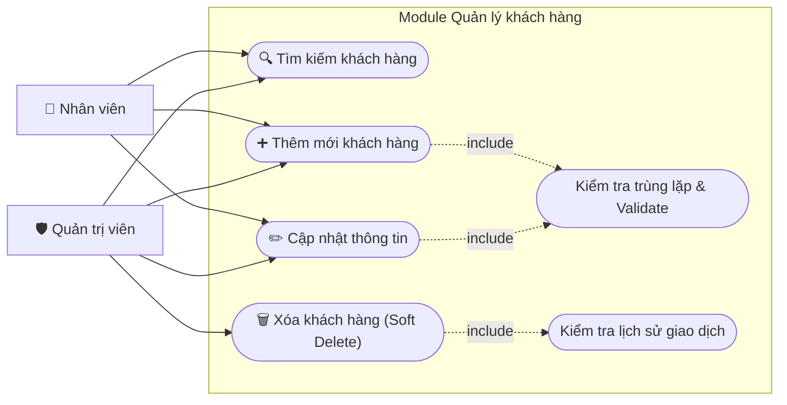

# Usecase - 004: Quản lý khách hàng

## Actor

- **Primary:** Nhân viên tại quầy, Quản trị viên (Admin)
- **System:** Server, Database

## Tiền điều kiện

- Người dùng (Nhân viên hoặc Quản trị viên) đã đăng nhập thành công vào hệ thống.

## Hậu điều kiện

- Thông tin khách hàng được truy xuất, tạo mới, cập nhật hoặc vô hiệu hóa (xóa mềm) thành công trong Database.
- Dữ liệu trả về giao diện được cập nhật đồng bộ.

## Mô tả

Chức năng cho phép người dùng hệ thống quản lý danh mục khách hàng. Cả Nhân viên và Quản trị viên đều có thể Tìm kiếm, Thêm mới và Cập nhật thông tin khách hàng. Tuy nhiên, thao tác Xóa (thực chất là vô hiệu hóa) chỉ được thực hiện bởi Quản trị viên để đảm bảo an toàn dữ liệu lịch sử giao dịch.

---

## Luồng chính

### [MF-1] Tra cứu khách hàng (Nhân viên & Quản trị)

1. Tại màn hình chính, người dùng chọn chức năng **Quản lý khách hàng**.
2. Hệ thống hiển thị giao diện quản lý với danh sách khách hàng mặc định (có phân trang) và bộ lọc tìm kiếm.
3. Người dùng nhập tiêu chí: **Số CMND/CCCD**, **Họ tên**, **Số điện thoại**, hoặc **Email**. Ấn "Tìm kiếm".
4. Hệ thống truy vấn Database bằng phép toán `LIKE` hoặc tìm chính xác.
5. Hệ thống trả về danh sách khách hàng khớp với tiêu chí. Nếu không có dữ liệu, hiển thị _"Không tìm thấy khách hàng nào phù hợp"_.

### [MF-2] Thêm mới khách hàng (Nhân viên & Quản trị)

1. Người dùng ấn nút **"Thêm mới"**.
2. Hệ thống hiển thị Form điền thông tin: Số CMND/CCCD, Họ tên, Số điện thoại, Email.
3. Người dùng nhập dữ liệu và ấn **"Lưu"**.
4. Hệ thống kiểm tra tính hợp lệ của dữ liệu (Validate định dạng, kiểm tra trùng lặp CCCD/Email).
5. Hệ thống tạo mới bản ghi `Customer` trong Database (với trạng thái mặc định là `Active`).
6. Hệ thống hiển thị thông báo _"Thêm khách hàng thành công"_ và tải lại danh sách.

### [MF-3] Cập nhật thông tin khách hàng (Nhân viên & Quản trị)

1. Tại danh sách, người dùng ấn nút **"Sửa"** trên dòng của một khách hàng cụ thể.
2. Hệ thống hiển thị Form với dữ liệu hiện tại của khách hàng đó.
3. Người dùng chỉnh sửa các thông tin cần thiết (Lưu ý: Không được sửa ID/Mã khách hàng nội bộ). Ấn **"Lưu"**.
4. Hệ thống kiểm tra validation dữ liệu mới.
5. Hệ thống cập nhật bản ghi `Customer` vào Database.
6. Hệ thống hiển thị thông báo _"Cập nhật thành công"_ và làm mới danh sách.

### [MF-4] Xóa khách hàng (Chỉ dành cho Quản trị viên)

1. Quản trị viên ấn nút **"Xóa"** kế bên thông tin khách hàng.
2. Hệ thống hiển thị hộp thoại cảnh báo: _"Bạn có chắc chắn muốn xóa khách hàng này? Thao tác này sẽ không xóa lịch sử giao dịch nhưng khách hàng sẽ không thể tiếp tục sử dụng dịch vụ."_
3. Quản trị viên ấn **"Xác nhận"**.
4. Hệ thống kiểm tra xem khách hàng đã có giao dịch (`Ticket`, `Invoice`) nào chưa:
   - Nếu **CHƯA có giao dịch**: Hệ thống thực hiện xóa cứng (Hard delete) khỏi Database.
   - Nếu **ĐÃ có giao dịch**: Hệ thống thực hiện xóa mềm (Soft delete) bằng cách set thuộc tính `isActive = false`.
5. Hệ thống thông báo _"Xóa khách hàng thành công"_ và ẩn khách hàng khỏi danh sách mặc định.

---

## Luồng lỗi & Ràng buộc ngoại lệ

- **[Lỗi trùng lặp dữ liệu]:** Ở các luồng Thêm/Sửa, nếu Số CMND/CCCD hoặc Email đã tồn tại trong hệ thống (thuộc về người khác) → Hệ thống báo lỗi _"Số CCCD / Email này đã được đăng ký. Vui lòng kiểm tra lại"_, không cho phép lưu.
- **[Lỗi sai định dạng / Thiếu thông tin]:** Người dùng bỏ trống trường bắt buộc (Họ tên, CCCD) hoặc nhập sai format (Email không có `@`, SĐT chứa chữ cái) → Hệ thống bôi đỏ trường tương ứng và báo _"Thông tin không hợp lệ"_.
- **[Lỗi phân quyền khi xóa]:** Nếu tài khoản đang đăng nhập là "Nhân viên" → Nút "Xóa" bị ẩn hoặc bị vô hiệu hóa (disabled).
- **[Khách hàng đang có vé chưa đi]:** Ở luồng Xóa, nếu hệ thống phát hiện khách hàng đang có `Ticket` với trạng thái `SOLD` (chuyến tàu chưa khởi hành) → Hệ thống chặn thao tác xóa và báo _"Không thể vô hiệu hóa khách hàng đang có vé tàu sắp khởi hành"_.

---

## Dữ liệu vào (Client → Server)

### Dữ liệu tìm kiếm

| Field          | Kiểu     | Bắt buộc | Mô tả                                  |
| -------------- | -------- | -------- | -------------------------------------- |
| `keyword`      | `String` | ✓        | Chuỗi tìm kiếm (CCCD, Tên, SĐT, Email) |
| `page`, `size` | `int`    | ✓        | Tham số phân trang                     |

### Dữ liệu Thêm / Sửa (CustomerDTO)

| Field        | Kiểu     | Bắt buộc | Mô tả                                |
| ------------ | -------- | -------- | ------------------------------------ |
| `customerId` | `String` | ✗        | Trống nếu Thêm mới, bắt buộc nếu Sửa |
| `fullName`   | `String` | ✓        | Họ tên                               |
| `idCard`     | `String` | ✓        | Số CMND / CCCD (Độ dài 9-12 số)      |
| `phone`      | `String` | ✗        | Số điện thoại                        |
| `email`      | `String` | ✗        | Địa chỉ Email                        |

### Dữ liệu Xóa

| Field        | Kiểu     | Bắt buộc | Mô tả                     |
| ------------ | -------- | -------- | ------------------------- |
| `customerId` | `String` | ✓        | ID của khách hàng cần xóa |

---

## Dữ liệu ra (Server → Client)

### Trả về danh sách (Page<CustomerDTO>)

| Field           | Kiểu                | Mô tả                                    |
| --------------- | ------------------- | ---------------------------------------- |
| `customers`     | `List<CustomerDTO>` | Danh sách khách hàng trên trang hiện tại |
| `totalElements` | `long`              | Tổng số lượng khách hàng tìm thấy        |
| `totalPages`    | `int`               | Tổng số trang                            |

---

## Business Rules

1. **Định danh duy nhất:** Thuộc tính `idCard` (Số CCCD) là định danh duy nhất ngoài đời thực của khách hàng, bắt buộc phải UNIQUE trong Database.
2. **Quy tắc bảo toàn dữ liệu (Toàn vẹn tham chiếu):** Tuyệt đối không dùng lệnh `DELETE FROM customers` nếu khách hàng đó đã nằm trong bảng `Invoice` hoặc `Ticket`. Phải dùng cờ `isActive` để vô hiệu hóa (Soft Delete).
3. **Hiển thị:** Các màn hình tìm kiếm, bán vé, đổi vé ở các chức năng khác chỉ được phép hiển thị và thao tác với các khách hàng có `isActive = true`.

---

## Sơ đồ Use Case

---

## 🛠 Yêu cầu cập nhật Database / Entity (Từ BA Review)

Để hệ thống không bị crash (vỡ) do lỗi khóa ngoại khi thực hiện chức năng Xóa, Entity `Customer` cần cập nhật như sau:

1. **Entity Customer:**
   - Thêm thuộc tính `isActive` (kiểu `boolean`, mapping xuống cột `is_active` kiểu `BIT` hoặc `TINYINT(1)`).
   - Set giá trị mặc định khi tạo mới là `true`.
   - Khi gọi API Xóa khách hàng, thay vì gọi `repository.delete(customer)`, ta gọi `customer.setActive(false)` rồi gọi `repository.save(customer)`.
2. **Repository (JPA):**
   - Viết lại câu query mặc định thành: `List<Customer> findByIsActiveTrue()`. Việc này đảm bảo các khách hàng "đã bị xóa" sẽ không hiện lên ở màn hình Bán vé nữa.

3. **Validation (Hibernate Validator):**
   - Áp dụng các annotation như `@Email` cho trường email, `@Pattern(regexp = "^[0-9]{9,12}$")` cho `idCard` để kiểm tra ngay tại tầng DTO trước khi lưu vào DB.
