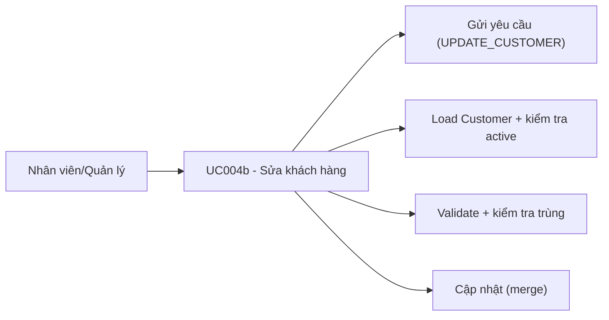

# Use case UC004b: Sửa khách hàng

## Actor
- **Primary:** Nhân viên / Quản lý
- **System:** JavaFX Client → TCP Socket Server → MariaDB

## Tiền điều kiện
- Người dùng đã đăng nhập.
- Khách hàng tồn tại và đang `isActive=true`.

## Hậu điều kiện (khi thành công)
- Cập nhật thông tin khách hàng (tên/giấy tờ/điện thoại/email).

---

## Luồng chính
1. Client gửi `Request(ActionType.UPDATE_CUSTOMER, CustomerDTO)` với `customerId` khác rỗng.
2. Server (`CustomerServiceImpl.updateCustomer`):
   - Validate DTO.
   - `customerId` bắt buộc (`CustomerMessages.CUSTOMER_ID_REQUIRED`).
   - Load customer:
     - Không thấy: `CustomerMessages.customerNotFound(...)`.
     - `isActive=false`: `CustomerMessages.customerInactive(...)`.
   - Kiểm tra trùng `idCard` (loại trừ chính nó) (`CustomerMessages.ID_CARD_DUPLICATE`).
   - Nếu có `email` thì kiểm tra trùng email (loại trừ chính nó) (`CustomerMessages.EMAIL_DUPLICATE`).
   - Update field và merge.
3. Trả `Response.success(CustomerMessages.UPDATE_SUCCESS, CustomerDTO)`.

---

## Luồng lỗi tiêu biểu
- `CustomerMessages.DATA_INVALID_PREFIX + ...`: DTO không hợp lệ.
- `CustomerMessages.CUSTOMER_ID_REQUIRED`: thiếu `customerId`.
- `CustomerMessages.customerNotFound(...)`: không tồn tại.
- `CustomerMessages.customerInactive(...)`: khách hàng đã bị vô hiệu hóa.
- `CustomerMessages.ID_CARD_DUPLICATE` / `CustomerMessages.EMAIL_DUPLICATE`: trùng dữ liệu.

---

## Dữ liệu vào/ra (I/O)

### Client → Server
| ActionType | DTO | Trường chính |
|---|---|---|
| `UPDATE_CUSTOMER` | `CustomerDTO` | `customerId`, `fullName`, `idCard` hoặc `passport`, `phone`, `email` |

### Server → Client
| Response.data |
|---|
| `CustomerDTO` |

---

## Use Case Diagram (Mermaid)

