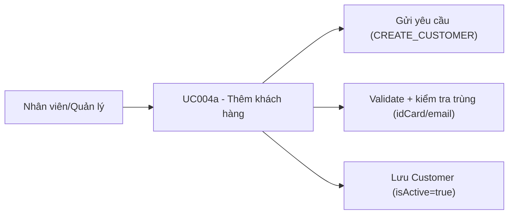

# Use case UC004a: Thêm khách hàng

## Actor
- **Primary:** Nhân viên / Quản lý
- **System:** JavaFX Client → TCP Socket Server → MariaDB

## Tiền điều kiện
- Người dùng đã đăng nhập.

## Hậu điều kiện (khi thành công)
- Tạo bản ghi `Customer` mới với `isActive=true`.

---

## Luồng chính
1. Client gửi `Request(ActionType.CREATE_CUSTOMER, CustomerDTO)` với `customerId=null`.
2. Server (`CustomerServiceImpl.createCustomer`):
   - Validate DTO (Jakarta Validation) và yêu cầu `customerId` phải rỗng (`CustomerMessages.CUSTOMER_ID_MUST_BE_NULL`).
   - Kiểm tra trùng `idCard` (unique) (`CustomerMessages.ID_CARD_DUPLICATE`).
   - Nếu có `email` thì kiểm tra trùng email (`CustomerMessages.EMAIL_DUPLICATE`).
   - Map DTO → Entity, set `isActive=true`, persist.
3. Server trả `Response.success(CustomerMessages.CREATE_SUCCESS, CustomerDTO)`.

---

## Luồng lỗi tiêu biểu (tham chiếu constant)
- `CustomerMessages.DATA_INVALID_PREFIX + ...`: DTO sai định dạng/thiếu dữ liệu (ví dụ: `fullName` rỗng, giấy tờ không hợp lệ).
- `CustomerMessages.CUSTOMER_ID_MUST_BE_NULL`: client gửi `customerId` khi thêm mới.
- `CustomerMessages.ID_CARD_DUPLICATE`: trùng CCCD.
- `CustomerMessages.EMAIL_DUPLICATE`: trùng email.
- `CustomerMessages.CREATE_FAILED_PREFIX + ...`: lỗi hệ thống khi persist.

---

## Dữ liệu vào/ra (I/O)

### Client → Server
| ActionType | DTO | Trường chính |
|---|---|---|
| `CREATE_CUSTOMER` | `CustomerDTO` | `customerId(null)`, `fullName`, `idCard` hoặc `passport`, `phone`, `email` |

### Server → Client
| Response.data |
|---|
| `CustomerDTO` |

---

## Use Case Diagram (Mermaid)

