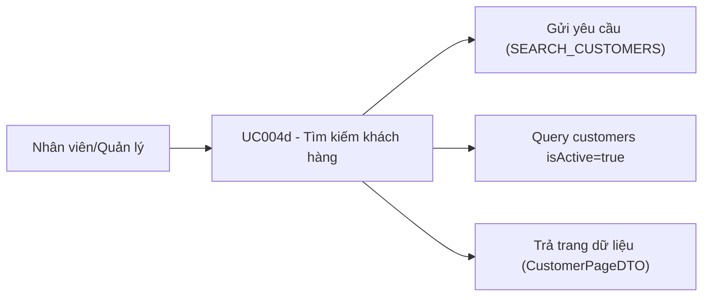

# Use case UC004d: Tìm kiếm khách hàng

## Actor
- **Primary:** Nhân viên / Quản lý
- **System:** JavaFX Client → TCP Socket Server → MariaDB

## Tiền điều kiện
- Người dùng đã đăng nhập.

## Hậu điều kiện (khi thành công)
- Trả về trang dữ liệu khách hàng đang hoạt động (`isActive=true`) theo `keyword/page/size`.

---

## Luồng chính
1. Client gửi `Request(ActionType.SEARCH_CUSTOMERS, CustomerSearchDTO)` (keyword có thể rỗng).
2. Server (`CustomerServiceImpl.searchCustomers`):
   - Nếu `searchDTO=null` → dùng mặc định `new CustomerSearchDTO()`.
   - Validate `page>=0`, `size>=1`.
   - Thực hiện:
     - `CustomerRepository.searchActiveCustomers(...)`
     - `CustomerRepository.countActiveCustomers(...)`
   - Đóng gói `CustomerPageDTO(customers,totalElements,totalPages,currentPage)`.
3. Trả `Response.success(CustomerMessages.SEARCH_SUCCESS, CustomerPageDTO)`.

---

## Luồng lỗi tiêu biểu
- `CustomerMessages.SEARCH_FAILED_PREFIX + ...`: lỗi trong quá trình query DB.
- Validation lỗi (ví dụ page âm / size <= 0): trả `Response.error(errors)`.

---

## Dữ liệu vào/ra (I/O)

### Client → Server
| ActionType | DTO | Trường chính |
|---|---|---|
| `SEARCH_CUSTOMERS` | `CustomerSearchDTO` | `keyword`, `page`, `size` |

### Server → Client
| Response.data |
|---|
| `CustomerPageDTO` |

---

## Use Case Diagram (Mermaid)

