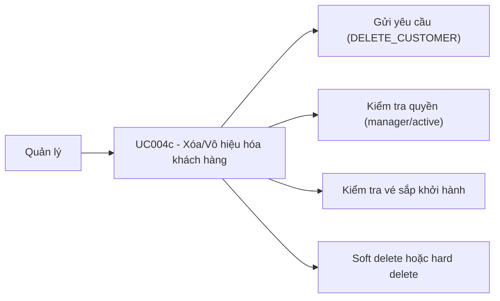

# Use case UC004c: Xóa / vô hiệu hóa khách hàng

## Actor
- **Primary:** Quản lý (manager)
- **System:** JavaFX Client → TCP Socket Server → MariaDB

## Tiền điều kiện
- Người dùng đã đăng nhập.
- Nhân viên yêu cầu xóa phải:
  - Tồn tại (`EmployeeRepository.findEmployeeById`)
  - `EmployeeStatus.ACTIVE`
  - `isManager=true`

## Hậu điều kiện (khi thành công)
- Nếu khách hàng có lịch sử vé/hóa đơn: **soft delete** `Customer.isActive=false`.
- Nếu khách hàng không có vé và không có hóa đơn: **hard delete** (xóa bản ghi).

---

## Luồng chính
1. Client gửi `Request(ActionType.DELETE_CUSTOMER, CustomerDeleteRequestDTO)` gồm:
   - `customerId`
   - `requestEmployeeId`
2. Server (`CustomerServiceImpl.deleteCustomer`):
   - Validate DTO.
   - Kiểm tra quyền:
     - Không thấy nhân viên: `CustomerMessages.requestEmployeeNotFound(...)`
     - Nhân viên inactive: `CustomerMessages.requestEmployeeInactive(...)`
     - Không phải manager: `CustomerMessages.MANAGER_ONLY`
   - Load customer:
     - Không thấy: `CustomerMessages.customerNotFound(...)`
   - Không cho xóa/vô hiệu hóa nếu khách hàng có vé `PAID` sắp khởi hành (`CustomerMessages.CUSTOMER_HAS_UPCOMING_TICKET`).
   - Kiểm tra lịch sử:
     - Có `Ticket` hoặc `Invoice` → set `isActive=false` và merge.
     - Không có `Ticket` và không có `Invoice` → remove (hard delete).
3. Trả `Response.success(CustomerMessages.DELETE_SUCCESS, CustomerDTO hoặc customerId)`.

---

## Luồng lỗi tiêu biểu
- `CustomerMessages.DATA_INVALID_PREFIX + ...`: DTO không hợp lệ.
- `CustomerMessages.MANAGER_ONLY`: không đủ quyền.
- `CustomerMessages.CUSTOMER_HAS_UPCOMING_TICKET`: có vé PAID sắp khởi hành.
- `CustomerMessages.DELETE_FAILED_PREFIX + ...`: lỗi hệ thống.

---

## Dữ liệu vào/ra (I/O)

### Client → Server
| ActionType | DTO | Trường chính |
|---|---|---|
| `DELETE_CUSTOMER` | `CustomerDeleteRequestDTO` | `customerId`, `requestEmployeeId` |

### Server → Client
| Response.data |
|---|
| `CustomerDTO` hoặc `customerId` |

---

## Use Case Diagram (Mermaid)

