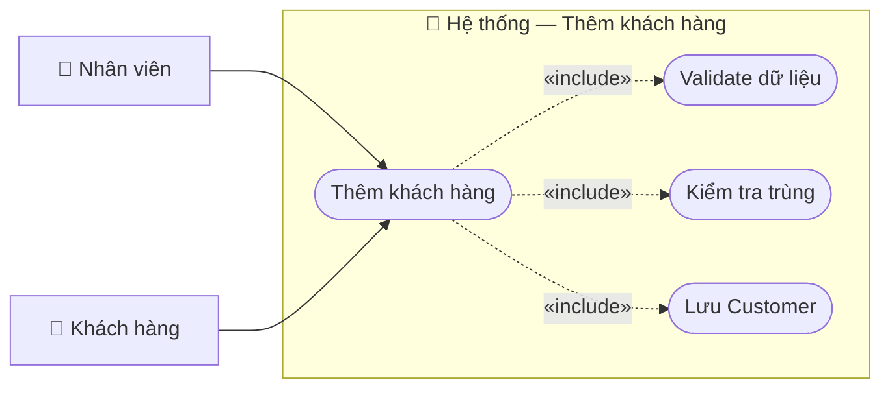

# Usecase: Thêm khách hàng

## Actor
- **Primary:** Nhân viên (`Employee`)
- **Secondary:** Khách hàng (cung cấp thông tin)
- **System:** JavaFX Client → TCP Socket Server (`RequestRouter`) → MariaDB

## Mô tả
Nhân viên tạo mới hồ sơ khách hàng để phục vụ bán vé, tích điểm và tra cứu lịch sử. Hệ thống kiểm tra tính hợp lệ và chống trùng theo giấy tờ/email trước khi lưu.

## Tiền điều kiện
- Nhân viên đang ở màn hình Quản lý khách hàng (`customer-management.fxml`).

## Hậu điều kiện
- Tạo bản ghi `Customer` mới trong DB với `Customer.isActive=true`.
- Trả về `CustomerDTO` để Client refresh danh sách.

## Luồng chính
1. Nhân viên nhấn **Thêm** trên màn hình quản lý khách hàng:
   - `CustomerManagementController.openAddCustomerDialog()` mở `khach-hang-dialog.fxml`.
2. Nhân viên nhập thông tin và nhấn **Lưu**:
   - Controller: `KhachHangDialogController.handleSave()`.
   - Client validate nhanh (tên/giấy tờ bắt buộc; format SĐT/Email nếu có).
3. Client gửi `ActionType.CREATE_CUSTOMER` với `CustomerDTO` (bắt buộc `customerId=null`).
4. Server `CustomerServiceImpl.createCustomer(...)`:
   - Validate bean validation (bao gồm `CustomerDTO.isDocumentPresent()`).
   - Nếu có `customerId` → `CustomerMessages.CUSTOMER_ID_MUST_BE_NULL`.
   - Check trùng CCCD/hộ chiếu/email:
     - `CustomerMessages.ID_CARD_DUPLICATE`, `PASSPORT_DUPLICATE`, `EMAIL_DUPLICATE`.
   - Persist `Customer` với `active=true`.
   - Trả `CustomerMessages.CREATE_SUCCESS` + `CustomerDTO`.
5. Client đóng dialog và reload danh sách.

## Luồng thay thế
- **[Không nhập SĐT/Email]:** Vẫn cho phép tạo (field optional).

## Luồng lỗi
- **[Dữ liệu không hợp lệ]:** `CustomerMessages.DATA_INVALID_PREFIX + <validation errors>`.
- **[Sai rule customerId khi thêm]:** `CustomerMessages.CUSTOMER_ID_MUST_BE_NULL`.
- **[Trùng dữ liệu]:** `CustomerMessages.ID_CARD_DUPLICATE`, `PASSPORT_DUPLICATE`, `EMAIL_DUPLICATE`.
- **[Lỗi hệ thống]:** `CustomerMessages.CREATE_FAILED_PREFIX + <message>`.

## Dữ liệu vào (Client → Server)
| Field | Kiểu | Bắt buộc | Mô tả |
|---|---|---|---|
| `customerId` | `String` |  | Khi thêm mới phải để trống/null. |
| `fullName` | `String` | ✓ | Họ tên. |
| `idCard` | `String` |  | CCCD (nếu dùng). |
| `passport` | `String` |  | Hộ chiếu (nếu dùng). |
| `phone` | `String` |  | SĐT (10 số) nếu có. |
| `email` | `String` |  | Email nếu có. |

## Dữ liệu ra (Server → Client)
| Field | Kiểu | Mô tả |
|---|---|---|
| `success` | `boolean` | Kết quả xử lý. |
| `message` | `String` | Thành công: `CustomerMessages.CREATE_SUCCESS`. |
| `data` | `CustomerDTO` | Khách hàng mới tạo. |

## Business Rules
- **Giấy tờ bắt buộc:** Phải có `idCard` hoặc `passport`.
- **Chống trùng:** Unique theo CCCD/hộ chiếu/email.
- **Active mặc định:** Khách mới luôn `isActive=true`.

---

## Sơ đồ Use Case

