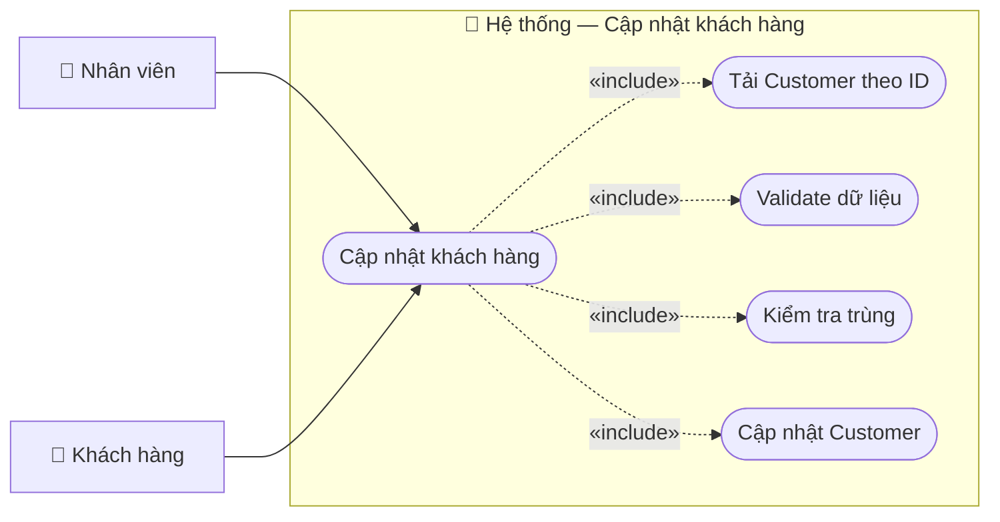

# Usecase: Cập nhật khách hàng

## Actor
- **Primary:** Nhân viên (`Employee`)
- **Secondary:** Khách hàng (cung cấp thông tin cập nhật)
- **System:** JavaFX Client → TCP Socket Server (`RequestRouter`) → MariaDB

## Mô tả
Nhân viên cập nhật thông tin hồ sơ khách hàng. Hệ thống đảm bảo khách hàng tồn tại, đang hoạt động và không trùng giấy tờ/email với khách khác.

## Tiền điều kiện
- Khách hàng tồn tại và `Customer.isActive=true`.
- Nhân viên đang ở màn hình Quản lý khách hàng và đã chọn khách để sửa.

## Hậu điều kiện
- Cập nhật `Customer` trong DB và trả về `CustomerDTO` mới.

## Luồng chính
1. Nhân viên chọn khách hàng và nhấn **Sửa**:
   - `CustomerManagementController.openEditCustomerDialog()` mở `khach-hang-dialog.fxml`.
2. Nhân viên chỉnh sửa và nhấn **Lưu**:
   - `KhachHangDialogController.handleSave()` gửi `ActionType.UPDATE_CUSTOMER` với `CustomerDTO` (có `customerId`).
3. Server `CustomerServiceImpl.updateCustomer(...)`:
   - Validate: yêu cầu `customerId` không rỗng (`CustomerMessages.CUSTOMER_ID_REQUIRED`).
   - Không tìm thấy → `CustomerMessages.customerNotFound(id)`.
   - Inactive → `CustomerMessages.customerInactive(id)`.
   - Check trùng CCCD/hộ chiếu/email (loại trừ chính record).
   - Update fields và trả `CustomerMessages.UPDATE_SUCCESS` + `CustomerDTO`.
4. Client đóng dialog và refresh danh sách.

## Luồng thay thế
- **[Đổi loại giấy tờ]:** Toggle CCCD/hộ chiếu trên form; Server chỉ yêu cầu có ít nhất một loại giấy tờ.

## Luồng lỗi
- **[Thiếu customerId]:** `CustomerMessages.CUSTOMER_ID_REQUIRED`.
- **[Không tồn tại/inactive]:** `CustomerMessages.customerNotFound(...)`, `CustomerMessages.customerInactive(...)`.
- **[Trùng dữ liệu]:** `CustomerMessages.ID_CARD_DUPLICATE`, `PASSPORT_DUPLICATE`, `EMAIL_DUPLICATE`.
- **[Dữ liệu không hợp lệ]:** `CustomerMessages.DATA_INVALID_PREFIX + <errors>`.
- **[Lỗi hệ thống]:** `CustomerMessages.UPDATE_FAILED_PREFIX + <message>`.

## Dữ liệu vào (Client → Server)
| Field | Kiểu | Bắt buộc | Mô tả |
|---|---|---|---|
| `customerId` | `String` | ✓ | ID khách hàng cần cập nhật. |
| `fullName` | `String` | ✓ | Họ tên. |
| `idCard` | `String` |  | CCCD. |
| `passport` | `String` |  | Hộ chiếu. |
| `phone` | `String` |  | SĐT. |
| `email` | `String` |  | Email. |

## Dữ liệu ra (Server → Client)
| Field | Kiểu | Mô tả |
|---|---|---|
| `success` | `boolean` | Kết quả xử lý. |
| `message` | `String` | Thành công: `CustomerMessages.UPDATE_SUCCESS`. |
| `data` | `CustomerDTO` | Khách hàng sau cập nhật. |

## Business Rules
- **Không cập nhật khách inactive:** Nếu `isActive=false` → từ chối (`CustomerMessages.CUSTOMER_INACTIVE`).
- **Chống trùng:** Unique theo CCCD/hộ chiếu/email.
- **Giấy tờ bắt buộc:** Phải có CCCD hoặc hộ chiếu.

---

## Sơ đồ Use Case

