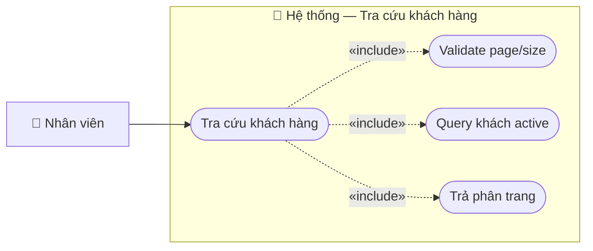

# Usecase: Tra cứu khách hàng

## Actor
- **Primary:** Nhân viên (`Employee`)
- **System:** JavaFX Client → TCP Socket Server (`RequestRouter`) → MariaDB

## Mô tả
Nhân viên tra cứu danh sách khách hàng đang hoạt động theo từ khóa, có phân trang để hiển thị trên bảng.

## Tiền điều kiện
- Nhân viên đang ở màn hình Quản lý khách hàng (`customer-management.fxml`).

## Hậu điều kiện
- Client nhận `CustomerPageDTO` để hiển thị danh sách khách hàng và điều khiển phân trang.

## Luồng chính
1. Nhân viên nhập từ khóa và nhấn **Tìm kiếm**:
   - Client gửi `ActionType.SEARCH_CUSTOMERS` với `CustomerSearchDTO { keyword, page, size }`.
2. Server `CustomerServiceImpl.searchCustomers(...)`:
   - Validate `page >= 0`, `size >= 1` (bean validation).
   - Query `CustomerRepository.searchActiveCustomers(...)` và `countActiveCustomers(...)`.
   - Trả `CustomerPageDTO { customers, totalElements, totalPages, currentPage }` với `CustomerMessages.SEARCH_SUCCESS`.
3. Client cập nhật bảng và Pagination.

## Luồng thay thế
- **[Hiển thị tất cả]:** `keyword=null` hoặc rỗng để load toàn bộ khách active.
- **[Refresh trang hiện tại]:** Gọi lại search với `page` đang đứng.

## Luồng lỗi
- **[Lỗi validate page/size]:** Server trả message từ `ValidationUtils`.
- **[Lỗi truy vấn]:** `CustomerMessages.SEARCH_FAILED_PREFIX + <message>`.

## Dữ liệu vào (Client → Server)
| Field | Kiểu | Bắt buộc | Mô tả |
|---|---|---|---|
| `keyword` | `String` |  | Từ khóa tìm kiếm. |
| `page` | `int` | ✓ | Trang (0-based). |
| `size` | `int` | ✓ | Số dòng/trang. |

## Dữ liệu ra (Server → Client)
| Response.data | Kiểu | Mô tả |
|---|---|---|
| `customers` | `List<CustomerDTO>` | Danh sách khách hàng. |
| `totalElements` | `long` | Tổng số kết quả. |
| `totalPages` | `int` | Tổng số trang. |
| `currentPage` | `int` | Trang hiện tại. |

## Business Rules
- **Chỉ trả khách active:** Search dùng repository `searchActiveCustomers`/`countActiveCustomers`.
- **Fallback phân trang:** Server normalize `size<=0 → 20`, `page<0 → 0`.

---

## Sơ đồ Use Case

